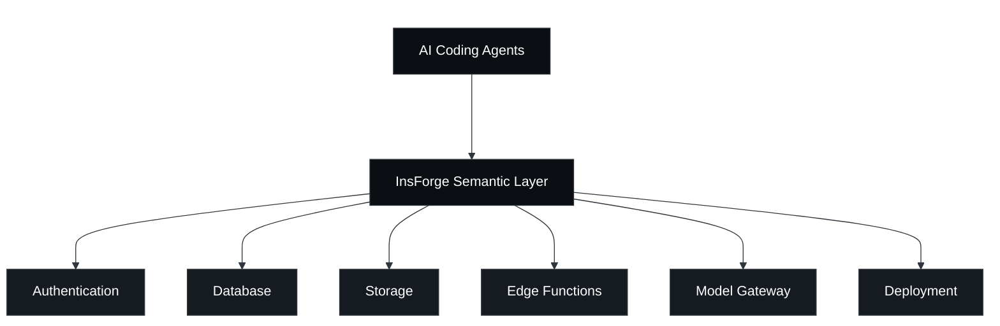

<div align="center">
  <a href="https://insforge.dev">
    <picture>
      <source media="(prefers-color-scheme: dark)" srcset="assets/logo-dark.svg">
      <source media="(prefers-color-scheme: light)" srcset="assets/logo-light.svg">
      
    </picture>
  </a>

  <p>
    The backend built for agentic coding.<br />
  </p>

  <p>
    <a href="https://opensource.org/licenses/Apache-2.0"></a>
    <a href="https://www.npmjs.com/package/@insforge/sdk"></a>
    <a href="https://github.com/InsForge/insforge/graphs/contributors"></a>
    <a href="https://cursor.com/link/prompt?text=Help+me+set+up+InsForge+locally.+Follow+these+steps%3A%0A%0A1.+First%2C+verify+Docker+is+installed+and+running%3A%0A+++docker+--version%0A+++docker+info%0A%0A2.+Clone+the+repository%3A%0A+++git+clone+https%3A%2F%2Fgithub.com%2Finsforge%2Finsforge.git%0A+++cd+insforge%0A%0A3.+Copy+the+example+env+config+and+start+services%3A%0A+++cp+env.example+to+env+file%0A+++docker+compose+up+-d%0A%0A4.+Wait+for+all+containers+to+be+healthy+(this+may+take+1-2+minutes)%3A%0A+++docker+compose+ps%0A%0A5.+Verify+the+app+is+accessible+at+http%3A%2F%2Flocalhost%3A7131%0A%0A6.+Follow+the+steps+in+the+dashboard+to+connect+InsForge+MCP+Server+to+your+agent.%0A%0AIf+there+are+any+errors%2C+help+me+troubleshoot+them.+Common+issues%3A%0A-+Docker+not+running%0A-+Ports+already+in+use%0A-+Insufficient+memory"></a>
    <a href="https://insforge.dev"></a>
  </p>
  <p>
    <a href="https://x.com/InsForge_dev"></a>
    <a href="https://www.linkedin.com/company/insforge"></a>
    <a href="https://discord.com/invite/MPxwj5xVvW"></a>
  </p>
</div>

## InsForge
InsForge is a backend development platform built for AI coding agents and AI code editors. It exposes backend primitives like databases, auth, storage, and functions through a semantic layer that agents can understand, reason about, and operate end to end.

<p align="center">
  <video width="100%" src="https://github.com/user-attachments/assets/b7477604-d1c5-40a6-834a-aca54c6419ed" controls></video>
</p>

### How it works
InsForge acts as a semantic layer between AI coding agents and backend primitives. It performs backend context engineering so agents can understand, operate, and inspect backend systems.

- **Fetch backend context**: Agents can fetch documentation and available operations for the backend primitives they use.
- **Configure primitives**: Agents can configure backend primitives directly.
- **Inspect backend state**: Backend state and logs are exposed through structured schemas.



### Core Products:
- **Authentication**: User management, authentication, and sessions
- **Database**: Postgres relational database
- **Storage**: S3 compatible file storage
- **Model Gateway**: OpenAI compatible API across multiple LLM providers
- **Edge Functions**: Serverless code running on the edge
- **Site Deployment**: Site build and deployment


## Quickstart

### Cloud-hosted: [insforge.dev](https://insforge.dev)

<a href="https://insforge.dev" target="_blank" rel="noopener noreferrer"></a>

### Self-hosted: Docker Compose

Prerequisites: [Docker](https://www.docker.com/) + [Node.js](https://nodejs.org/)

#### 1. Setup
```bash
# Run with Docker
git clone https://github.com/insforge/insforge.git
cd insforge
cp .env.example .env
docker compose up
```

#### 2. Connect InsForge MCP

Open [http://localhost:7131](http://localhost:7131)

Follow the steps to connect InsForge MCP Server

<div align="center">
  
</div>

#### 3. Verify installation

To verify the connection, send the following prompt to your agent:
```
I'm using InsForge as my backend platform, call InsForge MCP's fetch-docs tool to learn about InsForge instructions.
```

## Contributing

**Contributing**: If you're interested in contributing, you can check our guide here [CONTRIBUTING.md](CONTRIBUTING.md). We truly appreciate pull requests, all types of help are appreciated!

**Support**: If you need any help or support, we're responsive on our [Discord channel](https://discord.com/invite/MPxwj5xVvW), and also feel free to email us [info@insforge.dev](mailto:info@insforge.dev) too!


## Documentation & Support

### Documentation
- **[Official Docs](https://docs.insforge.dev/introduction)** - Comprehensive guides and API references

### Community
- **[Discord](https://discord.com/invite/MPxwj5xVvW)** - Join our vibrant community
- **[Twitter](https://x.com/InsForge_dev)** - Follow for updates and tips

### Contact
- **Email**: info@insforge.dev

## License

This project is licensed under the Apache License 2.0 - see the [LICENSE](LICENSE) file for details.

---

[](https://www.star-history.com/#InsForge/insforge&Date)

## Translations

- [Arabic | العربية](/i18n/README.ar.md)
- [Spanish | Español](/i18n/README.es.md)
- [French | Français](/i18n/README.fr.md)
- [Hindi | हिंदी](/i18n/README.hi.md)
- [Japanese | 日本語](/i18n/README.ja.md)
- [Korean | 한국어](/i18n/README.ko.md)
- [Portuguese (Brazilian) / Português Brasileiro](/i18n/README.pt-BR.md)
- [Russian | Русский](/i18n/README.ru.md)
- [Chinese (Simplified) | 简体中文](/i18n/README.zh-CN.md)
