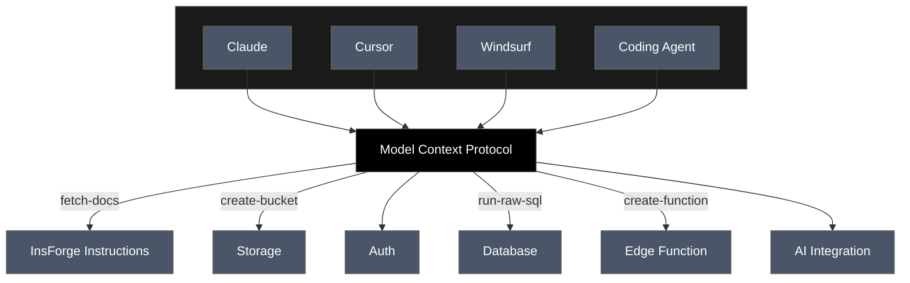

<div align="center">
  <a href="https://insforge.dev">
    <picture>
      <source media="(prefers-color-scheme: dark)" srcset="assets/logo-dark.svg">
      <source media="(prefers-color-scheme: light)" srcset="assets/logo-light.svg">
      
    </picture>
  </a>

  <p>
    <b>InsForge:</b> The backend built for AI-assisted development.<br />
    Connect InsForge with any agent. Add authentication, database, storage, functions, and AI integrations to your app in seconds.
  </p>

  <p>
    <a href="https://opensource.org/licenses/Apache-2.0"></a>
    <a href="https://www.npmjs.com/package/@insforge/sdk"></a>
    <a href="https://github.com/InsForge/insforge/graphs/contributors"></a>
    <a href="https://github.com/InsForge/insforge"></a>
    <a href="https://insforge.dev"></a>
  </p>
  <p>
    <a href="https://x.com/InsForge_dev"></a>
    <a href="https://www.linkedin.com/company/insforge"></a>
    <a href="https://discord.com/invite/MPxwj5xVvW"></a>
  </p>
</div>

## Key Features & Use Cases

### Core Features:
- **Authentication** - Complete user management system
- **Database** - Flexible data storage and retrieval
- **Storage** - File management and organization
- **AI Integration** - Chat completions and image generation (OpenAI-compatible)
- **Serverless Functions** - Scalable compute power
- **Site Deployment** *(coming soon)* - Easy application deployment

### Use Cases: Building full-stack applications using natural language
- **Connect AI agents to InsForge** - Enable Claude, GPT, or other AI agents to manage your backend

## Prompt Examples:

<td align="center">
  
  <br>
</td>

## Quickstart TLDR;

### 1. Install and run InsForge

**Use Docker (Recommended)**  
Prerequisites: [Docker](https://www.docker.com/) + [Node.js](https://nodejs.org/)

```bash
# Run with Docker
git clone https://github.com/insforge/insforge.git
cd insforge
cp .env.example .env
docker compose up
```

### 2. Connect an AI Agent

Visit InsForge Dashboard (default: http://localhost:7131), log in, and follow the "Connect" guide, and set up your MCP.

<div align="center">
  <table>
    <tr>
      <td align="center">
        
        <br>
        <em>Sign in to InsForge</em>
      </td>
      <td align="center">
        
        <br>
        <em>Configure MCP connection</em>
      </td>
    </tr>
  </table>
</div>

### 3. Test the Connection

In your agent, send:
```
I'm using InsForge as my backend platform, fetch InsForge instruction doc to learn more about InsForge.
```

<div align="center">
  
  <br>
  <em>Sample successful response calling insforge MCP tools</em>
</div>

### 4. Start Using InsForge

Start building your project in a new directory! Build your next todo app, Instagram clone, or online platform in seconds!

**Sample Project Prompt:**

"Build an app similar to Reddit with community-based discussion threads using InsForge as the backend platform that has these features:
- Has a "Communities" list where users can browse or create communities
- Each community has its own posts feed
- Users can create posts with a title and body (text or image upload to InsForge storage)
- Users can comment on posts and reply to other comments
- Allows upvoting and downvoting for both posts and comments
- Shows vote counts and comment counts for each post"

## Architecture




## Contributing

**Contributing**: If you're interested in contributing, you can check our guide here [CONTRIBUTING.md](CONTRIBUTING.md). We truly appreciate pull requests, all types of help are appreciated!

**Support**: If you need any help or support, we're responsive on our [Discord channel](https://discord.com/invite/MPxwj5xVvW), and also feel free to email us [info@insforge.dev](mailto:info@insforge.dev) too!


## Documentation & Support

### Documentation
- **[Official Docs](https://docs.insforge.dev/introduction)** - Comprehensive guides and API references

### Community
- **[Discord](https://discord.com/invite/MPxwj5xVvW)** - Join our vibrant community
- **[Twitter](https://x.com/InsForge_dev)** - Follow for updates and tips

### Contact
- **Email**: info@insforge.dev

## License

This project is licensed under the Apache License 2.0 - see the [LICENSE](LICENSE) file for details.

---

[](https://www.star-history.com/#InsForge/insforge&Date)

## Translations

- [Arabic | العربية](/i18n/README.ar.md)
- [Spanish | Español](/i18n/README.es.md)
- [French | Français](/i18n/README.fr.md)
- [Hindi | हिंदी](/i18n/README.hi.md)
- [Japanese | 日本語](/i18n/README.ja.md)
- [Korean | 한국어](/i18n/README.ko.md)
- [Portuguese (Brazilian) / Português Brasileiro](/i18n/README.pt-BR.md)
- [Russian | Русский](/i18n/README.ru.md)
- [Chinese (Simplified) | 简体中文](/i18n/README.zh-CN.md)
