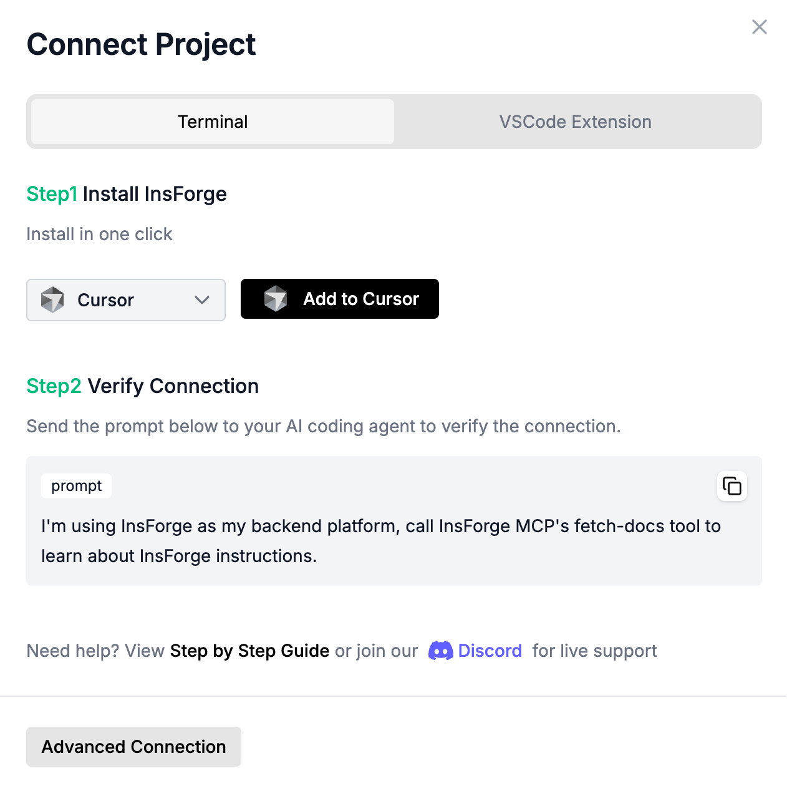

# Deploy InsForge with Docker

## Prerequisites

- Docker and Docker Compose installed on your machine
- Git, to check out the repository

## Setup InsForge

### Step 1: Get the repository

```bash
curl -fsSL https://raw.githubusercontent.com/InsForge/InsForge/main/deploy/setup.sh | sh -s ~/insforge
```

Checks out the files the stack reads and generates `JWT_SECRET`, `ENCRYPTION_KEY`
and `ROOT_ADMIN_PASSWORD` into `.env`. Nothing is started.

<details>
<summary>Prefer not to pipe a script into a shell? Do the same by hand</summary>

```bash
git clone --depth 1 --filter=blob:none --sparse \
  https://github.com/InsForge/InsForge.git ~/insforge
cd ~/insforge
git sparse-checkout set --no-cone \
  /.env.example \
  /docker-compose.minio.yml /docker-compose.rustfs.yml \
  /deploy/setup.sh \
  /deploy/docker-compose/docker-compose.yml \
  /deploy/docker-init/db/

cp .env.example .env
```

Then set `COMPOSE_FILE` in `.env` to `deploy/docker-compose/docker-compose.yml` — the template ships the development value.

</details>

Every service pulls a published image — there is no build step. The checkout is
required because Postgres mounts `deploy/docker-init/db/` from it.

### Step 2: Start InsForge

```bash
cd ~/insforge
docker compose up -d
```

### Step 3: Access InsForge

Open your browser and navigate to `http://localhost:7130`, you can see the InsForge dashboard as below:

<div align="center">
  
</div>

## Running Multiple Instances

You can run multiple InsForge projects on the same host by using different ports and project names.

### Step 1: Create a separate env file for each project

```bash
cp .env.example .env.project1
cp .env.example .env.project2
```

### Step 2: Give each env file its own project name and ports

**.env.project1** (default ports):
```
COMPOSE_PROJECT_NAME=project1
POSTGRES_PORT=5432
POSTGREST_PORT=5430
APP_PORT=7130
AUTH_PORT=7131
DENO_PORT=7133
```

**.env.project2** (different ports):
```
COMPOSE_PROJECT_NAME=project2
POSTGRES_PORT=5442
POSTGREST_PORT=5440
APP_PORT=7230
AUTH_PORT=7231
DENO_PORT=7233
```

Make sure each project has its own `JWT_SECRET` and `ROOT_ADMIN_PASSWORD`.

### Step 3: Start each project

```bash
docker compose --env-file .env.project1 up -d
docker compose --env-file .env.project2 up -d
```

`COMPOSE_PROJECT_NAME` gives each one isolated containers, volumes, and networks; the ports keep them from colliding on the host. Leaving two env files on the same name is what you have to avoid — `docker compose up` with either one adopts and recreates the other's containers.

### Managing multiple instances

```bash
# Check status
docker compose --env-file .env.project1 ps

# View logs
docker compose --env-file .env.project1 logs -f

# Stop an instance
docker compose --env-file .env.project1 down

# Stop and remove all data
docker compose --env-file .env.project1 down -v
```

Each project has its own database, storage, and configuration. They are completely independent.

---

## Start using InsForge

### 1. Connect InsForge MCP

Open [InsForge Dashboard](http://localhost:7130), Follow the steps to connect InsForge MCP Server:

<div align="center">
  
</div>

### 2. Verify installation

To verify the connection, send the following prompt to your agent:
```
I'm using InsForge as my backend platform, call InsForge MCP's fetch-docs tool to learn about InsForge instructions.
```

### 3. Start building your project

Build your next todo app, Instagram clone, or online platform in seconds!

Sample Project Prompt:

```
Build an app similar to Reddit with community-based discussion threads using InsForge as the backend platform that has these features:

- Has a "Communities" list where users can browse or create communities
- Each community has its own posts feed
- Users can create posts with a title and body (text or image upload to InsForge storage)
- Users can comment on posts and reply to other comments
- Allows upvoting and downvoting for both posts and comments
- Shows vote counts and comment counts for each post
```
