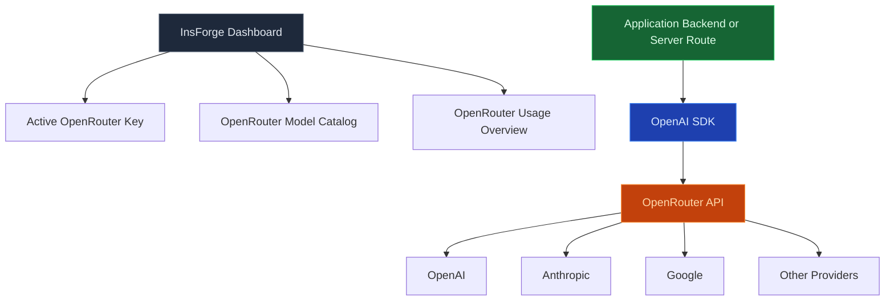

Use the Model Gateway to call chat, streaming, and embedding models through one OpenAI-compatible endpoint. InsForge holds the provider keys, tracks usage per project, and routes traffic through [OpenRouter](https://openrouter.ai), so your application code never sees Anthropic, OpenAI, or Mistral credentials directly.

<Frame caption="One OpenAI-compatible endpoint with per-provider access, ready-to-copy code, and usage tracking.">
  
</Frame>

<Note>
  **Want to run AI code, not call a model?** Use [Edge Functions](/core-concepts/functions/overview) to orchestrate prompts, retrieval, and tools. The Model Gateway is the call; functions are the program around it.
</Note>



## Features

### OpenAI-compatible API

Point any OpenAI SDK or `openai`-compatible library at `https://<project>.insforge.dev/v1` and it works. `/v1/chat/completions`, `/v1/embeddings`, and `/v1/models` all behave like the upstream spec.

### Streaming

Server-sent events for chat completions. Use the streaming endpoint the same way you would with OpenAI; the gateway forwards tokens as they arrive from the provider.

### Embeddings

Generate dense vectors from any embedding model OpenRouter supports. Store the result in Postgres with [pgvector](/core-concepts/database/pgvector) for semantic search.

### Per-project quotas

Each project carries its own rate limit and spend cap. Hit it, and the gateway returns a clean 429 instead of leaking provider quota state into your app.

### Usage tracking

Every request is logged with model, token count, and cost. Query usage from the dashboard, CLI, or MCP — billing reconciles to OpenRouter's invoice automatically.

### Multi-provider routing

Switch between Anthropic, OpenAI, Mistral, Llama, Gemini, and dozens more by changing the model name in the request. Application code does not change.

## Choosing a model

Select a model by setting the `model` field on each request to an OpenRouter model ID in `provider/model` format — for example `openai/gpt-4o`, `anthropic/claude-3.5-haiku`, or `google/gemini-2.5-flash-image`. Switching providers or models is a one-line change; nothing else in the request changes.

Browse the available models in the dashboard model catalog or on [OpenRouter's models page](https://openrouter.ai/models). Self-hosted deployments can also list the catalog over the admin API with `GET /api/ai/models`.

## Provider keys

How you supply the OpenRouter key depends on where InsForge runs. Either way, keep the key server-side — never ship it in a browser bundle.

**InsForge Cloud (managed).** InsForge provisions and manages the OpenRouter key for each project — you don't bring your own. Copy the active key from the InsForge dashboard{/* TODO: confirm dashboard location */}, store it in `OPENROUTER_API_KEY`, and call OpenRouter from trusted server-side code. Setting a custom key over the admin API is rejected on Cloud with `Model Gateway credentials are managed by InsForge Cloud.`

**Self-hosted (bring your own).** Get a key from [openrouter.ai](https://openrouter.ai) and provide it either way:

- Set it in the environment before starting the backend:

  ```bash
  OPENROUTER_API_KEY=sk-or-...
  ```

- Or store it at runtime with the admin API (requires admin auth — your project API Key):

  ```bash
  curl -X PUT "$PROJECT_URL/api/ai/config" \
    -H "Authorization: Bearer $API_KEY" \
    -H "Content-Type: application/json" \
    -d '{ "apiKey": "sk-or-..." }'
  ```

Check the configuration (the key is returned masked) or read the active key back:

```bash
# status: { "apiKey": { "configured": true, "maskedKey": "sk-or-v1••••••••abcd" }, ... }
curl "$PROJECT_URL/api/ai/config" -H "Authorization: Bearer $API_KEY"

# the active OpenRouter key for this instance
curl "$PROJECT_URL/api/ai/openrouter/api-key" -H "Authorization: Bearer $API_KEY"
```

Rotate the key with `POST /api/ai/openrouter/api-key/rotate`. The `/api/ai/config` and `/api/ai/openrouter/*` endpoints are self-hosted only; on Cloud they return the managed-credentials error above.

## Checking usage and credits

Every request is logged with its model, token count, and cost. To see how much you have used in the current billing period — including AI model credits — run the CLI:

```bash
npx @insforge/cli usage
```

It prints your organization and plan, a usage summary table (including an `ai_credits` row), and a per-project breakdown of status, database, storage, and egress. Usage is also visible in the dashboard{/* TODO: confirm dashboard location */} and over MCP. For the credit allowance included with each plan, see [Pricing](/pricing).

## Build with it

<CardGroup cols={2}>
  <Card title="TypeScript SDK" icon="js" href="/sdks/typescript/ai">
    Chat, stream, and embed from Node, browser, and edge runtimes.
  </Card>

  <Card title="Swift SDK" icon="swift" href="/sdks/swift/ai">
    Native Swift AI client for iOS and macOS.
  </Card>

  <Card title="Kotlin SDK" icon="android" href="/sdks/kotlin/ai">
    Coroutines-first AI client for Android and JVM.
  </Card>

  <Card title="REST API" icon="code" href="/sdks/rest/ai">
    Plain HTTP AI endpoints, callable from any language.
  </Card>
</CardGroup>

## Next steps

- Set up the [CLI](/quickstart) to link your project (the recommended path).
- Browse the [TypeScript SDK reference](/sdks/typescript/ai) for chat and embedding patterns.
