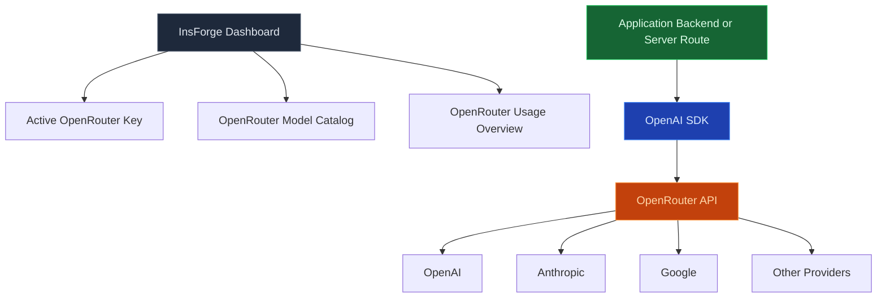

Use the Model Gateway to provision an OpenRouter key for your project, browse the model catalog, and follow spend and per-model usage. Your application calls [OpenRouter](https://openrouter.ai) directly with that key, so one integration reaches chat, streaming, and embedding models from Anthropic, OpenAI, Mistral, Google, and dozens of other providers.

<Frame caption="The Model Gateway page in the dashboard: the active key, per-provider access, ready-to-copy code, and usage charts.">
  
</Frame>

<Note>
  **Want to run AI code, not call a model?** Use [Edge Functions](/core-concepts/functions/overview) to orchestrate prompts, retrieval, and tools. The Model Gateway is the call; functions are the program around it.
</Note>

## Features

### OpenAI-compatible API

Copy the provisioned key from the dashboard into a server-only `OPENROUTER_API_KEY`, then point any OpenAI SDK or `openai`-compatible library at `https://openrouter.ai/api/v1`. The [TypeScript SDK](/sdks/typescript/ai) and [REST](/sdks/rest/ai) references have working snippets.

<Warning>
  The provisioned key is a server-side credential. Keep OpenRouter calls behind a backend route, server action, or Edge Function, and never ship the key in a browser bundle.
</Warning>

### Streaming

Server-sent events for chat completions. Set `stream: true` the way you would with OpenAI, and tokens arrive as the provider produces them.

### Embeddings

Generate dense vectors from any embedding model OpenRouter supports. Store the result in Postgres with [pgvector](/core-concepts/database/pgvector) for semantic search.

### Spend and usage

The Model Gateway page in the dashboard reads your key's activity from OpenRouter: total spend, daily, weekly, and monthly usage, remaining credit and its reset date, and a per-model breakdown.

### Multi-provider routing

Switch between Anthropic, OpenAI, Mistral, Llama, Gemini, and dozens more by changing the model name in the request. Application code does not change.

## Build with it

<CardGroup cols={2}>
  <Card title="TypeScript SDK" icon="js" href="/sdks/typescript/ai">
    Chat, stream, and embed from Node, browser, and edge runtimes.
  </Card>

  <Card title="Swift SDK" icon="swift" href="/sdks/swift/ai">
    Native Swift AI client for iOS and macOS.
  </Card>

  <Card title="Kotlin SDK" icon="android" href="/sdks/kotlin/ai">
    Coroutines-first AI client for Android and JVM.
  </Card>

  <Card title="REST API" icon="code" href="/sdks/rest/ai">
    Plain HTTP AI endpoints, callable from any language.
  </Card>
</CardGroup>

## Next steps

- Set up the [CLI](/quickstart) to link your project (the recommended path).
- Browse the [TypeScript SDK reference](/sdks/typescript/ai) for chat and embedding patterns.
