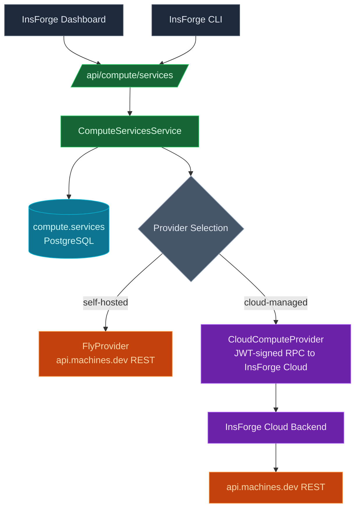

## Overview

Compute lets you deploy a Docker image as a long-running service from your InsForge backend, get a public HTTPS URL, and manage its lifecycle (start/stop/restart, env vars, image updates) from the dashboard or the CLI. Each service runs as a single [Fly.io machine](https://fly.io/docs/machines/) provisioned by InsForge.

This is **not** a serverless platform — services are always-on Fly machines (with optional auto-stop on idle). For event-driven, short-lived code, use [Edge Functions](/core-concepts/functions/architecture) instead.

## Self-Hosted vs Cloud-Managed

Compute supports two execution modes. The OSS distribution selects the mode at startup based on which environment variables are set; you do not pick one in the dashboard.

| Mode | Who owns the Fly account | Trigger | Where billing lands |
|------|-------------------------|---------|---------------------|
| **Self-hosted** | You | `FLY_API_TOKEN` + `FLY_ORG` are set | Your Fly.io account |
| **Cloud-managed** | InsForge Cloud | `PROJECT_ID` + `CLOUD_API_HOST` + `JWT_SECRET` are set (provisioned automatically by InsForge Cloud — operators don't set these by hand) | Your InsForge Cloud invoice |

If you are running OSS InsForge yourself, you are in **self-hosted** mode. The cloud-managed path is what InsForge Cloud uses internally to proxy compute calls through the cloud control plane on behalf of customers — it is not something a self-hoster opts into.

If neither set of variables is configured, the `/api/compute/services` endpoint returns `503 COMPUTE_NOT_CONFIGURED` and the dashboard's Compute page renders a setup card.

## Setting Up Self-Hosted Compute

### 1. Create a Fly account and org

If you do not already have one:

1. Sign up at [fly.io](https://fly.io).
2. Install the [`flyctl` CLI](https://fly.io/docs/flyctl/install/) (only needed once, for token creation and listing orgs).
3. Run `fly orgs list` and pick the org slug you want compute services to live under (typically `personal` for individual accounts).

### 2. Mint an API token

Compute talks to the [Fly Machines REST API](https://docs.machines.dev/) directly. Create an org-scoped deploy token:

```bash
fly tokens create org -o <your-org-slug>
```

Copy the resulting `FlyV1 fm2_…` string.

### 3. Configure the InsForge backend

Add to your `.env`:

```bash
FLY_API_TOKEN=FlyV1 fm2_lJ…    # the token from step 2 — keep the FlyV1 prefix
FLY_ORG=personal                # or your org slug from step 1
```

Optional:

```bash
COMPUTE_DOMAIN=compute.example.com   # custom domain for service endpoints (defaults to fly.dev)
```

Restart the backend container so the new env is picked up. The Compute item appears in the dashboard sidebar once the metadata route reports the feature as configured.

### 4. Verify

```bash
curl -H "Authorization: Bearer <admin-token>" \
     http://localhost:7130/api/compute/services
# → []   (empty array on first run, not 503)
```

## Deploying a Service

### From the CLI

The OSS [InsForge CLI](https://github.com/InsForge/CLI) is the recommended path — it handles image push, env var encryption, and polling for `running` status.

```bash
insforge compute deploy \
  --name my-api \
  --image nginx:alpine \
  --port 80 \
  --cpu shared-1x \
  --memory 256 \
  --region iad
```

To deploy from local source instead of a pre-built image, drop the `--image` flag and point `--dockerfile` at a Dockerfile; the CLI will run a Fly remote build and push the resulting image to `registry.fly.io`.

### From the dashboard

The **Compute** page exposes the same deploy flow as a dialog: name, image URL, port, CPU profile, memory, region, and env vars.

### Service lifecycle states

| Status | Meaning |
|--------|---------|
| `creating` | DB row inserted, Fly app being created |
| `deploying` | Fly app exists; machine launch in progress |
| `running` | Machine is up and serving traffic |
| `stopped` | User stopped the machine; row + Fly app retained |
| `failed` | A deploy step errored; check `compute events <id>` |
| `destroying` | Delete in progress |
| `destroyed` | Row deleted; Fly app destroyed |

`compute events <id>` returns Fly machine lifecycle events (start/stop/exit/restart). Container stdout/stderr streaming is roadmap work — see the [feature gap notes](#limitations) below.

## Architecture



### Provider selection

`selectComputeProvider()` runs once when `ComputeServicesService` is first instantiated and never changes for the lifetime of the process:

1. **Fly takes precedence.** If `FLY_API_TOKEN` is set, the self-hosted path is selected. A missing or empty `FLY_ORG` is logged as a warning at this point — Fly's API will reject requests without a valid org slug.
2. **Cloud fallback.** Otherwise, if `PROJECT_ID` (≠ `local`), `CLOUD_API_HOST`, and `JWT_SECRET` are all set, the cloud-proxy path is selected.
3. **Neither.** Throws `503 COMPUTE_NOT_CONFIGURED`.

### App naming

Fly apps are named `<service-name>-<projectId>` (truncated to 60 chars with a SHA-256 suffix when the combined length would overflow). The endpoint URL defaults to `https://<app-name>.fly.dev` unless `COMPUTE_DOMAIN` is set.

### Env var storage

Env vars set on a service are encrypted at rest using `EncryptionManager` (AES-256-GCM, key derived from `ENCRYPTION_KEY` or `JWT_SECRET`) and stored in `compute.services.env_vars_encrypted`. They are forwarded to the Fly machine as plaintext at launch time only; the dashboard's GET path never returns env values, only the keys. Partial updates are supported via `envVarsPatch: { set, unset }` so rotating one secret does not require re-stating the other six.

## Database Schema

```sql
CREATE SCHEMA IF NOT EXISTS compute;

CREATE TABLE compute.services (
  id UUID DEFAULT gen_random_uuid() PRIMARY KEY,
  project_id TEXT NOT NULL,
  name TEXT NOT NULL,
  image_url TEXT NOT NULL,
  port INT NOT NULL,
  cpu TEXT NOT NULL,           -- 'shared-1x' | 'shared-2x' | 'performance-1x' | …
  memory INT NOT NULL,         -- MB
  region TEXT NOT NULL,        -- Fly region code (e.g. 'iad', 'sjc')
  fly_app_id TEXT,
  fly_machine_id TEXT,
  status TEXT NOT NULL,
  endpoint_url TEXT,
  env_vars_encrypted TEXT,     -- AES-256-GCM ciphertext
  created_at TIMESTAMPTZ DEFAULT NOW(),
  updated_at TIMESTAMPTZ DEFAULT NOW(),
  UNIQUE (project_id, name)
);
```

Migration: `038_create-compute-services.sql`.

## API Endpoints

All endpoints require the project admin token.

| Method | Endpoint | Description |
|--------|----------|-------------|
| GET | `/api/compute/services` | List services in the current project |
| GET | `/api/compute/services/:id` | Get one service (excludes env values) |
| POST | `/api/compute/services` | Create + launch a service in one call |
| POST | `/api/compute/services/deploy` | Create the Fly app without launching a machine (CLI uses this when running `flyctl remote build`) |
| POST | `/api/compute/services/:id/deploy-token` | Issue a short-lived Fly deploy token (cloud-managed only) |
| PATCH | `/api/compute/services/:id` | Update image, port, env, etc. Mutually exclusive: `envVars` (replace) vs `envVarsPatch` (set/unset) |
| POST | `/api/compute/services/:id/start` | Start a stopped machine |
| POST | `/api/compute/services/:id/stop` | Stop the machine; row + Fly app retained |
| DELETE | `/api/compute/services/:id` | Destroy the machine, app, and DB row. Returns an audit snapshot. |
| GET | `/api/compute/services/:id/events` | Fly machine lifecycle events (`start`/`stop`/`exit`/`restart`); not stdout/stderr |

## Environment Variables

| Variable | Required for self-host | Description |
|----------|----------------------|-------------|
| `FLY_API_TOKEN` | yes | Org-scoped deploy token (`FlyV1 fm2_…`). Mint with `fly tokens create org`. |
| `FLY_ORG` | yes | Fly org slug, e.g. `personal`. Get with `fly orgs list`. |
| `COMPUTE_DOMAIN` | no | Custom domain for endpoint URLs. Defaults to `fly.dev`. |
| `ENCRYPTION_KEY` | recommended | AES-256-GCM key for env-var encryption. Falls back to `JWT_SECRET` — **rotating `JWT_SECRET` without a dedicated `ENCRYPTION_KEY` corrupts all stored env vars.** |

The cloud-managed path uses a different set of variables (`PROJECT_ID`, `CLOUD_API_HOST`, `JWT_SECRET`) — operators on InsForge Cloud have these provisioned automatically and do not need to set them by hand.

## Limitations

<CardGroup cols={2}>
  <Card title="No container logs yet" icon="terminal">
    `compute events` returns Fly machine lifecycle events (start/stop/exit). Streaming container stdout/stderr is roadmap work and will reuse the now-vacated `compute logs` command name when it ships.
  </Card>

  <Card title="Single machine per service" icon="server">
    Each service runs as exactly one Fly machine. Multi-region replicas, autoscale, and process groups are not yet exposed.
  </Card>

  <Card title="Cron and one-shot tasks" icon="clock">
    The current API only models long-running services. Scheduled tasks and one-shot jobs are tracked separately on the `feat/compute` branch and not yet in main.
  </Card>

  <Card title="No BYOK in the dashboard" icon="key">
    `FLY_API_TOKEN` is read from the environment only. There is no in-dashboard token entry form (unlike Model Gateway BYOK).
  </Card>
</CardGroup>

## Troubleshooting

### "Compute services not configured"

The metadata route reports `compute.enabled = false`. Either `FLY_API_TOKEN` is empty or `FLY_ORG` is empty (a missing org slug logs a warning at provider-selection time but the feature still appears off because Fly will reject every request). Set both, restart the container.

### `unauthorized` from Fly

The token does not match the org. `FLY_ORG` must be the slug shown by `fly orgs list`, not a display name.

### Service stuck in `creating`

Check `/api/compute/services/:id/events` for the Fly machine's last lifecycle event. The most common cause is an image that fails to pull (private registry without `imagePullSecrets`) or a port mismatch between the container's `EXPOSE` and the `--port` flag.
