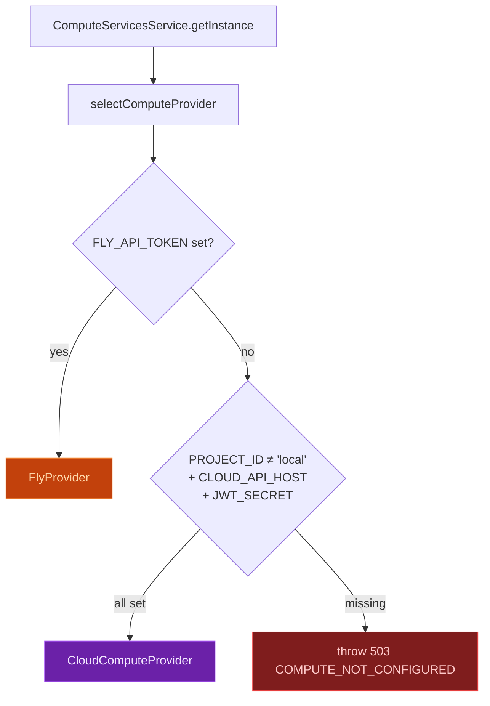
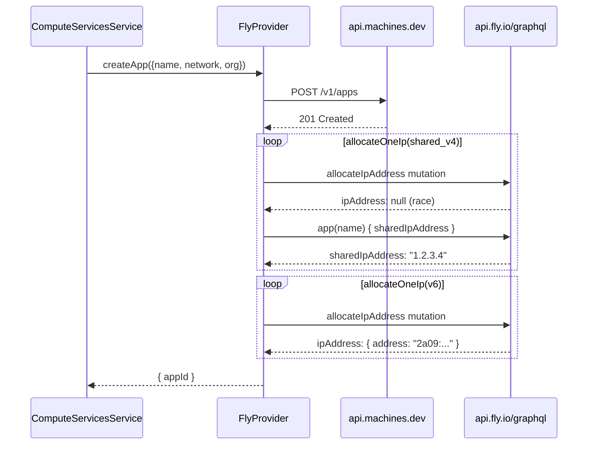
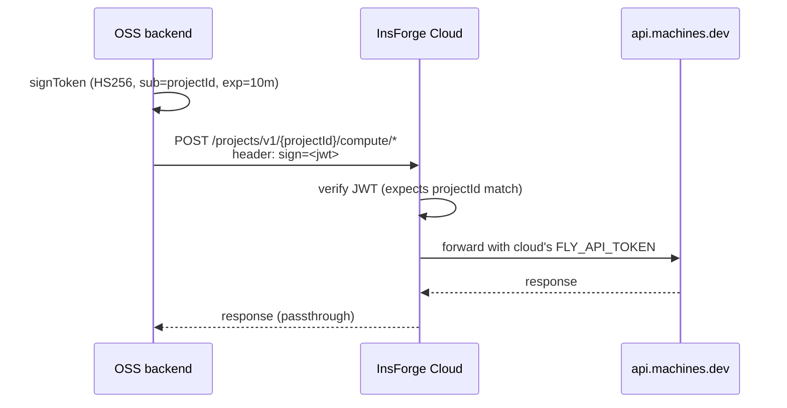
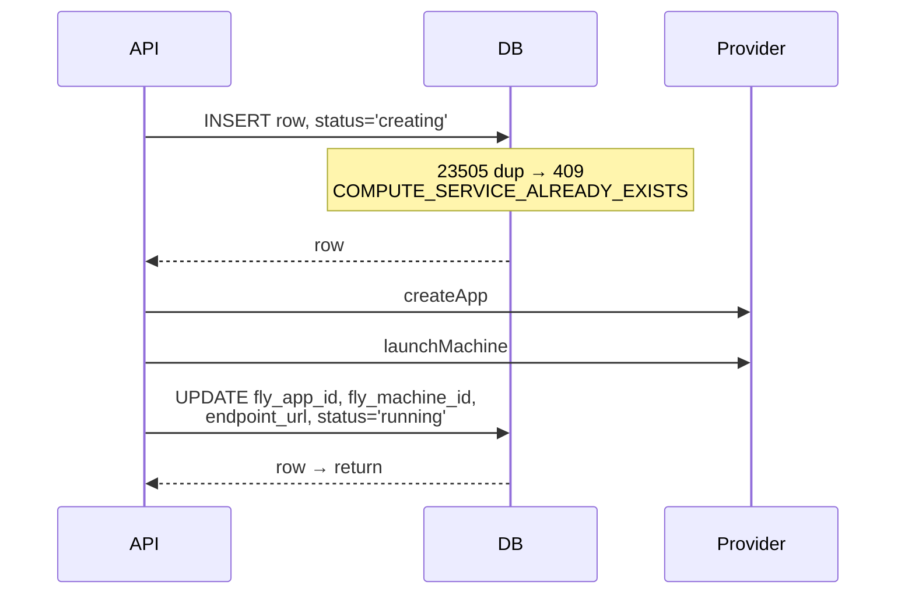
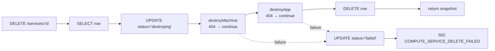
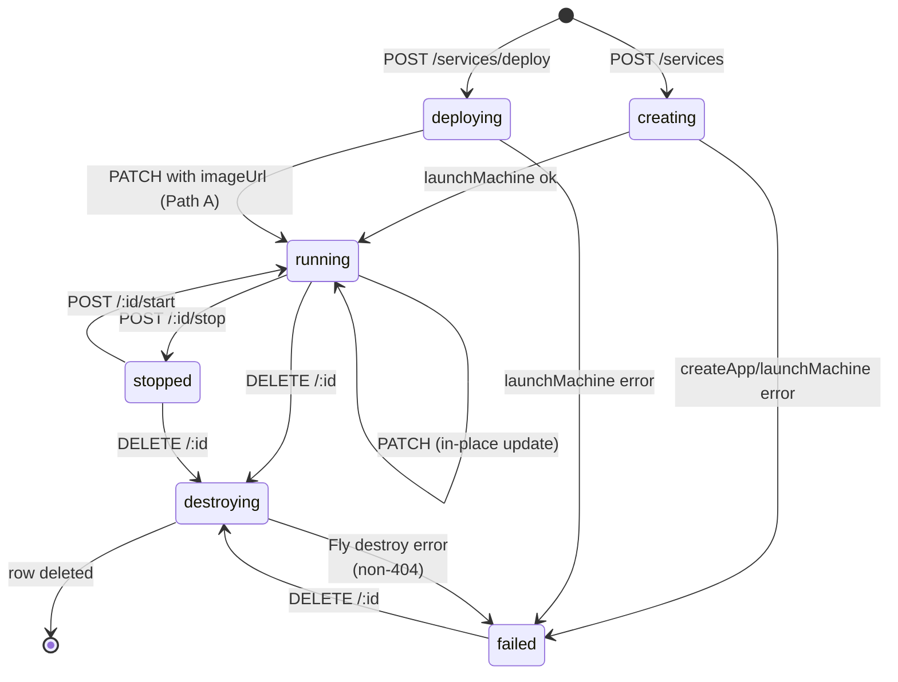

This page is the deep dive for operators and contributors. For "what is Compute and how do I turn it on," start with the [architecture overview](/core-concepts/compute/architecture).

## Provider Abstraction

The compute system has a single integration point — the [`ComputeProvider`](https://github.com/InsForge/InsForge/blob/main/backend/src/providers/compute/compute.provider.ts) interface — and two implementations.

```ts
interface ComputeProvider {
  isConfigured(): boolean;
  createApp(p: { name; network; org }): Promise<{ appId }>;
  destroyApp(appId): Promise<void>;
  launchMachine(p: LaunchMachineParams): Promise<{ machineId }>;
  updateMachine(p: UpdateMachineParams): Promise<void>;
  stopMachine(appId, machineId): Promise<void>;
  startMachine(appId, machineId): Promise<void>;
  destroyMachine(appId, machineId): Promise<void>;
  listMachines(appId): Promise<MachineSummary[]>;
  getMachineStatus(appId, machineId): Promise<{ state }>;
  getEvents(appId, machineId, opts?): Promise<ComputeEvent[]>;
  waitForState(appId, machineId, targetStates, timeoutMs?): Promise<string>;
}
```

`selectComputeProvider()` runs **once** at the time `ComputeServicesService` is first instantiated. The chosen provider lives on a `private readonly` field for the lifetime of the process — switching modes requires a backend restart.



A missing `FLY_ORG` while `FLY_API_TOKEN` is set still chooses `FlyProvider` but emits a startup warning — the next API call to Fly will return `401 unauthorized` because Fly cannot tell which org to act in.

## FlyProvider: REST Contract

`FlyProvider` talks directly to the [Fly Machines REST API](https://docs.machines.dev/) at `https://api.machines.dev/v1`. The `Authorization: Bearer <FLY_API_TOKEN>` header carries an org-scoped deploy token (`FlyV1 fm2_…`).

### Create app + IP allocation

`POST /v1/apps` only creates the app shell. To make the app reachable on the public internet, two IPs must be allocated separately (Fly does not auto-allocate on app create):



Two non-obvious mechanics live in this path:

| Mechanic | Why |
|----------|-----|
| **Retry loop in `allocateOneIp`** | When called immediately after `POST /apps`, Fly's GraphQL returns `{ipAddress: null}` with no `errors` field — the response looks successful but no allocation happened. Five attempts with linear backoff (1s, 2s, 3s, 4s, 5s) catch the eventual write through Fly's internal store. |
| **`shared_v4` follow-up query** | Shared IPv4 is an org-level address; Fly returns `null` from the mutation and instead flips a flag on the app. The provider verifies via a separate `app(name) { sharedIpAddress }` query before declaring success. Without this the app would be marked IPv6-only and IPv4-only clients would `NXDOMAIN` the `.fly.dev` URL. |

### Launch + update machines

`POST /v1/apps/{app}/machines` launches a machine; the body wraps a [Fly machine config](https://docs.machines.dev/#tag/Apps/operation/Machines_create) with three opinions InsForge bakes in:

```json
{
  "config": {
    "image": "<image url>",
    "guest": { "cpu_kind": "shared|performance", "cpus": <N>, "memory_mb": <MB> },
    "env": { ... },
    "services": [{
      "ports": [
        { "port": 443, "handlers": ["tls", "http"] },
        { "port": 80,  "handlers": ["http"] }
      ],
      "internal_port": <user-port>,
      "protocol": "tcp"
    }]
  },
  "region": "iad"
}
```

- **Always TCP, always 80 + 443.** The user picks `internal_port`; Fly terminates TLS at 443 and serves a `301`-style redirect from 80. UDP / non-HTTP services are not yet exposed.
- **No restart policy override.** Default Fly behavior (auto-restart on crash) applies.
- **No volumes.** Stateless services only; persistent storage is roadmap work.

`POST /v1/apps/{app}/machines/{id}` (yes, POST not PATCH) updates the same shape. `updateMachine` is used for in-place image / port / env / CPU / memory changes; the machine restarts but keeps its `machine_id` and IP. Region cannot change in-place — that constraint is enforced at the service layer (see [updateService](#updateservice)).

### CPU tier parsing

`mapCpuTier` parses Fly's `<kind>-<N>x` pattern with a single regex:

```ts
const m = /^(shared|performance)-([1-9]\d*)x$/.exec(cpu);
if (!m) return { cpu_kind: 'shared', cpus: 1, memory_mb: memory };
return { cpu_kind: m[1], cpus: parseInt(m[2], 10), memory_mb: memory };
```

There is no hardcoded allow-list. Fly is the source of truth for which sizes exist; an unsupported combination returns a clean Fly 4xx at machine-create time. A typo in the input (e.g. `shared-1` without the `x`) silently falls back to `shared-1x` rather than crashing the deploy.

### Destroying machines

`DELETE /v1/apps/{app}/machines/{id}?force=true` is used unconditionally. Without `force=true` Fly returns `412 failed_precondition` for any running machine, which would 502 the caller's delete and leave the Fly app + DB row orphaned. The force flag costs nothing for already-stopped machines.

### Events ≠ logs

`getEvents` returns Fly's machine **lifecycle** events from `GET /v1/apps/{app}/machines/{id}/events` — `start`, `stop`, `exit`, `restart`. The provider folds Fly's structured event into a flat `[<source>] <type>: <status>` string. **Container stdout/stderr is a separate Fly NATS log stream and is not yet integrated.** `compute logs` was renamed to `compute events` in the CLI to reflect this distinction; the `logs` command name is reserved for the future container-log integration.

## CloudComputeProvider: JWT-Signed RPC

When InsForge runs as a cloud-managed customer project, the OSS instance does not hold a Fly token. Instead it proxies every compute call through the InsForge cloud control plane.



| Detail | Value |
|--------|-------|
| **Sign algorithm** | HS256 with `JWT_SECRET` |
| **Claims** | `{ sub: PROJECT_ID }`, 10-minute expiry |
| **Header** | `sign: <jwt>` (not `Authorization`) |
| **Timeout** | 60s per call (was 15s — caused false-positive `COMPUTE_CLOUD_UNAVAILABLE` and orphaned Fly resources during slow `launchMachine` calls; bump to 60s covered the 15–25s tail) |
| **Error mapping** | Network failure → `503 COMPUTE_CLOUD_UNAVAILABLE`. Non-2xx HTTP from cloud → `COMPUTE_PROVIDER_ERROR` with the cloud's status passed through. `signToken` failure → surfaces `COMPUTE_NOT_CONFIGURED` (config-level, not network-level). |

### Deploy token issuance

The cloud-managed path has one method that does not exist on `FlyProvider`: `issueDeployToken`. The CLI uses it so `compute deploy` can run `flyctl` (for the remote-build push to `registry.fly.io`) without the user holding their own `FLY_API_TOKEN`.

```
POST /projects/v1/{projectId}/compute/apps/{appId}/deploy-token
→ { token: "FlyV1 fm2_...", expirySeconds: 1200 }
```

The cloud mints the token using its own org-scoped `FLY_API_TOKEN`. Token is scoped to **one app** and expires in 20 minutes. Self-hosters do not need this endpoint — they already have a Fly token in `.env`.

The previous implementation shelled out to `flyctl tokens attenuate` inside the cloud's container; it now uses Fly's native `POST /v1/apps/{app}/deploy_token` REST endpoint instead, dropping a 10 MB binary dependency and ~50ms of subprocess startup latency per call.

## Service-Layer Orchestration

`ComputeServicesService` sits between the HTTP routes and the provider. Every method follows a "DB write → provider call → DB write" sandwich, with rollback on partial failure.

### App naming + network isolation

Fly app names are project-scoped:

```ts
makeFlyAppName(serviceName, projectId)
// → "<serviceName>-<projectId>", or
// → "<truncated-name>-<6-char-sha256>-<projectId>" if combined > 60 chars
```

The network is `<projectId>-network` — every service in the same project shares one Fly private network, but services across projects are isolated.

The endpoint URL defaults to `https://<flyAppName>.fly.dev` and falls through to `https://<flyAppName>.<COMPUTE_DOMAIN>` when set. We deliberately **don't** synthesize a vanity domain at the dashboard level — operators who haven't set up `COMPUTE_DOMAIN` get a URL that actually resolves instead of a misleading one.

### `createService` — image-mode immediate launch

The simple path: image already exists in a registry, launch in one shot.



If `createApp` or `launchMachine` throws, the catch block destroys whatever Fly resources got created (machine first, then app) and flips status to `failed`. The DB row is **kept** so the operator can see the failure in the dashboard; the Fly side is cleaned up to stop billing.

### `prepareForDeploy` + `updateService` — source-mode (Path A)

When the user runs `insforge compute deploy` against a Dockerfile, the CLI cannot know the final image URL until `flyctl deploy --build-only --push` finishes the remote build. The flow is:

```mermaid
sequenceDiagram
    participant CLI
    participant API
    participant DB
    participant Fly as Provider

    CLI->>API: POST /compute/services/deploy
    API->>DB: INSERT, status='deploying',<br/>fly_app_id=<name>, fly_machine_id=NULL
    API->>Fly: createApp (idempotent on 422 'already exists')
    API-->>CLI: { id, flyAppId, ... }

    CLI->>API: POST /compute/services/<id>/deploy-token (cloud-only)
    API-->>CLI: { token: 'FlyV1 fm2_...' }

    CLI->>CLI: flyctl deploy --build-only --push<br/>→ registry.fly.io/&lt;app&gt;:&lt;sha&gt;

    CLI->>API: PATCH /compute/services/&lt;id&gt; { imageUrl }
    API->>Fly: launchMachine (Path A — first launch)
    API->>DB: UPDATE fly_machine_id, status='running'<br/>WHERE id=$1 AND fly_machine_id IS NULL
    Note over DB: optimistic lock<br/>(see launch-race below)
```

`prepareForDeploy` tolerates "app already exists" (422) so the CLI can retry safely after a transient network blip. Other failures (including IP allocation timeout) destroy the partially-created Fly app and the DB row.

### Launch-race optimistic lock

A subtle case in `updateService`: when the CLI double-clicks the deploy button or retries on a flaky network, two concurrent `PATCH` calls can race past the "no machine yet" check, both call `launchMachine`, and both end up holding a freshly-created Fly machine. Without a guard, the second writer would silently overwrite `fly_machine_id` and the first machine would orphan.

The fix is an optimistic lock at the final UPDATE:

```sql
UPDATE compute.services
SET fly_machine_id = $N, status = 'running', endpoint_url = $M, ...
WHERE id = $X AND fly_machine_id IS NULL
RETURNING *;
```

If `RETURNING *` is empty, the loser knows it lost the race. It then calls `destroyMachine` on the orphan it just created and re-fetches the row to return the winner's state. Best-effort: even if the destroy itself fails, returning the current row is still correct because the winning machine is healthy.

### `updateService` — in-place updates

Once a machine exists (`fly_machine_id IS NOT NULL`), updates fan out by field type:

| Field | Effect |
|-------|--------|
| `imageUrl` / `port` / `cpu` / `memory` / `envVars` | `updateMachine` on Fly **first**, then DB write. Ordering matters: a Fly failure must not leave the DB ahead of reality. |
| `region` | `400 COMPUTE_REGION_CHANGE_NOT_SUPPORTED` if the machine already exists. Region is persisted only on first deploy because Fly cannot move machines in-place. |
| `envVarsPatch` | Resolved to a full `envVars` map at the start of `updateService` (decrypt current + apply set/unset), then everything else flows through unchanged. The CLI sends a sparse patch; the storage layer keeps writing one full encrypted blob. |

`envVars` and `envVarsPatch` are mutually exclusive — enforced at both the route schema and the service layer.

### `deleteService` + audit snapshot

Delete is destructive and irreversible at the Fly side, so the response includes an `auditSnapshot` containing the row state at delete time, **including the still-encrypted env-vars blob**. The route writes this snapshot into the audit log so a future restore path can re-deploy the same service with the same secrets without ever exposing them in plaintext to the audit reader.



404s are treated as success — if the Fly resource is already gone (out-of-band cleanup, partial previous delete), the DB row still drops cleanly. Any other Fly error aborts and pins the row at `failed` so the operator can investigate.

## Env-Var Encryption

Env vars set on a service are encrypted at rest in `compute.services.env_vars_encrypted`:

| Property | Value |
|----------|-------|
| **Algorithm** | AES-256-GCM |
| **Key** | `sha256(ENCRYPTION_KEY)` (preferred) or `sha256(JWT_SECRET)` (fallback, with startup warning) |
| **Storage format** | `<iv-hex>:<authTag-hex>:<ciphertext-hex>` — single TEXT column |
| **GET path** | Returns key names only, never plaintext values |
| **Forward to Fly** | Decrypted at `launchMachine`/`updateMachine` time and passed in the machine config; lives in Fly's machine state from then on |

<Warning>
**Rotating `JWT_SECRET` without setting a dedicated `ENCRYPTION_KEY` corrupts every stored env-vars blob across the database** — not just compute. `JWT_SECRET` is used by auth tokens, function secrets, and (as fallback) the encryption manager. If you must rotate it, set `ENCRYPTION_KEY` to a separate value first and redeploy, then rotate `JWT_SECRET`.
</Warning>

## Status State Machine



CHECK constraint enforces the set: `status IN ('creating', 'deploying', 'running', 'stopped', 'failed', 'destroying')`. The terminal `destroyed` state from the SDK schema is not stored — it's the absence of a row.

## Database Schema

```sql
CREATE SCHEMA IF NOT EXISTS compute;

CREATE TABLE compute.services (
  id                  UUID PRIMARY KEY DEFAULT gen_random_uuid(),
  project_id          TEXT NOT NULL,
  name                TEXT NOT NULL,
  image_url           TEXT NOT NULL,
  port                INT  NOT NULL DEFAULT 8080 CHECK (port BETWEEN 1 AND 65535),
  cpu                 TEXT NOT NULL DEFAULT 'shared-1x',
  memory              INT  NOT NULL DEFAULT 512,
  env_vars_encrypted  TEXT,
  region              TEXT NOT NULL DEFAULT 'iad',
  fly_app_id          TEXT,
  fly_machine_id      TEXT,
  status              TEXT NOT NULL DEFAULT 'creating'
                      CHECK (status IN ('creating','deploying','running','stopped','failed','destroying')),
  endpoint_url        TEXT,
  created_at          TIMESTAMPTZ NOT NULL DEFAULT NOW(),
  updated_at          TIMESTAMPTZ NOT NULL DEFAULT NOW(),
  UNIQUE (project_id, name)
);

CREATE INDEX idx_compute_services_project ON compute.services(project_id);
CREATE INDEX idx_compute_services_status  ON compute.services(status);

CREATE TRIGGER update_compute_services_updated_at
  BEFORE UPDATE ON compute.services
  FOR EACH ROW EXECUTE FUNCTION system.update_updated_at();
```

Migration: `038_create-compute-services.sql`. The `(project_id, name)` uniqueness is what surfaces as `409 COMPUTE_SERVICE_ALREADY_EXISTS` when the INSERT trips Postgres error code `23505`.

## Failure Modes

| Symptom | Likely cause | Where to look |
|---------|--------------|---------------|
| `503 COMPUTE_NOT_CONFIGURED` on every call | Neither Fly nor cloud creds set | `selectComputeProvider` log line at startup |
| `401 unauthorized` from Fly | `FLY_ORG` is empty or wrong slug | Startup warning from `selectComputeProvider`; verify with `fly orgs list` |
| Service stuck in `creating` | `createApp` succeeded but `launchMachine` is blocked on the image pull | `getEvents` returns Fly's last lifecycle event; private registries need `imagePullSecrets` config (not yet exposed) |
| Service stuck in `deploying` | CLI never followed up with the PATCH (build failed before push, network blip) | `services.status` + absence of `fly_machine_id`; CLI logs |
| `COMPUTE_CLOUD_UNAVAILABLE` (cloud-managed only) | Cloud control plane unreachable, or call took longer than 60s | OSS backend logs for the AbortSignal timeout; cloud backend health |
| `COMPUTE_REGION_CHANGE_NOT_SUPPORTED` | PATCH tried to change `region` after the machine exists | Delete + redeploy in the new region |
| Orphaned Fly app under your org | Pre-rollback bug (≤ v2.1.0) where `prepareForDeploy` IP-allocation failure left the app behind | Fixed in fb3e3a19 — recent failures should self-clean |

## Observability

| Source | What to look at |
|--------|-----------------|
| Backend logs | Every `compute service deployed/stopped/started/deleted` line includes `serviceId`, `flyAppName`, and (where applicable) `machineId`. Failures log `error` with the original Fly response body. |
| `compute.services` table | Snapshot of every service's last-known state. `status='failed'` rows are not auto-cleaned — operators decide whether to retry or delete. |
| `audit_logs` table | One entry per CREATE / UPDATE / DELETE / STOP / START. `envVarsPatch` audit entries log only the **set/unset key names**, never values. DELETE audit entries embed the `auditSnapshot` (with encrypted env blob). |
| `getEvents` API | Fly machine lifecycle from the last 100 events, surfaced via `compute events <id>`. |

## Comparison: Self-Hosted vs Cloud-Managed

| Aspect | Self-hosted (`FlyProvider`) | Cloud-managed (`CloudComputeProvider`) |
|--------|-----------------------------|----------------------------------------|
| **Fly account** | Yours | InsForge's |
| **Fly token storage** | `FLY_API_TOKEN` in your `.env` | Cloud's secret store, never reaches OSS |
| **Networking** | Direct HTTPS to `api.machines.dev` | HTTPS to InsForge cloud, proxied to Fly |
| **Latency overhead** | One round trip | Two round trips (OSS → cloud → Fly) |
| **Deploy token endpoint** | Not needed (CLI uses your `FLY_API_TOKEN`) | `POST /:id/deploy-token` mints 20-min app-scoped tokens |
| **Billing** | Your Fly invoice | Your InsForge Cloud invoice |
| **IP allocation** | Done by OSS provider directly via Fly GraphQL | Done by cloud backend |
| **Per-call timeout** | Fly's own (no AbortSignal) | 60s AbortSignal in OSS |
| **Failure surface** | `Fly API error (xxx): <body>` | `COMPUTE_PROVIDER_ERROR` (cloud passthrough) or `COMPUTE_CLOUD_UNAVAILABLE` (network) |
