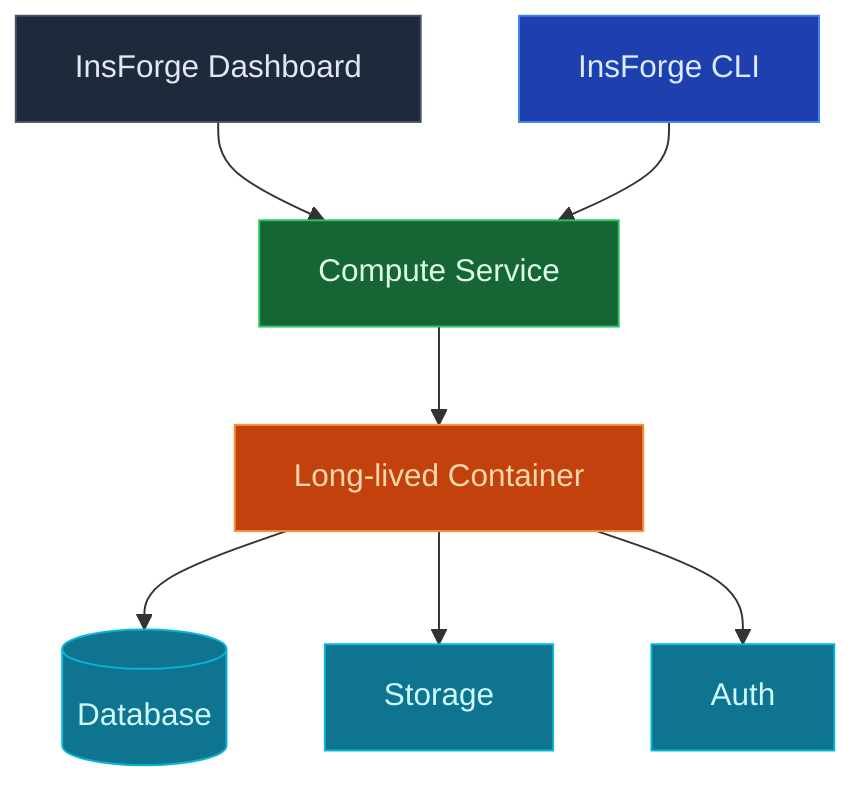

Use InsForge Custom Compute to run long-lived containers next to your project: queue workers, background processors, AI inference loops, websocket servers, scrapers, anything that needs to stay up. Containers attach to your project's database, storage, and auth with the same credentials a function would use.

<Note>
  **Just need to handle a request?** Use [Edge Functions](/core-concepts/functions/overview) for request/response work and short jobs. Custom Compute is for processes that need to run continuously.
</Note>

## Features

### Container deploys

Push any Docker image to InsForge and it runs. Use a `Dockerfile` from your repo or point at a pre-built image on a registry. No proprietary build pipeline to learn.

### Project-linked credentials

Containers receive the InsForge project URL, service-role JWT, and S3 storage credentials as environment variables. Connect to Postgres, call the SDK, and read objects without provisioning anything.

### Scaling

Run one instance for a singleton worker, or scale horizontally for stateless workloads. Memory, CPU, and replica count are configurable per service.

### Logs

Structured logs per container, queryable by service and time range. Tail in the dashboard, CLI, or MCP without `kubectl exec`-ing into anything.

### Secrets and env vars

Set environment variables and secrets per service, separately from your edge-function secrets. Rotate without redeploying.

## Self-hosting: enable compute

Custom Compute runs your containers on [Fly.io](https://fly.io). On InsForge Cloud this is fully managed and you configure nothing. When you self-host, you bring your own Fly account and turn compute on with two environment variables in your `.env`:

- `FLY_API_TOKEN`: a Fly.io API token, created with `fly tokens create org`. InsForge uses it to create and manage your compute containers.
- `FLY_ORG`: your Fly organization slug, from `fly orgs list`. This is the org the containers are created in.

Both are required. A token with no org has nothing to authenticate against, and an org with no token can't be called. Set them, then restart the container. Until both are present, compute endpoints return `503 COMPUTE_NOT_CONFIGURED`.

## Next steps

- Set up the [CLI](/quickstart) to link your project (the recommended path).
- See [Edge Functions](/core-concepts/functions/overview) if request/response is all you need.
