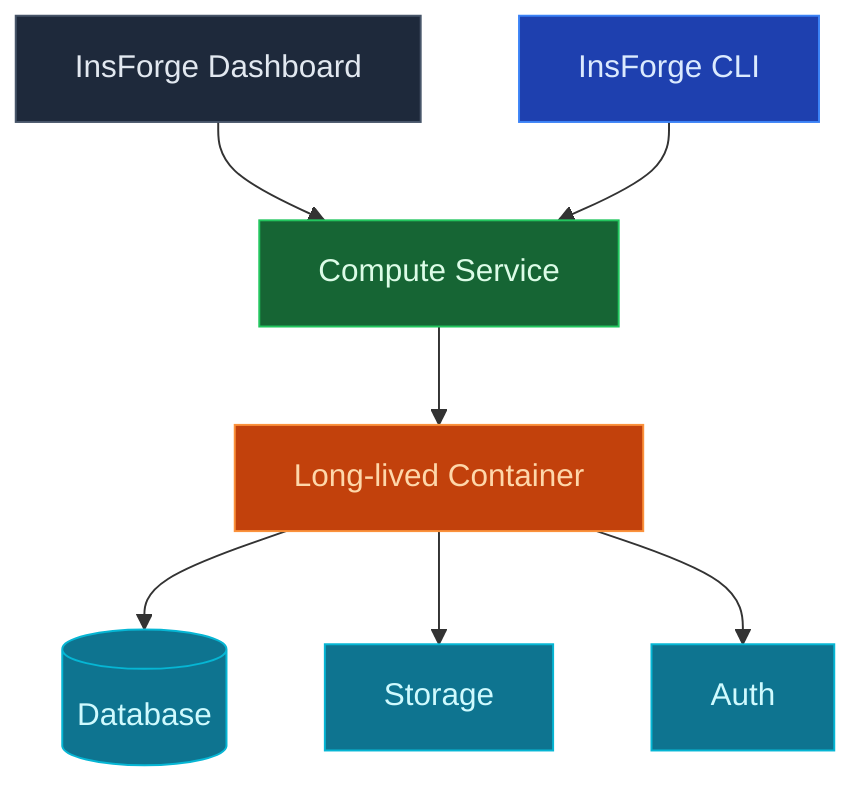

Use InsForge Custom Compute to run long-lived containers next to your project: queue workers, background processors, AI inference loops, websocket servers, scrapers, anything that needs to stay up.

<Note>
  **Just need to handle a request?** Use [Edge Functions](/core-concepts/functions/overview) for request/response work and short jobs. Custom Compute is for processes that need to run continuously.
</Note>


```mermaid
graph TB
    Dashboard[InsForge Dashboard] --> Service[Compute Service]
    CLI[InsForge CLI] --> Service

    Service --> Container[Long-lived Container]

    Container --> DB[(Database)]
    Container --> Storage[Storage]
    Container --> Auth[Auth]

    style Dashboard fill:#1e293b,stroke:#475569,color:#e2e8f0
    style CLI fill:#1e40af,stroke:#3b82f6,color:#dbeafe
    style Service fill:#166534,stroke:#22c55e,color:#dcfce7
    style Container fill:#c2410c,stroke:#fb923c,color:#fed7aa
    style DB fill:#0e7490,stroke:#06b6d4,color:#cffafe
    style Storage fill:#0e7490,stroke:#06b6d4,color:#cffafe
    style Auth fill:#0e7490,stroke:#06b6d4,color:#cffafe
```

## Features

### Container deploys

Push any Docker image to InsForge and it runs. Point at a pre-built image on a registry, or upload a build context and let InsForge build it from your `Dockerfile`. No proprietary build pipeline to learn.

### Reaching your project

Set the credentials your container needs as environment variables on the service — the project URL, an API key, S3 credentials, whatever the workload uses. Nothing is injected for you, so you decide exactly what the container can reach.

When you self-host, compute containers join your project's own network by default, so `postgres:5432` and `postgrest:3000` resolve by name from inside the container exactly as they do for edge functions — no public round trip.

### Resources

Memory and CPU are configurable per service. Each service runs one instance; run several services if you need several workers.

### Logs

Structured logs per container, queryable by service and time range. Tail in the dashboard, CLI, or MCP without `kubectl exec`-ing into anything.

### Secrets and env vars

Set environment variables and secrets per service, separately from your edge-function secrets. Rotate without redeploying.

<Warning>
  **No persistent volumes yet.** Container state survives restarts and host reboots, but changing the image, environment variables, or port recreates the container and discards anything written inside it. Use your project's Postgres or Storage for data you need to keep.
</Warning>

## Self-hosting: enable compute

On InsForge Cloud, compute is fully managed and you configure nothing. When you self-host, you choose where containers run. Two providers are available, and until one is configured the compute endpoints return `503 COMPUTE_NOT_CONFIGURED`.

<Tabs>
  <Tab title="Docker (your own host)">
    Containers run on the same Docker daemon that runs InsForge, as siblings of the InsForge container. Nothing to sign up for, and no per-container bill.

    Enabling it is a single deliberate act: mount the Docker socket into the InsForge container. In your compose file, uncomment the line that is already there for this:

    ```yaml
    services:
      insforge:
        volumes:
          - ${DOCKER_SOCKET_PATH:-/var/run/docker.sock}:${DOCKER_SOCKET_PATH:-/var/run/docker.sock}
    ```

    That is the whole edit. The socket is mode `660 root:docker` on Linux and `root:root` on Docker Desktop, and the group id differs per host, so the container reads it off the socket at startup and joins that group before dropping to the app user. Nothing to look up and nothing to set.

    Restart the stack. The driver registers itself when the socket is reachable and logs `Compute provider "docker" ready`.

    <Warning>
      **The Docker socket is root-equivalent on the host.** Anyone who can reach it can start a container that reads the whole filesystem, so mounting it is a decision to make deliberately. InsForge builds every container spec itself and never forwards caller-supplied options, so a leaked InsForge API key cannot ask for a privileged container or a host bind mount — but the socket itself remains as powerful as the account that owns it.
    </Warning>

    Optional settings:

    | Variable | Default | What it does |
    | --- | --- | --- |
    | `DOCKER_SOCKET_PATH` | `/var/run/docker.sock` | Point at a rootless Docker (`$XDG_RUNTIME_DIR/docker.sock`) or Podman (`/run/podman/podman.sock`) socket. The compose file mounts it at the same path inside the container, so one value covers both sides. |
    | `COMPUTE_ISOLATE_NETWORK` | off | Keep compute containers off the project network. Off by default, because sitting next to the database and storage is the point. |
    | `COMPUTE_BUILD_MAX_CONTEXT` | `64mb` | Ceiling on an uploaded build context. The whole tarball is buffered in memory, so lower it on a small host. |
    | `COMPUTE_BUILD_UPLOAD_IDLE_TIMEOUT` | `30` | Seconds an upload may send nothing before it is treated as stalled. Resets on every chunk, so a slow but active connection is never cut. |
  </Tab>

  <Tab title="Fly.io">
    Containers run on [Fly.io](https://fly.io) under your own account. Turn it on with two environment variables in your `.env`:

    - `FLY_API_TOKEN`: an org-scoped Fly.io API token, created with `fly tokens create org -o <your-org>`. Paste the whole line the CLI prints — the `FlyV1` prefix is handled for you. InsForge uses it to create and manage your compute containers.
    - `FLY_ORG`: your Fly organization slug, from `fly orgs list`. This is the org the containers are created in.

    Both are required. A token with no org has nothing to authenticate against, and an org with no token can't be called. Set them, then restart the container.
  </Tab>
</Tabs>

If both are configured, existing services stay with the provider that created them and new ones go to Fly. Set `COMPUTE_PROVIDER` to `fly`, `docker`, or `off` to be explicit.

### Choosing how a service is reachable

Each service picks an ingress mode. Which modes exist depends on the provider, and so does the default: on a single host it is `none`, because most compute — queue workers, processors, inference loops — takes no inbound traffic at all, while Fly gives every app a hostname and so offers only `host`. Omit the field and the active provider's default applies; ask for a mode the provider cannot give and it is coerced to one it can.

| Mode | What happens |
| --- | --- |
| `none` | Reachable only on the project's internal network. No host port is published and no URL is advertised. |
| `port` | Published on a host port the daemon assigns. Set `COMPUTE_PUBLIC_HOST` to have InsForge advertise a URL; left empty, no URL is returned rather than one that may not resolve. |
| `host` | Reachable at a hostname you route yourself. Set `COMPUTE_DOMAIN` to the base domain. |

Published ports bind to `127.0.0.1` by default. Set `COMPUTE_BIND_ADDRESS` to change that — Docker's own default publishes on every interface, including IPv6, which would put your container on the public internet on a reachable host.

Set the deployment-wide default with `COMPUTE_DEFAULT_INGRESS`. For `host` mode, InsForge advertises the hostname but does not terminate TLS or route traffic — run your own gateway (Caddy, Traefik, nginx) in front, as you already do for the dashboard.

### Building from source

Deploying a pre-built image needs nothing special: create the service with an image reference and it is pulled and started.

To have InsForge build your `Dockerfile`, reserve the service, then upload the build context as a tarball:

```bash
# 1. Reserve the name (no image yet) and keep the id it returns
ID=$(curl -sX POST "$INSFORGE_URL/api/compute/services/deploy" \
  -H "x-api-key: $INSFORGE_API_KEY" -H 'Content-Type: application/json' \
  -d '{"name":"worker","port":8080,"memory":512}' | jq -r .id)

# 2. Upload the context; the response carries the build log and the deployed tag
tar --no-xattrs -cf context.tar -C ./worker .
curl -X POST "$INSFORGE_URL/api/compute/services/$ID/build" \
  -H "x-api-key: $INSFORGE_API_KEY" -H 'Content-Type: application/x-tar' \
  --data-binary @context.tar
```

Add `?dockerfile=docker/Dockerfile` if your `Dockerfile` is not at the context root; the path must stay inside the context. One build runs at a time — a second upload gets `429` rather than being buffered. On macOS, tar with `--no-xattrs` (or `COPYFILE_DISABLE=1`): extended attributes that the Linux daemon cannot apply will make it reject the whole context.

### Platform support

| Tier | Platforms | Notes |
| --- | --- | --- |
| Verified | Docker Compose on Linux, Docker Desktop (macOS) | Both deploy paths tested end to end, including a host reboot and SELinux in enforcing mode on Amazon Linux 2023. |
| Expected to work | Dokploy, Coolify, Containarium | The socket mount is the same; not yet exercised for compute. |
| Not supported | Managed container platforms that do not expose a Docker socket | There is no daemon to talk to. |

### What differs between providers

Ask `GET /api/metadata` for the `compute` slice — it reports the configured providers and what each one can do, so tools can stop offering options that would be ignored.

| | Docker | Fly.io |
| --- | --- | --- |
| Regions | Single host | Selectable |
| Scale to zero | Not available | Supported |
| Ingress modes | `none`, `port`, `host` | Hostname |
| Source builds | Upload a context to InsForge | Built by the CLI with `flyctl` |

## Next steps

- Set up the [CLI](/quickstart) to link your project (the recommended path).
- See [Edge Functions](/core-concepts/functions/overview) if request/response is all you need.
