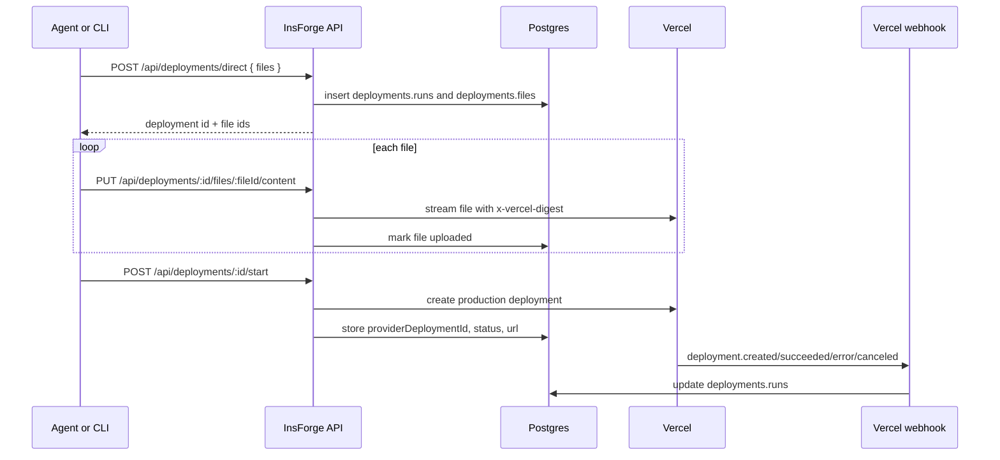

Deployments has two jobs: accept an application source tree safely, then keep InsForge's database in sync with the provider build. The primary path is direct upload. The legacy zip path remains available for older tooling.

## Runtime Flow


```mermaid
sequenceDiagram
    participant Tool as Agent or CLI
    participant API as InsForge API
    participant DB as Postgres
    participant Vercel as Vercel
    participant WH as Vercel webhook

    Tool->>API: POST /api/deployments/direct { files }
    API->>DB: insert deployments.runs and deployments.files
    API-->>Tool: deployment id + file ids

    loop each file
      Tool->>API: PUT /api/deployments/:id/files/:fileId/content
      API->>Vercel: stream file with x-vercel-digest
      API->>DB: mark file uploaded
    end

    Tool->>API: POST /api/deployments/:id/start
    API->>Vercel: create production deployment
    API->>DB: store providerDeploymentId, status, url
    Vercel->>WH: deployment.created/succeeded/error/canceled
    WH->>DB: update deployments.runs
```

## Data Model

Deployment state is stored in the dedicated `deployments` schema.

| Table | Purpose |
|-------|---------|
| `deployments.runs` | One deployment attempt. Stores provider ID, status, live URL, metadata, and timestamps. |
| `deployments.files` | Direct-upload file manifest rows. Stores relative path, SHA-1 digest, file size, upload timestamp, and the parent deployment ID. |

`deployments.files` has a unique `(deployment_id, file_path)` constraint so a manifest cannot register the same path twice.

## Direct Upload Flow

### 1. Register a manifest

The client calls `POST /api/deployments/direct` with source files described as relative paths, SHA-1 hashes, and byte sizes.

```json
{
  "files": [
    {
      "path": "package.json",
      "sha": "7f83b1657ff1fc53b92dc18148a1d65dfa1357d7",
      "size": 742
    },
    {
      "path": "src/App.tsx",
      "sha": "9f86d081884c7d659a2feaa0c55ad015a3bf4f1b",
      "size": 2136
    }
  ]
}
```

The backend validates:

- At least one file is present.
- Paths are relative and use forward slashes.
- Paths do not contain null bytes, empty segments, `.`, or `..`.
- Paths are unique within the deployment.
- Each `sha` is a SHA-1 hex digest.
- File count and byte totals stay under the configured limits.

The response returns the deployment ID and a `fileId` for each manifest entry.

### 2. Upload each file

Each file is uploaded through:

```http
PUT /api/deployments/{deploymentId}/files/{fileId}/content
Content-Type: application/octet-stream
```

The backend streams the body to Vercel, verifies the streamed byte count, verifies the SHA-1 digest against the manifest, and records `uploadedAt`. A deployment can only receive files while its status is `WAITING` or `UPLOADING`.

This endpoint is intentionally not write-rate-limited per file. The parent `POST /direct` call consumes the deployment write budget.

### 3. Start the deployment

After all manifest rows have `uploadedAt`, the client calls:

```http
POST /api/deployments/{deploymentId}/start
```

The body can include build settings, environment variables, and provider metadata:

```json
{
  "projectSettings": {
    "buildCommand": "npm run build",
    "outputDirectory": "dist",
    "installCommand": "npm install"
  },
  "envVars": [
    {
      "key": "VITE_INSFORGE_BASE_URL",
      "value": "https://my-project.us.insforge.app"
    }
  ],
  "meta": {
    "source": "agent"
  }
}
```

If `envVars` are provided, InsForge creates or updates them in Vercel before creating the deployment.

## Legacy Zip Flow

`POST /api/deployments` creates a `WAITING` run and returns a presigned S3 form upload for a source zip. After the client uploads the zip, `POST /api/deployments/{id}/start` downloads it, extracts the files, uploads them to Vercel, starts the deployment, and deletes the zip.

Use this only for backward compatibility. It requires `AWS_S3_BUCKET` and related S3 settings in addition to the deployment provider credentials.

## Status Lifecycle

| Status | Owner | Meaning |
|--------|-------|---------|
| `WAITING` | InsForge | Run was created and is waiting for source uploads. |
| `UPLOADING` | InsForge | Source files are being uploaded or a provider deployment is being created. |
| `QUEUED` | Provider | Vercel accepted the deployment and queued the build. |
| `BUILDING` | Provider | Vercel is building the project. |
| `READY` | Provider | Deployment is live and `url` is available. |
| `ERROR` | Provider | Build, upload, provider, or webhook processing failed. |
| `CANCELED` | InsForge or provider | The deployment was canceled. |

InsForge updates status in three ways:

- The start request stores the initial provider status returned by Vercel.
- `POST /api/deployments/{id}/sync` reads the latest provider state and updates `deployments.runs`.
- Vercel webhooks update runs when deployments are created, succeed, fail, or are canceled.

## Environment Variables

Deployment environment variables are provider-level Vercel variables, not rows in the InsForge database. The API exposes:

| Endpoint | Behavior |
|----------|----------|
| `GET /api/deployments/env-vars` | Lists variable IDs, keys, types, and timestamps. Values are omitted. |
| `GET /api/deployments/env-vars/{id}` | Returns one variable with its decrypted value. |
| `POST /api/deployments/env-vars` | Creates or updates variables. Duplicate keys in one request are rejected. |
| `DELETE /api/deployments/env-vars/{id}` | Deletes a provider variable by Vercel env var ID. |

Variables are stored as encrypted variables for `production`, `preview`, and `development` targets.

## Domains

Deployments can expose three kinds of URLs:

| URL type | Source |
|----------|--------|
| Provider deployment URL | Returned by Vercel after a ready deployment. |
| `.insforge.site` slug | Cloud-only project slug managed through `PUT /api/deployments/slug`. |
| User-owned custom domain | Vercel project domain managed through `/api/deployments/domains`. |

Custom slug validation allows lowercase letters, numbers, and hyphens. The slug must be 3 to 63 characters and cannot start or end with a hyphen.

User-owned domains must be normal DNS names such as `app.example.com` or `example.com`. Domains ending in `.insforge.site` are reserved. Domain responses include DNS setup hints:

- `cnameTarget` for subdomains.
- `aRecordValue` for apex domains.
- `verification` records when the provider requires explicit ownership verification.

## Provider Configuration

InsForge Cloud retrieves Vercel credentials from the InsForge control plane. Self-hosted deployments use backend environment variables:

```env
VERCEL_TOKEN=
VERCEL_TEAM_ID=
VERCEL_PROJECT_ID=
```

If these values are missing, deployment management endpoints return a configuration error. Legacy zip deployments also require S3-compatible storage because the zip is temporarily stored before extraction.

## Dashboard Model

The dashboard is a client of the same REST API:

- Overview reads `/api/deployments/metadata` and the latest ready run.
- Deployment Logs lists `deployments.runs`, filters by status, and can call sync or cancel.
- Environment Variables reads and writes provider variables.
- Domains reads deployment metadata, custom slug state, and custom domain DNS status.

Paginated deployment lists are returned as arrays with PostgREST-style `Content-Range` headers. The dashboard API client wraps those responses into `{ data, pagination }` for UI code.

## Operational Notes

- Direct file uploads must use `Content-Type: application/octet-stream`.
- A start request fails if any direct-upload file has not been uploaded.
- File size and SHA mismatches are treated as client input errors.
- Vercel file upload rate limits can surface as `RATE_LIMITED`; retry the upload step with a fresh request.
- Canceling a legacy `WAITING` run also tries to remove the staged source zip.
- The Dashboard "Deployment Logs" page is deployment history and status tracking, not a raw build-log stream.
