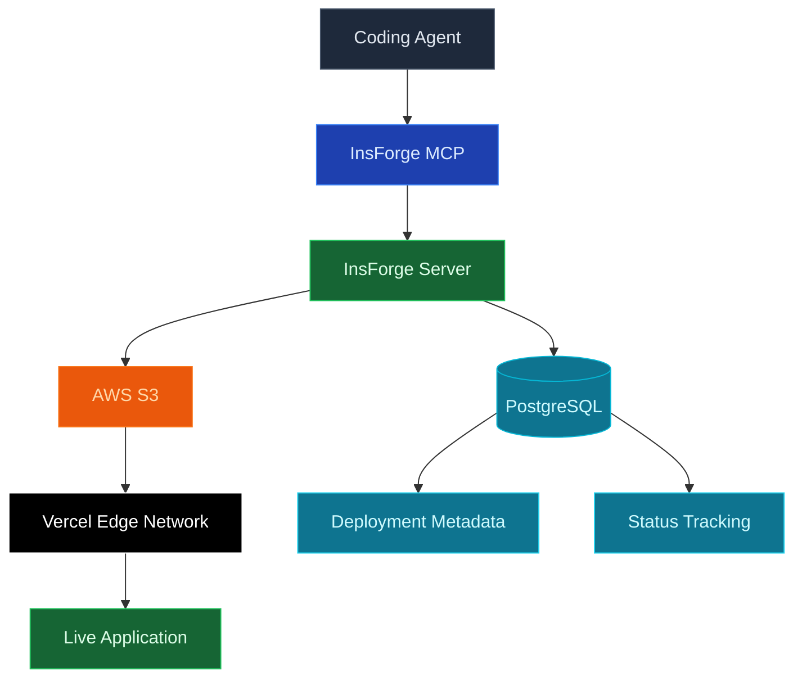
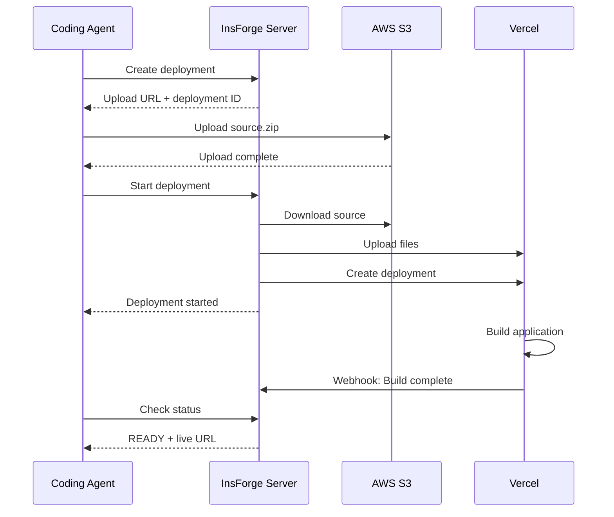

<Warning>
  Deployments is an experimental feature. APIs and behavior may change.
</Warning>

## Overview

InsForge Deployments enable developers to deploy web applications with a single prompt. By integrating with coding agents via InsForge MCP, developers can simply say "Deploy my app" and have their application live within a minute—no configuration required.

## Technology Stack

## Core Components

| Component | Technology | Purpose |
|-----------|------------|---------|
| **Edge Storage** | AWS S3 | Temporary source file staging |
| **Build Platform** | Vercel | Production builds and hosting |
| **Status Tracking** | PostgreSQL | Deployment state and metadata |
| **Webhook Handler** | HMAC-SHA1 | Real-time build status updates |

## How It Works

### Deployment Flow

### Step-by-Step Process

1. **Create Deployment**: Agent requests a new deployment, receiving a presigned S3 upload URL
2. **Upload Source**: Source files are zipped and uploaded directly to S3 via edge network
3. **Start Build**: InsForge downloads the source, extracts files, and uploads to Vercel
4. **Build & Deploy**: Vercel builds the application and deploys to its edge network
5. **Go Live**: Application becomes available at `https://{app-key}.insforge.site`

The entire process typically completes in about one minute.

## Deployment Status

| Status | Description |
|--------|-------------|
| `WAITING` | Deployment created, awaiting source upload |
| `UPLOADING` | Source files being processed |
| `QUEUED` | Build queued on Vercel |
| `BUILDING` | Application being built |
| `READY` | Live and accessible |
| `ERROR` | Build failed |
| `CANCELED` | Deployment canceled |

## Environment Variables

Environment variables can be passed during deployment for build-time configuration. They are encrypted at rest and in transit, and are only accessible during the build process. For auditing purposes, only variable names are logged, never values.

<Warning>
  While environment variables are encrypted, avoid storing sensitive credentials in frontend applications. Variables prefixed with `NEXT_PUBLIC_` or similar are embedded in client bundles.
</Warning>

## Current Limitations

<Note>
  This is an experimental feature with the following constraints:
</Note>

| Limitation | Details |
|------------|---------|
| **Environment** | Production deployments only |
| **Custom Domains** | Coming soon |
| **Preview Deployments** | Coming soon |
| **Build Logs** | Limited visibility |

## Performance

### Edge Network Optimization

Both AWS S3 and Vercel utilize global edge networks, enabling:

- **Fast Uploads**: Source files uploaded to nearest S3 edge location
- **Rapid Builds**: Vercel's distributed build infrastructure
- **Global Distribution**: Deployed applications served from edge locations worldwide
- **Low Latency**: Sub-100ms response times for static assets

## Best Practices

<CardGroup cols={2}>
  <Card title="Keep Builds Small" icon="minimize">
    Avoid uploading large assets. Use InsForge Storage and access via URLs.
  </Card>

  <Card title="Use Environment Variables" icon="key">
    Configure builds via env vars, not hardcoded values
  </Card>

  <Card title="Test Locally First" icon="flask">
    Verify builds work locally before deploying
  </Card>

  <Card title="Monitor Status" icon="chart-line">
    Check deployment status for build errors
  </Card>
</CardGroup>
