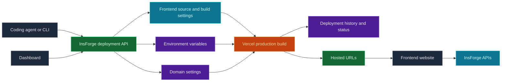

Use InsForge Deployments to ship the browser-facing app that belongs to your project. A connected agent, CLI, or custom tool uploads your frontend source and build settings through InsForge. InsForge creates a Vercel production deployment, then the dashboard tracks the URL, status, deployment history, environment variables, and domains.

<Frame caption="Deployments dashboard: latest deployment, custom domains, environment variables, and deployment history.">
  
</Frame>

<Note>
  **Need to deploy a container or backend service?** Use [Compute](/core-concepts/compute/overview) for workers, queues, WebSocket servers, and long-running services. Deployments are for frontend websites and framework builds that produce a hosted web app.
</Note>

## Features

### Agent-native deploys

Connected agents can deploy the app they just built. They upload source files, pass build settings when needed, and start a production build without leaving the development loop.

### Framework builds

Deploy React, Vue, Svelte, Next.js, and other frontend frameworks. InsForge sends the source files and project settings to Vercel. Build commands, install commands, root directories, and output directories can be supplied when framework detection is not enough.

### Environment variables

Manage provider environment variables from the dashboard. Use public prefixes such as `VITE_` or `NEXT_PUBLIC_` only for values that are safe to expose in browser code.

### Deployment history

Review previous runs, sync Vercel status, inspect metadata, and cancel in-progress deployments from the Deployment Logs page.

### Domains

Every ready deployment gets a default URL at `https://<appkey>.insforge.site`. You can also set an InsForge-managed slug at `https://<slug>.insforge.site`. For a custom domain, add the domain in the dashboard and configure the DNS record it returns, usually a CNAME for subdomains.

## Deploy with it

<CardGroup cols={2}>
  <Card title="Agent deployment guide" icon="terminal" href="/agent-docs/deployment">
    Instructions for agents that deploy frontend source through InsForge.
  </Card>

  <Card title="Quickstart" icon="rocket" href="/quickstart">
    Connect your project and start using InsForge from the CLI.
  </Card>

  <Card title="Compute" icon="server" href="/core-concepts/compute/overview">
    Use Compute when the app needs a container or long-running backend service.
  </Card>
</CardGroup>

## Next steps

- Set up the [CLI](/quickstart) and connect your project.
- Ask your connected agent to deploy the frontend app.
- Add browser-safe environment variables before deploying production builds.
