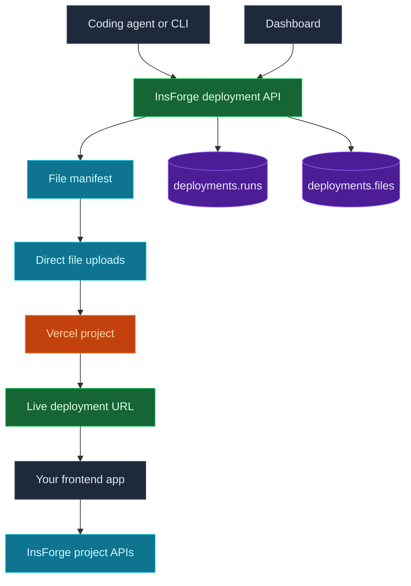

Use InsForge Deployments to ship the browser-facing application that belongs to your project. A deployment run uploads source files through InsForge, asks the configured Vercel project to build them, and stores the resulting status and URL in `deployments.runs`.

<Note>
  **Need a long-running backend service?** Use [Compute](/core-concepts/compute/overview) for workers, queues, websocket servers, and other always-on processes. Deployments are for hosted frontend apps and framework builds.
</Note>



## How It Works

### Source upload is the default path

Agents and tooling deploy by registering a file manifest, streaming each file through InsForge to Vercel, then starting the deployment. The backend verifies every path, file size, and SHA-1 digest before a run can build.

The older source-zip flow still exists for backward compatibility, but new tools should use direct uploads.

### Vercel does the build

InsForge creates production deployments in the configured Vercel project. You can pass `buildCommand`, `installCommand`, `outputDirectory`, `devCommand`, and `rootDirectory` when starting a run. If a setting is omitted, Vercel uses its framework detection and project defaults.

### Status is stored in Postgres

Each deployment run moves through InsForge upload states and provider build states:

`WAITING` -> `UPLOADING` -> `QUEUED` -> `BUILDING` -> `READY`

Failures end in `ERROR`. Canceled runs end in `CANCELED`. The Dashboard reads the same `deployments.runs` records that the API returns.

### Environment variables live on the provider

Deployment environment variables are stored in Vercel as encrypted variables for `production`, `preview`, and `development` targets. Listing variables returns keys and metadata only. A single-variable fetch returns the decrypted value for editing.

You can also include `envVars` in a start request when a deployment needs variables created or updated before the build begins.

### Domains are managed after a successful deploy

Every ready deployment has a provider URL. InsForge Cloud projects can also set a custom `.insforge.site` slug and manage user-owned domains from the Dashboard. User-owned domains return the DNS records needed for verification, including CNAME, A record, and provider verification records when required.

## Dashboard

The Dashboard exposes the deployment workflow in four areas:

| Page | What it shows |
|------|---------------|
| Overview | The latest ready deployment, preview iframe, status, and visit link |
| Deployment Logs | Deployment history, status filters, sync, and cancel actions |
| Environment Variables | Provider environment variable keys, add/edit flow, and delete actions |
| Domains | Default URL, `.insforge.site` slug, custom domains, DNS records, and verification |

## Self-Hosting

InsForge Cloud retrieves deployment credentials from the InsForge control plane. Self-hosted instances need Vercel credentials in the backend environment:

```env
VERCEL_TOKEN=
VERCEL_TEAM_ID=
VERCEL_PROJECT_ID=
```

The legacy zip endpoint, `POST /api/deployments`, also requires S3-compatible storage for the source zip. Direct uploads do not use the deployment S3 bucket.

## Limits

Direct upload deployments default to:

| Limit | Default |
|-------|---------|
| Files per deployment | `5000` |
| Total source size | `100 MB` |
| Single file size | `100 MB` |

Self-hosted operators can override these with `MAX_DEPLOYMENT_FILES`, `MAX_DEPLOYMENT_TOTAL_BYTES`, and `MAX_DEPLOYMENT_FILE_BYTES`.

## Concepts

<CardGroup cols={2}>
  <Card title="Architecture" icon="diagram-project" href="/core-concepts/deployments/architecture">
    Direct upload flow, provider state, tables, status transitions, environment variables, and domains.
  </Card>
</CardGroup>

## Next Steps

- Read the [architecture guide](/core-concepts/deployments/architecture) for the runtime model.
- Use the Dashboard's Deployments page to inspect the latest deployed app.
- Use the API reference when building deployment tooling outside the MCP and CLI paths.
