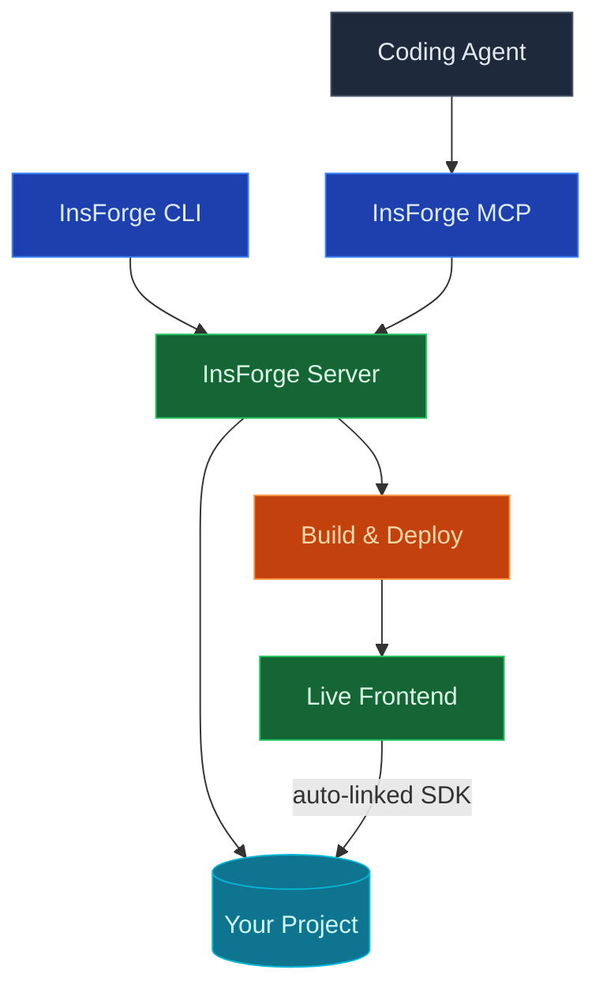

Use InsForge Deployments to push a frontend (Next.js, React, Vue, Svelte, or any static site) and bind it to your project at build time. The SDK is configured automatically, so you never copy anon keys into environment variables or manage a separate dashboard.

<Note>
  **Need to run a backend service?** Use [Compute](/core-concepts/compute/overview) for queue workers, AI inference loops, and other always-on jobs. Deployments are for the frontend; Compute is for the long-running back end.
</Note>

## Features

### Auto-linked SDK config

When a build runs, the InsForge SDK gets the project URL and anon key injected as environment variables. The same code works in local dev, preview, and production with zero config drift.

### Framework detection

The build pipeline detects Next.js, React, Vue, Nuxt, Svelte, Astro, and plain static output. Set a custom build command and output directory when you need to override.

### Custom domains

Bring your own domain and point a `CNAME` at the deployment. HTTPS certificates are provisioned and renewed automatically via Let's Encrypt.

### Preview environments

Every branch can publish to its own preview URL, wired to an isolated [database branch](/agent-native/branching). Merge to main and the preview promotes to production.

### Build logs

Structured logs per deploy, queryable by status and duration. Failures surface the offending command and stderr; no need to grep through a giant text dump.

## Next steps

- Set up the [CLI](/quickstart) to link your project (the recommended path).
- Pick a [framework guide](/examples/framework-guides/nextjs) to scaffold your first project.
