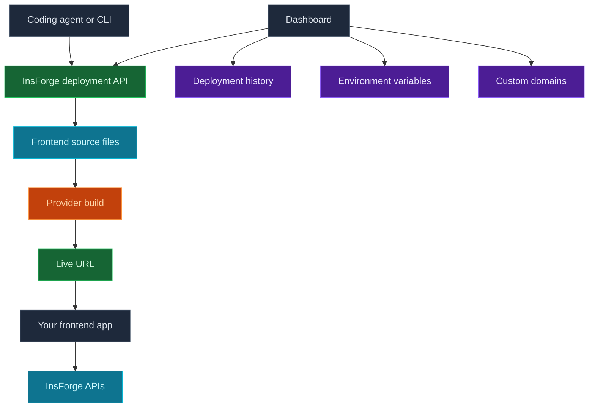

Use InsForge Deployments to ship the browser-facing app that belongs to your project. A connected agent, CLI, or custom tool uploads your frontend source, InsForge starts a provider build, and the dashboard tracks the live URL, status, logs, environment variables, and domains.

<Frame caption="Deployments dashboard: live preview, latest deployment, custom domains, and deployment history.">
  
</Frame>

<Note>
  **Need an always-on backend process?** Use [Compute](/core-concepts/compute/overview) for workers, queues, WebSocket servers, and long-running services. Deployments are for hosted frontend apps and framework builds.
</Note>

## Features

### Agent-native deploys

Connected agents can deploy the app they just built. They upload source files, pass build settings when needed, and start a production build without leaving the development loop.

### Framework builds

Deploy React, Vue, Svelte, Next.js, and other frontend frameworks. Build commands, install commands, root directories, and output directories can be supplied when the default framework detection is not enough.

### Live preview

The dashboard shows the latest ready deployment with a preview, status, provider, creation time, and visit link.

### Deployment history

Review previous runs, sync provider status, inspect metadata, and cancel in-progress deployments from the Deployment Logs page.

### Environment variables

Manage provider environment variables from the dashboard. Use public prefixes such as `VITE_` or `NEXT_PUBLIC_` only for values that are safe to expose in browser code.

### Domains

Use the provider URL immediately, set an InsForge-managed `.insforge.site` slug, or attach your own custom domain and follow the DNS verification hints in the dashboard.

### Self-hosting support

InsForge Cloud includes deployment provider wiring. Self-hosted instances need provider credentials configured before deployments can start.

## Deploy with it

<CardGroup cols={2}>
  <Card title="Agent deployment guide" icon="terminal" href="/agent-docs/deployment">
    Instructions for agents that deploy frontend source through InsForge.
  </Card>

  <Card title="Quickstart" icon="rocket" href="/quickstart">
    Connect your project and start using InsForge from the CLI.
  </Card>

  <Card title="Compute" icon="server" href="/core-concepts/compute/overview">
    Use Compute when the app needs a long-running backend process.
  </Card>
</CardGroup>

## Next steps

- Set up the [CLI](/quickstart) and connect your project.
- Ask your connected agent to deploy the frontend app.
- Add browser-safe environment variables before deploying production builds.
