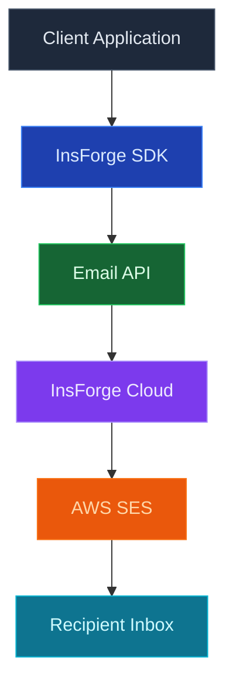
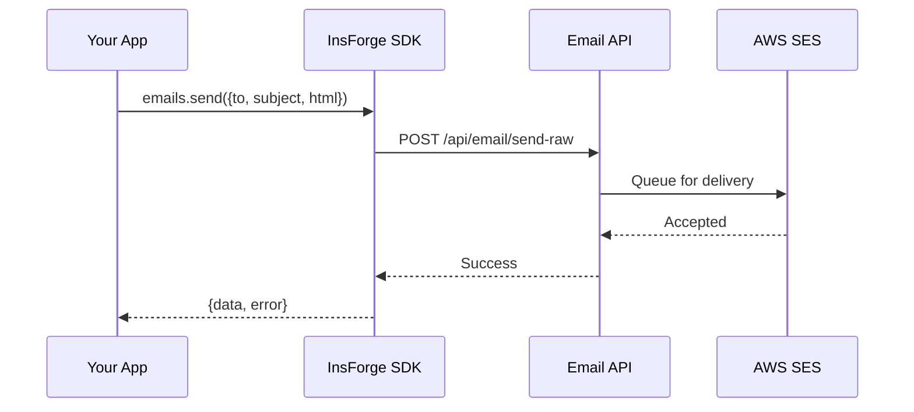

<Note>**Private Preview** - This feature is currently in private preview.</Note>

## Overview

InsForge provides a managed email service for sending transactional emails. Built on AWS SES, it offers high deliverability and scalability without requiring you to configure email infrastructure.

## Technology Stack

## How It Works

1. **SDK Call** - Your application calls `emails.send()` with recipients and HTML content
2. **API Processing** - Request is validated and authenticated
3. **Cloud Delivery** - InsForge Cloud queues and sends via AWS SES
4. **Delivery** - Email is delivered to recipient inboxes

## Key Features

<CardGroup cols={2}>
  <Card title="High Deliverability" icon="inbox">
    AWS SES infrastructure with optimized sending reputation
  </Card>

  <Card title="Multiple Recipients" icon="users">
    Send to up to 50 recipients per request with CC/BCC support
  </Card>

  <Card title="Custom Sender" icon="signature">
    Customize the sender display name for your brand
  </Card>

  <Card title="HTML Content" icon="code">
    Full HTML email support for rich formatting
  </Card>
</CardGroup>

## Rate Limits

| Plan | Limit |
|------|-------|
| **Starter** | 10 emails per hour |
| **Pro** | 50 emails per hour |

<Note>
Custom transactional emails require a paid plan. Authentication emails (verification, password reset) are included in all plans.
</Note>

## Best Practices

<CardGroup cols={2}>
  <Card title="Validate Recipients" icon="at">
    Verify email addresses before sending to maintain deliverability
  </Card>

  <Card title="Meaningful Content" icon="envelope-open-text">
    Send relevant, expected emails to avoid spam reports
  </Card>

  <Card title="Handle Errors" icon="triangle-exclamation">
    Always check the error response and handle failures gracefully
  </Card>

  <Card title="Respect Limits" icon="gauge">
    Implement queuing for bulk sends to stay within rate limits
  </Card>
</CardGroup>

## SDK References

<CardGroup cols={1}>
  <Card title="TypeScript" icon="js" href="/sdks/typescript/overview">
    Send transactional emails from web and Node.js applications
  </Card>
</CardGroup>

<Note>
Email SDK is currently only available for TypeScript as part of the TypeScript SDK. Mobile SDKs (Swift, Kotlin, Flutter) support for email is coming soon.
</Note>
