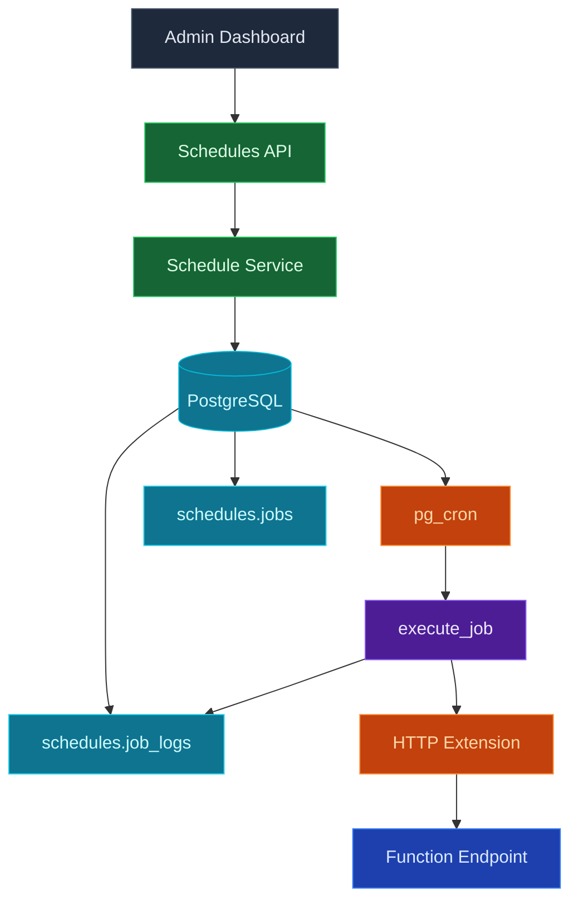
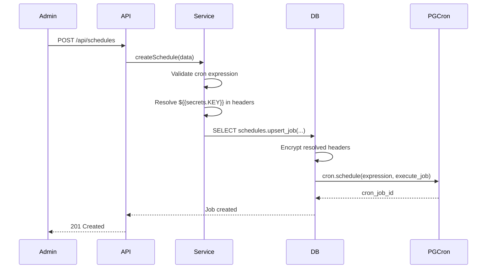
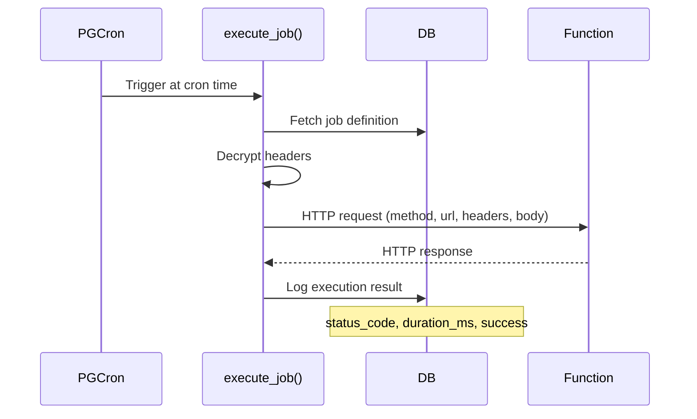

## Overview

InsForge Schedules lets you run serverless functions on a recurring cron schedule. Jobs are managed entirely in PostgreSQL using the `pg_cron` extension, which executes HTTP requests to your function endpoints at the specified intervals.

## Technology Stack

## Core Components

| Component | Technology | Purpose |
|-----------|------------|---------|
| **Scheduler** | pg_cron | PostgreSQL-native cron job scheduling |
| **HTTP Client** | pg http extension | Execute HTTP requests from within PostgreSQL |
| **Encryption** | pgcrypto (AES) | Encrypt sensitive headers and secrets |
| **Job Store** | PostgreSQL | Job definitions and execution history |
| **Service Layer** | Node.js | Cron validation, secret resolution, CRUD |

## Database Schema

### Jobs Table

The `schedules.jobs` table stores job definitions:

| Column | Type | Description |
|--------|------|-------------|
| `id` | UUID | Primary key |
| `name` | TEXT | Display name |
| `cron_schedule` | TEXT | 5-field cron expression |
| `function_url` | TEXT | Target HTTP endpoint |
| `http_method` | TEXT | GET, POST, PUT, PATCH, or DELETE |
| `headers` | JSONB | Template headers (no secrets) |
| `encrypted_headers` | TEXT | AES-encrypted resolved headers |
| `body` | JSONB | Request payload |
| `is_active` | BOOLEAN | Whether the job is scheduled |
| `cron_job_id` | BIGINT | pg_cron job reference |
| `last_executed_at` | TIMESTAMPTZ | Last execution timestamp |

### Job Logs Table

The `schedules.job_logs` table tracks every execution:

| Column | Type | Description |
|--------|------|-------------|
| `id` | UUID | Primary key |
| `job_id` | UUID | Foreign key to jobs |
| `executed_at` | TIMESTAMPTZ | When the job ran |
| `status_code` | INT | HTTP response status |
| `success` | BOOLEAN | True if status 200-299 |
| `duration_ms` | BIGINT | Execution time in milliseconds |
| `message` | TEXT | Error message or "Success" |

## How It Works

### Schedule Creation

### Job Execution

## Cron Expressions

Standard 5-field format (seconds not supported):

| Field | Values | Description |
|-------|--------|-------------|
| Minute | 0-59 | Minute of the hour |
| Hour | 0-23 | Hour of the day |
| Day | 1-31 | Day of the month |
| Month | 1-12 | Month of the year |
| Weekday | 0-6 | Day of the week (Sunday = 0) |

**Examples:**

| Expression | Schedule |
|------------|----------|
| `*/5 * * * *` | Every 5 minutes |
| `0 * * * *` | Every hour |
| `0 0 * * *` | Daily at midnight |
| `0 9 * * 1` | Every Monday at 9am |
| `0 0 1 * *` | First day of every month |

## Secret Management

Headers support the `${{secrets.KEY_NAME}}` template syntax. When a schedule is created or updated:

1. Template headers are stored as-is in `headers` (safe for display)
2. Secret placeholders are resolved against the project's secrets store
3. Resolved headers are encrypted with `pgcrypto` and stored in `encrypted_headers`
4. At execution time, headers are decrypted just before the HTTP request

<Warning>
If a referenced secret is deleted, scheduled jobs using it will fail at execution time. Update or disable affected schedules after removing secrets.
</Warning>

## API Endpoints

All endpoints require admin authentication.

| Method | Endpoint | Description |
|--------|----------|-------------|
| GET | `/api/schedules` | List all schedules |
| GET | `/api/schedules/:id` | Get a schedule |
| GET | `/api/schedules/:id/logs` | Get execution logs (paginated) |
| POST | `/api/schedules` | Create a schedule |
| PATCH | `/api/schedules/:id` | Update a schedule |
| DELETE | `/api/schedules/:id` | Delete a schedule and its logs |

## Architecture Features

<CardGroup cols={2}>
  <Card title="Database-Native" icon="database">
    Scheduling runs entirely in PostgreSQL via pg_cron — no external job queue needed
  </Card>

  <Card title="Encrypted Secrets" icon="lock">
    Headers containing secrets are AES-encrypted at rest and decrypted only at execution time
  </Card>

  <Card title="Execution Logging" icon="clipboard-list">
    Every run is logged with status code, duration, and success/failure for debugging
  </Card>

  <Card title="Enable/Disable" icon="toggle-on">
    Pause and resume schedules without deleting them or losing configuration
  </Card>

  <Card title="Multi-Method" icon="code">
    Supports GET, POST, PUT, PATCH, and DELETE HTTP methods
  </Card>

  <Card title="Next Run Preview" icon="clock">
    Dashboard shows the computed next execution time for each schedule
  </Card>
</CardGroup>

## Best Practices

<CardGroup cols={2}>
  <Card title="Use Secrets for Auth" icon="key">
    Pass API keys via header secrets instead of hardcoding values
  </Card>

  <Card title="Monitor Logs" icon="chart-bar">
    Check execution logs regularly for failures and unexpected status codes
  </Card>

  <Card title="Keep Functions Fast" icon="bolt">
    Scheduled functions should complete within the 30-second timeout
  </Card>

  <Card title="Test Before Scheduling" icon="flask">
    Invoke your function manually before setting up a recurring schedule
  </Card>
</CardGroup>

## Limitations

- **Minimum Interval**: 1 minute (pg_cron limitation)
- **No Seconds**: Only 5-field cron expressions — no second-level precision
- **Admin Only**: Schedules can only be managed by project admins
- **Single Region**: Jobs execute from the database server's region
- **No Retry**: Failed executions are logged but not automatically retried
