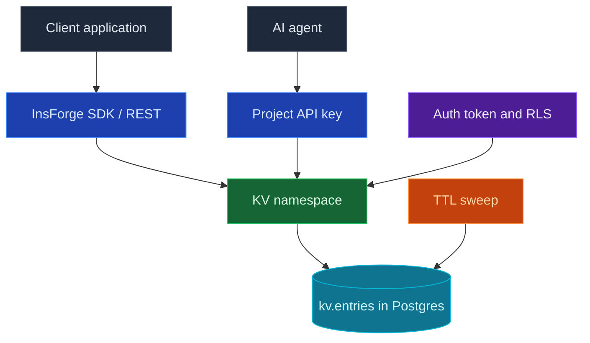

Use the InsForge KV store for the data that doesn't belong in a table: cache entries, feature flags, rate-limit counters, session scratch, per-user preferences, and idempotency keys. Values are arbitrary JSON addressed by a `namespace` and a `key`, with optional time-to-live (TTL) expiry. It runs on the same Postgres instance as the rest of your project — no separate Redis to operate.

<Note>
  **When to reach for KV vs the Database.** Use KV for ephemeral or schemaless values keyed by a string, especially when you want TTL expiry or atomic counters. Use the [Database](/core-concepts/database/overview) when you need relations, queries across rows, or a typed REST surface.
</Note>



## Data model

A KV entry is a JSON value addressed by `(namespace, key)`. Namespaces and keys are plain strings; `:` is the conventional separator inside a key (for example `user:123:prefs`). Both are single URL path segments — they must not contain `/`.

Two access tiers share the same store:

- **Project-global entries** — written with the project API key. These have no owner and are visible to anyone holding the API key (your agent, backend, or CLI). Use them for shared cache and config.
- **End-user entries** — written with a user's auth token. These are owned by that user and isolated by Postgres row-level security; one user can never read or write another user's keys.

### Visibility

Every entry has a `visibility` that controls who else can read it (writes are always owner-only):

| Visibility | Who can read |
| --- | --- |
| `private` (default) | Only the owner |
| `authed` | Any signed-in user |
| `public` | Anyone, including anonymous clients |

## TTL and expiry

Every new key defaults to a **30-day TTL**. Override it per write, or set it to never expire:

- `ttl: <seconds>` — expire this many seconds from now
- `ttl: null` — never expires
- omit `ttl` — use the 30-day default

Expired entries stop being readable immediately and are reclaimed by a background sweep. Use `expire` to change a TTL later and `ttl` to read the remaining seconds.

## Features

### Read and write

```bash
# Set a value (defaults to a 30-day TTL, private visibility)
curl -X PUT "$INSFORGE_URL/api/kv/entries/default/greeting" \
  -H "Authorization: Bearer $API_KEY" \
  -H "Content-Type: application/json" \
  -d '{"value": {"text": "hello"}, "ttl": 3600}'

# Get it back
curl "$INSFORGE_URL/api/kv/entries/default/greeting" \
  -H "Authorization: Bearer $API_KEY"
# => { "value": { "text": "hello" } }

# Delete it
curl -X DELETE "$INSFORGE_URL/api/kv/entries/default/greeting" \
  -H "Authorization: Bearer $API_KEY"
```

Pass `"ifNotExists": true` to a `PUT` to set a key only when it is absent (a `setnx`); the response reports `created: false` and a `409` status when the key already exists, leaving the existing value untouched.

### Atomic counters

`incr` and `decr` mutate a numeric value in a single statement, so concurrent callers never lose updates. A missing key initializes to `0` before applying the delta.

```bash
# Increment (initializes to 0, then adds `by`)
curl -X POST "$INSFORGE_URL/api/kv/entries/default/page:views/incr" \
  -H "Authorization: Bearer $API_KEY" \
  -H "Content-Type: application/json" \
  -d '{"by": 1}'
# => { "value": 1 }
```

Incrementing a value that isn't a JSON number returns `KV_NOT_A_NUMBER`.

### Compare-and-swap

`cas` writes `next` only if the current value still equals `expected` — the building block for optimistic concurrency and distributed locks. A mismatch returns `KV_CAS_MISMATCH` (`409`); a missing key returns `KV_NOT_FOUND` (`404`).

```bash
curl -X POST "$INSFORGE_URL/api/kv/entries/default/lock/cas" \
  -H "Authorization: Bearer $API_KEY" \
  -H "Content-Type: application/json" \
  -d '{"expected": "free", "next": "held"}'
```

### Bulk operations

Read or write many keys in one round trip with `mget` and `mset`:

```bash
curl -X POST "$INSFORGE_URL/api/kv/mget" \
  -H "Authorization: Bearer $API_KEY" \
  -H "Content-Type: application/json" \
  -d '{"namespace": "default", "keys": ["a", "b", "c"]}'
# => { "values": { "a": 1, "b": 2 } }   (missing keys are omitted)
```

### TTL management

```bash
# Change the TTL of an existing key
curl -X POST "$INSFORGE_URL/api/kv/entries/default/session/expire" \
  -H "Authorization: Bearer $API_KEY" \
  -H "Content-Type: application/json" \
  -d '{"ttl": 900}'

# Read the remaining seconds (null = never expires)
curl "$INSFORGE_URL/api/kv/entries/default/session/ttl" \
  -H "Authorization: Bearer $API_KEY"
# => { "ttl": 899 }
```

### Row-level security

End-user entries are enforced by Postgres RLS on `kv.entries`, keyed on `auth.uid()`. A signed-in user's token only ever sees their own keys plus any `public` entries and (when signed in) `authed` ones. The project API key connects with elevated privileges and manages the project-global store. You don't write any policies — the managed schema ships them.

## Limits

- Values are capped at **256 KB** serialized (`KV_VALUE_TOO_LARGE`). Store larger blobs in [Storage](/core-concepts/storage/overview).
- `mget` reads up to 100 keys per call.

## Next steps

- Set up the [CLI](/quickstart) to link your project.
- Use [Authentication](/core-concepts/authentication/overview) so end-user entries are owner-scoped.
- Reach for the [Vector Store](/core-concepts/vector-store/overview) when you need semantic search instead of exact-key lookups.
