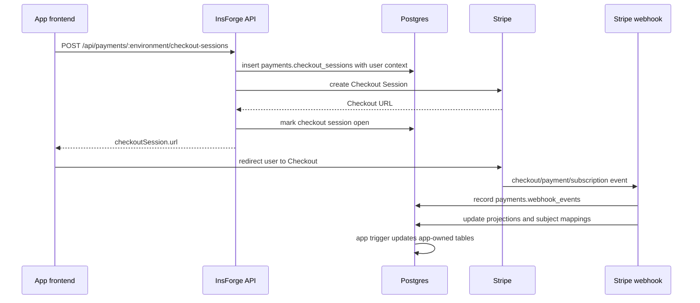

Payments has three paths that work together: admins configure Stripe, apps create runtime sessions, and Stripe webhooks update Postgres projections.

## Runtime Flow



The returned Stripe URL is only a redirect target. Payment success, subscription status, refunds, and failed payments are all confirmed through webhook-projected rows.

## Control Plane

Project-admin routes are mounted under `/api/payments`.

| Route | Purpose |
|-------|---------|
| `GET /api/payments/status` | Return connection, sync, and webhook status for `test` and `live`. |
| `GET /api/payments/config` | Return whether each Stripe key is configured and the masked key when available. |
| `PUT /api/payments/:environment/config` | Validate and store a Stripe secret key for one environment. |
| `DELETE /api/payments/:environment/config` | Disable the saved Stripe key and webhook secret for one environment. |
| `POST /api/payments/sync` | Sync every configured environment. |
| `POST /api/payments/:environment/sync` | Sync one environment. |
| `POST /api/payments/:environment/webhook` | Create or recreate the managed Stripe webhook endpoint. |
| `GET /api/payments/:environment/catalog` | Return mirrored products and prices. |
| `/api/payments/:environment/catalog/products` | Create, read, update, or delete Stripe products through InsForge. |
| `/api/payments/:environment/catalog/prices` | Create, read, update, or archive Stripe prices through InsForge. |
| `GET /api/payments/:environment/customers` | Admin read of the customer display mirror. |
| `GET /api/payments/:environment/subscriptions` | Admin read of mirrored subscriptions. |
| `GET /api/payments/:environment/payment-history` | Admin read of payment, invoice, refund, and failed-payment projections. |

The control plane accepts project-admin bearer tokens or API keys. Runtime checkout and portal routes require a user token because the backend needs a user context for local session rows.

## Environments And Secrets

Payments supports two Stripe environments:

| Environment | Secret name | Required prefix |
|-------------|-------------|-----------------|
| `test` | `STRIPE_TEST_SECRET_KEY` | `sk_test_` |
| `live` | `STRIPE_LIVE_SECRET_KEY` | `sk_live_` |

Keys are stored in `system.secrets` as reserved InsForge secrets. Self-hosted projects can seed them from environment variables with the same names. Dashboard and CLI configuration write the same secret records.

When a key is saved, InsForge:

1. Validates the key prefix for the selected environment.
2. Retrieves the Stripe account to verify the key.
3. Stores the encrypted key.
4. Attempts to create a managed webhook endpoint at `/api/webhooks/stripe/:environment`.
5. Syncs catalog, customers, and subscriptions.

If the key now points to a different Stripe account, InsForge clears the mirrored payment data for that environment before writing the new snapshot. This prevents rows from two Stripe accounts being mixed in one environment.

## Data Model

Payment state lives in the `payments` schema.

| Table | Purpose |
|-------|---------|
| `payments.stripe_connections` | Per-environment Stripe account, sync, key, and webhook status. |
| `payments.products` | Mirrored Stripe products. |
| `payments.prices` | Mirrored Stripe prices. |
| `payments.stripe_customer_mappings` | Operational mapping from app billing subject to Stripe customer. |
| `payments.checkout_sessions` | Local checkout attempts and returned Stripe Checkout Session IDs. |
| `payments.customer_portal_sessions` | Local Billing Portal attempts and returned Stripe Portal Session URLs. |
| `payments.payment_history` | One-time payments, subscription invoices, refunds, and failed payments. |
| `payments.subscriptions` | Mirrored Stripe subscriptions, including mapped billing subjects when known. |
| `payments.subscription_items` | Mirrored subscription line items. |
| `payments.customers` | Display mirror of Stripe customers for dashboard/admin views. |
| `payments.webhook_events` | Idempotency and status tracking for received Stripe events. |

`project_admin` can `SELECT` all payments tables and can create triggers on checkout sessions, portal sessions, subscriptions, payment history, and customers. Writes to Stripe-managed rows should go through the Payments API or Stripe webhooks.

## Checkout Sessions

Runtime checkout uses:

```http
POST /api/payments/{environment}/checkout-sessions
Authorization: Bearer <user-token>
```

The body is the SDK shape:

```json
{
  "mode": "subscription",
  "lineItems": [
    {
      "stripePriceId": "price_123",
      "quantity": 1
    }
  ],
  "successUrl": "https://app.example.com/billing/success",
  "cancelUrl": "https://app.example.com/billing",
  "subject": {
    "type": "team",
    "id": "team_123"
  },
  "customerEmail": "buyer@example.com",
  "idempotencyKey": "team:team_123:pro-monthly"
}
```

Important behavior:

- `mode` is `payment` or `subscription`.
- `subscription` mode requires `subject`.
- One-time `payment` mode can omit `subject` for guest purchases.
- Metadata keys starting with `insforge_` are reserved.
- `lineItems` can contain up to 100 Stripe prices.
- `idempotencyKey` is unique per environment.

The backend first inserts a local `payments.checkout_sessions` row with the caller's user context. It then creates the Stripe Checkout Session and stores Stripe IDs and the redirect URL on the local row.

For retry safety, InsForge checks the existing local row when the same `idempotencyKey` is reused. If the request shape is identical and the existing row has a Stripe session URL, the existing row is returned. If the same key is reused with different input, the request fails with a checkout idempotency conflict.

When a checkout request includes a subject, InsForge adds subject metadata to Stripe. After Stripe returns a customer through a completion webhook, InsForge writes `payments.stripe_customer_mappings` so future checkout and portal requests can reuse the same Stripe customer.

## Customer Portal Sessions

Runtime portal creation uses:

```http
POST /api/payments/{environment}/customer-portal-sessions
Authorization: Bearer <authenticated-user-token>
```

Example:

```json
{
  "subject": {
    "type": "team",
    "id": "team_123"
  },
  "returnUrl": "https://app.example.com/billing"
}
```

Customer portal sessions require:

- An authenticated user token. Anonymous users are rejected.
- A billing `subject`.
- An existing `payments.stripe_customer_mappings` row for that subject and environment.

If no mapping exists, the route returns a not-found error. In most apps this means the user has not completed Checkout for that billing subject yet.

## Webhook Processing

Stripe sends managed webhook events to:

```http
POST /api/webhooks/stripe/{environment}
Stripe-Signature: ...
```

The backend mounts this route with a raw JSON body so Stripe signature verification can use the exact request bytes.

InsForge records every Stripe event in `payments.webhook_events` before applying it. The unique `(environment, stripe_event_id)` key makes webhook handling idempotent. Duplicate events are acknowledged without processing again unless a previous attempt failed or stayed pending long enough to be reclaimed.

Handled event groups:

| Event group | Projection updates |
|-------------|--------------------|
| `customer.*` | Upserts or marks rows in `payments.customers`; customer deletion removes subject mappings for that Stripe customer. |
| `checkout.session.*` | Updates checkout session status, writes customer mappings, and can create one-time payment history. |
| `payment_intent.*` | Records succeeded or failed one-time payment history when the intent came from an InsForge payment checkout. |
| `invoice.*` | Records subscription invoice success or failure. |
| `charge.refunded` and `refund.*` | Records refund rows and updates original payment refund state. |
| `customer.subscription.*` | Upserts subscription and subscription item projections. |

Events outside the handled set are marked `ignored`.

## Sync Model

Sync pulls state from Stripe into Postgres for one or both environments.

```http
POST /api/payments/sync
POST /api/payments/{environment}/sync
```

Sync updates:

- Products and prices from Stripe catalog.
- Customer display data.
- Subscriptions and subscription items.
- Connection status, last sync time, sync counts, and sync errors.

Stripe remains the source of truth. Product and price rows missing from Stripe are removed from the local mirror during catalog sync. Customer mirror sync failures are logged and do not stop subscription sync.

Payments uses advisory locks around environment-level sync/config operations and checkout idempotency operations so concurrent calls do not mix snapshots or create duplicate checkout rows.

## Dashboard Model

The dashboard is an admin client for the same REST API.

| Dashboard area | API used |
|----------------|----------|
| Environment toggle | Selects `test` or `live` before reading data. |
| Settings -> Stripe Keys | `GET /payments/config`, `PUT /payments/:environment/config`, `DELETE /payments/:environment/config`. |
| Settings -> Sync | `POST /payments/sync`. |
| Settings -> Webhooks | `GET /payments/status`, `POST /payments/:environment/webhook`. |
| Catalog | `GET /payments/status` and `GET /payments/:environment/catalog`. |
| Customers | `GET /payments/status` and `GET /payments/:environment/customers`. |
| Subscriptions | `GET /payments/status`, catalog, customers, and subscriptions endpoints. |
| Payment History | `GET /payments/status` and `GET /payments/:environment/payment-history`. |

The current dashboard catalog is read-only. Use Stripe, the CLI, or REST admin endpoints for catalog mutation.

## Authorization And Fulfillment

The Payments runtime routes do not know your app's membership model. If `subject` can reference shared resources such as teams, workspaces, organizations, tenants, or groups, add your own authorization boundary before exposing checkout or portal UI.

Common options:

- Enable RLS on `payments.checkout_sessions` and `payments.customer_portal_sessions`, then write insert policies that check membership in your app tables.
- Call Payments through an app-owned server endpoint that checks membership first.
- Restrict the UI so users can only choose subjects they are already authorized to manage.

For user-facing billing state, create app-owned tables with RLS and update them from payment projections. Examples:

| App table | Projection source |
|-----------|-------------------|
| `public.orders` | `payments.payment_history` rows where `type = 'one_time_payment'` and `status = 'succeeded'`. |
| `public.credit_ledger` | Succeeded payments or subscription invoices that represent credit purchases. |
| `public.team_entitlements` | `payments.subscriptions` rows where `status` is `active` or `trialing`. |
| `public.billing_events` | Normalized history from `payments.payment_history` and `payments.subscriptions`. |

This keeps Stripe-derived operational data separate from the app-specific tables your users are allowed to read.

## Operational Notes

- Never put Stripe secret keys in frontend code or public deployment environment variables.
- Use `environment: "test"` until production Stripe changes are explicitly approved.
- Do not construct Stripe Checkout or Portal URLs manually. Always redirect to the URL returned by InsForge.
- Configure or recreate managed webhooks after the backend has a public API URL.
- Use stable idempotency keys based on orders, carts, or billing subjects.
- Refunds, disputes, and unusual financial operations should still be handled in Stripe Dashboard.
