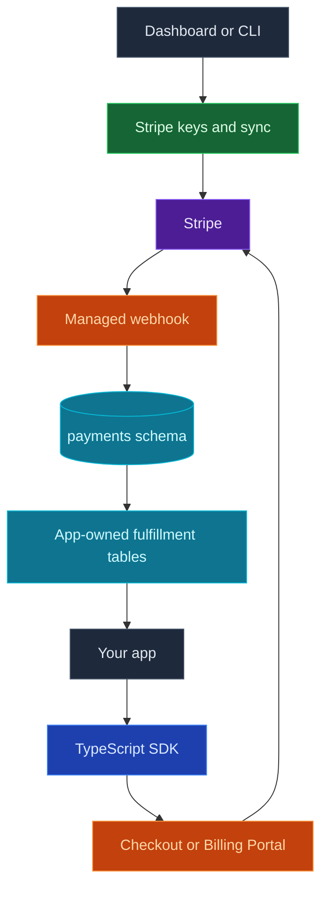

Use InsForge Payments when your app needs Stripe Checkout or Billing Portal without putting Stripe secret keys in application code. InsForge stores separate `test` and `live` Stripe keys, syncs catalog and customer state, creates managed webhook endpoints, and mirrors payment activity into Postgres for your app to fulfill from.

<Warning>
  Payments is currently in private preview. APIs and behavior may change before general availability.
</Warning>

<Frame caption="Payments dashboard: Stripe connection, catalog, customers, subscriptions, and payment history.">
  
</Frame>

<Note>
  Stripe remains the source of truth for charges, invoices, refunds, and disputes. InsForge gives your app a safer Checkout and Billing Portal path plus local payment projections for fulfillment.
</Note>

## Features

### Stripe connection

Configure `test` and `live` Stripe secret keys from the dashboard, CLI, or admin API. InsForge validates the key, stores it in the secret store, and reports connection health.

### Catalog sync

Sync Stripe products and prices into InsForge so your dashboard and app can reason about the catalog without making every request call Stripe.

### Checkout Sessions

Create one-time payment or subscription Checkout Sessions from the TypeScript SDK. Your frontend receives a Stripe-hosted URL and redirects the user to complete payment.

### Billing Portal

Create Billing Portal sessions for existing customers so users can update payment methods, review invoices, change plans, or cancel subscriptions through Stripe-hosted UI.

### Managed webhooks

InsForge can create the Stripe webhook endpoint for each environment. Incoming Stripe events update local payment state and record processing status.

### Payment projections

The `payments` schema mirrors checkout sessions, customer mappings, customers, subscriptions, payment history, refunds, and webhook events. Use those rows as operational inputs, not as your public end-user billing API.

### Fulfillment model

Do not fulfill from the Checkout success URL alone. Populate app-owned tables such as `orders`, `credit_ledger`, or `team_entitlements` from webhook-projected payment state, then protect those tables with your own RLS policies.

## Build with it

<CardGroup cols={2}>
  <Card title="TypeScript SDK" icon="js" href="/sdks/typescript/payments">
    Create Checkout and Billing Portal sessions from your app.
  </Card>

  <Card title="Payments CLI" icon="terminal" href="/core-concepts/payments/cli">
    Configure Stripe keys, sync state, and manage catalog objects from scripts.
  </Card>

  <Card title="REST patterns" icon="code" href="/sdks/rest/overview">
    Use REST client setup patterns for admin tooling and non-TypeScript clients.
  </Card>
</CardGroup>

## Next steps

- Configure Stripe keys in Dashboard -> Payments -> Settings.
- Sync your Stripe catalog into InsForge.
- Use the [TypeScript SDK reference](/sdks/typescript/payments) to create Checkout and Billing Portal sessions.
