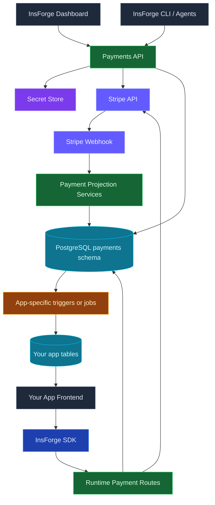

Use InsForge Payments to charge customers, run subscriptions, and host the customer portal through [Stripe](https://stripe.com) without holding the secret key in your application code. Project-level Stripe keys handle billing, webhook routing, and customer/subscription mirroring into your Postgres database.

<Note>
  Payments is currently in private preview. The API may change before general availability. Reach out if you want early access.
</Note>

## Features

### Checkout sessions

Create a Stripe Checkout session with one API call and redirect the user. The session is bound to an InsForge user, so subscription state lands on the right account when the webhook fires.

### Subscriptions

Manage recurring plans, upgrades, downgrades, trials, and proration. Subscription rows are mirrored into Postgres so feature gating and entitlements are a `SELECT`, not a Stripe API round-trip.

### Customer portal

Hosted Stripe customer portal links scoped to an authenticated user. Customers update payment methods, change plans, and download invoices without you building any UI.

### Webhook routing

Inbound Stripe webhooks land at one URL, signature-verified, idempotency-keyed, and routed to the right handler. No raw webhook plumbing in your app.

### Declarative provisioning

Define products, prices, and webhook subscriptions in `insforge.toml` and apply them with the [CLI](/core-concepts/payments/cli). Stripe state stays in version control.

## Concepts

<CardGroup cols={2}>
  <Card title="CLI" icon="terminal" href="/core-concepts/payments/cli">
    Provision products, prices, and webhooks declaratively.
  </Card>
</CardGroup>

## Build with it

<CardGroup cols={2}>
  <Card title="TypeScript SDK" icon="js" href="/sdks/typescript/payments">
    Create checkout sessions and customer portal links from your app.
  </Card>

  <Card title="REST API" icon="code" href="/sdks/rest/overview">
    Plain HTTP payments endpoints, callable from any language.
  </Card>
</CardGroup>

## Next steps

- Set up the [CLI](/quickstart) to link your project (the recommended path).
- Browse the [TypeScript SDK reference](/sdks/typescript/payments) for checkout patterns.
