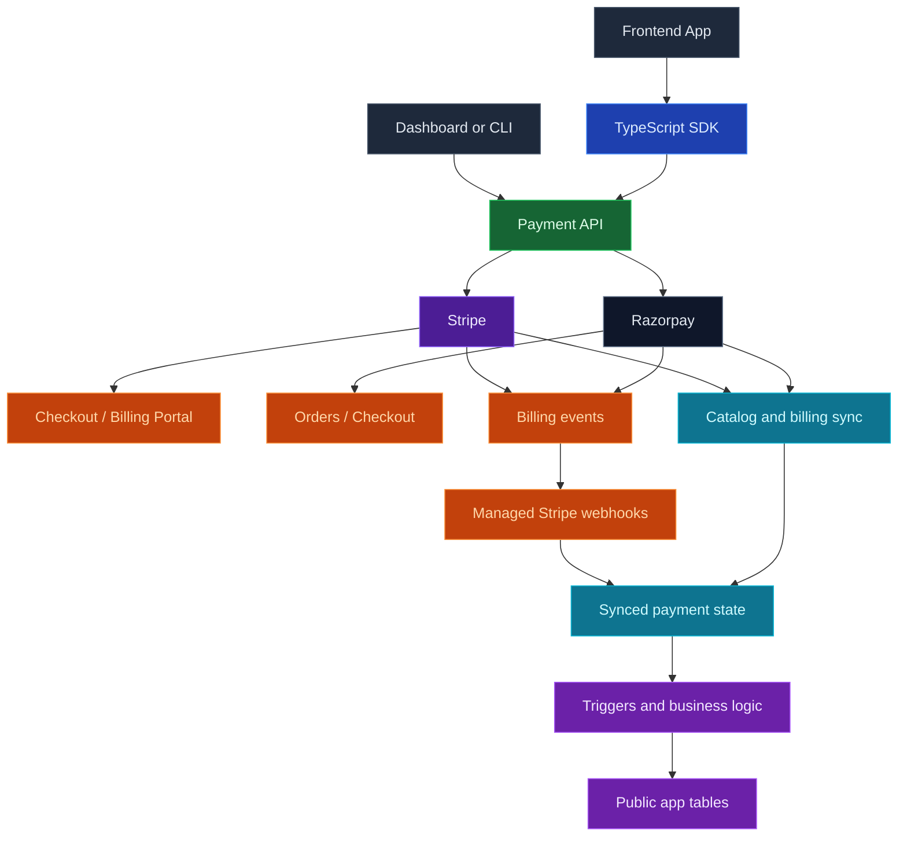

Use InsForge Payments to add checkout, subscriptions, and billing management to your app with your own Stripe or Razorpay account. InsForge keeps provider secrets server-side, creates provider-native checkout sessions or orders, verifies webhook events, and syncs payment state back to your project.

Connect a payment provider once in the dashboard or CLI. From there, your app can sell one-time products, start subscriptions, let customers manage billing where the provider supports it, and run custom fulfillment logic from verified provider events.

<Frame caption="Payments dashboard: connection, catalog, subscriptions, and history.">
  
</Frame>

<Note>
  Stripe or Razorpay remains the source of truth for charges, invoices, refunds,
  disputes, taxes, and account-level financial operations. InsForge is not a
  payment processor or merchant of record, and it does not replace the provider
  dashboard.
</Note>



## Features

### Stripe connection

Configure `test` and `live` Stripe secret keys from the dashboard, CLI, or admin API. InsForge validates the key, stores it in the secret store, creates a managed webhook when your backend is reachable, and runs the initial sync after setup.

```bash
npx @insforge/cli payments status
npx @insforge/cli payments config set test sk_test_xxx
```

### Razorpay connection

Configure `test` and `live` Razorpay key IDs and key secrets from the dashboard or admin API. Razorpay webhooks must be created manually in the Razorpay Dashboard because Razorpay does not support automatic webhook registration with normal API keys. InsForge generates the webhook URL and signing secret for you to copy into Razorpay.

### Catalog

Stripe and Razorpay catalog concepts are provider-native.

Products and prices sync from Stripe so your dashboard and app can reason about the catalog without making every request call Stripe. You can manage catalog objects in Stripe, the dashboard, or admin CLI/API flows. Product and price mutations call Stripe first, then sync the result into InsForge.

Razorpay uses Items and Plans instead of Stripe Products and Prices. An Item is the amount-bearing sellable unit. A Plan is a recurring subscription definition built around an item. Razorpay catalog mutations call Razorpay first, then sync the result into InsForge.

```bash
npx @insforge/cli payments sync --environment test

npx @insforge/cli payments products create \
  --environment test \
  --name "Pro Plan"

npx @insforge/cli payments prices create \
  --environment test \
  --product prod_123 \
  --currency usd \
  --unit-amount 1900 \
  --interval month
```

### Checkout Sessions

Create one-time payment or subscription Checkout Sessions from the TypeScript SDK. Your frontend receives a Stripe-hosted URL and redirects the user to complete payment.

```javascript
const { data, error } = await insforge.payments.createCheckoutSession({
  environment: 'test',
  mode: 'subscription',
  subject: { type: 'team', id: teamId },
  lineItems: [{ priceId: 'price_monthly_123', quantity: 1 }],
  successUrl: `${window.location.origin}/billing/success`,
  cancelUrl: `${window.location.origin}/billing`,
  customerEmail: user.email,
  idempotencyKey: `team:${teamId}:pro-monthly`
});

if (error) throw error;
if (data?.checkoutSession.url) {
  window.location.assign(data.checkoutSession.url);
}
```

Checkout inserts a row in `payments.stripe_checkout_sessions` using the caller's InsForge token. Add RLS policies so users can only create Checkout Sessions for subjects they are allowed to bill, such as their own user, team, workspace, or organization. If your app uses idempotency keys, retries also need a matching `SELECT` policy for the same subject.

### Billing Portal

Create Billing Portal sessions for existing customers so users can update payment methods, review invoices, change plans, or cancel subscriptions through Stripe-hosted UI.

```javascript
const { data, error } = await insforge.payments.createCustomerPortalSession({
  environment: 'test',
  subject: { type: 'team', id: teamId },
  returnUrl: `${window.location.origin}/billing`
});

if (error) throw error;
if (data?.customerPortalSession.url) {
  window.location.assign(data.customerPortalSession.url);
}
```

Billing Portal inserts a row in `payments.stripe_customer_portal_sessions`. It requires an authenticated user and an existing Stripe customer mapping for the subject. Protect portal creation with RLS or a server-side membership check so users cannot open billing settings for a team or organization they do not manage.

### Razorpay Orders and Subscriptions

Razorpay's recommended flow is not a hosted redirect URL like Stripe Checkout. For one-time payments, create a Razorpay Order from your backend, pass the returned `checkoutOptions` to the Razorpay Checkout script in your frontend, then verify the Checkout signature through the backend.

```http
POST /api/payments/razorpay/test/orders
POST /api/payments/razorpay/test/orders/verify
```

For subscriptions, create a Razorpay Plan first, then create a Razorpay Subscription from the backend. The frontend opens Razorpay Checkout with the returned `subscriptionId`, and the backend verifies the authorization payment signature.

```http
POST /api/payments/razorpay/test/subscriptions
POST /api/payments/razorpay/test/subscriptions/verify
```

Subscription creation first checks the caller against `payments.razorpay_subscriptions` RLS `INSERT` policies, so your app can decide who can start a subscription for a team, workspace, or organization. Future manage/cancel flows should use the same table's `UPDATE` policies.

Signature verification protects the immediate client return path. Durable fulfillment should still come from verified Razorpay webhook events because customers can complete or change payment state without returning to your app.

### Webhooks

After a Stripe key is connected, InsForge automatically tries to create the managed Stripe webhook endpoint for that environment. Incoming Stripe events for checkout, invoices, payment intents, refunds, customers, and subscriptions are verified, processed, and recorded automatically.

For Razorpay, InsForge stores the webhook signing secret and verifies incoming events at `/api/webhooks/razorpay/{environment}`. Create the webhook manually in the Razorpay Dashboard with the URL and secret generated by InsForge.

### Payment projections

Synced payment state gives your app structured records for checkout sessions, customer mappings, customers, subscriptions, provider webhook events, and the `payments.transactions` dashboard/reporting projection. Use those rows as operational inputs, not as your public end-user billing API.

### Fulfillment model

Do not fulfill from the Checkout success URL alone. Use the `subject` field to identify the app-owned billing owner, such as `{ type: 'team', id: teamId }`. InsForge copies that subject into Stripe metadata and synced payment state, so your business logic can connect Stripe events back to your app tables.

For durable fulfillment, attach triggers to verified provider webhook events and update tables in `public`, such as `public.orders`, `public.credit_ledger`, or `public.team_entitlements`. Keep the trigger function idempotent, and protect the public tables with your own RLS policies.

```sql
CREATE TRIGGER fulfill_from_payment_webhook
  AFTER INSERT OR UPDATE ON payments.webhook_events
  FOR EACH ROW
  EXECUTE FUNCTION public.fulfill_payment_event();
```

If an app accepts multiple payment providers, keep the trigger function idempotent and branch on `provider`/`event_type` from `payments.webhook_events`.

If you are upgrading from the older Stripe-only `payments.payment_history` table, move fulfillment triggers to `payments.webhook_events`. InsForge migrates old rows into `payments.transactions` for dashboard/reporting, but it does not automatically rewrite trigger logic from the old table.

### Platform boundaries

InsForge provides secure session creation, secret storage, webhook verification, synced payment state, and dashboard/CLI visibility for your payment integration. **InsForge does not handle money movement.** The provider still owns account operations, including charges, refunds, disputes, invoices, taxes, and compliance workflows.

InsForge does not provide platform-owned merchant accounts, Stripe Connect account setup, or automatic entitlement logic. Model fulfillment in your own tables and policies so billing state stays explicit in your app.

## Build with it

<CardGroup cols={2}>
  <Card title="TypeScript SDK" icon="js" href="/sdks/typescript/payments">
    Create Stripe Checkout and Billing Portal sessions from your app.
  </Card>

  <Card title="REST patterns" icon="code" href="/sdks/rest/overview">
    Use REST client setup patterns for admin tooling and non-TypeScript clients.
  </Card>
</CardGroup>

## Next steps

- Set up the [CLI](/quickstart) and connect your project.
- Configure provider keys in Dashboard -> Payments -> Settings.
- Add RLS policies for Checkout, Billing Portal, Razorpay Order, and Razorpay Subscription creation.
- Use the [TypeScript SDK reference](/sdks/typescript/payments) to create Checkout and Billing Portal sessions.
- Add trigger-backed fulfillment tables that map payment events to your product access model.
