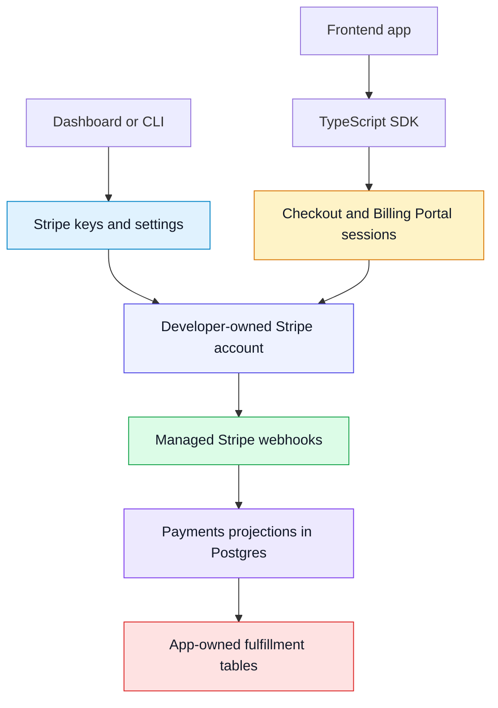

Use InsForge Payments when your app needs Stripe Checkout or Billing Portal without putting Stripe secret keys in application code. Connect your own Stripe account, store separate `test` and `live` keys in InsForge, and create Checkout or Billing Portal sessions from the SDK.

InsForge manages Stripe webhooks and mirrors Stripe catalog, customer, subscription, and payment activity into Postgres. Your app can use those projections to update fulfillment tables such as `orders`, `credit_ledger`, or `team_entitlements`.

<Frame caption="Payments dashboard: Stripe connection, catalog, customers, subscriptions, and payment history.">
  
</Frame>

<Note>
  Stripe remains the source of truth for charges, invoices, refunds, disputes,
  taxes, and account-level financial operations. InsForge is not a payment
  processor or merchant of record, and it does not replace Stripe Dashboard.
</Note>



## Features

### Stripe connection

Configure `test` and `live` Stripe secret keys from the dashboard, CLI, or admin API. InsForge validates the key, stores it in the secret store, creates a managed webhook when your backend is reachable, and mirrors the Stripe account state after setup.

```bash
npx @insforge/cli payments status
npx @insforge/cli payments config set test sk_test_xxx
```

### Catalog mirror

Stripe products and prices are mirrored into InsForge so your dashboard and app can reason about the catalog without making every request call Stripe. You can manage catalog objects in Stripe, the dashboard, or admin CLI/API flows, with Stripe as the source of truth.

### Checkout Sessions

Create one-time payment or subscription Checkout Sessions from the TypeScript SDK. Your frontend receives a Stripe-hosted URL and redirects the user to complete payment.

### Billing Portal

Create Billing Portal sessions for existing customers so users can update payment methods, review invoices, change plans, or cancel subscriptions through Stripe-hosted UI.

### Managed webhooks

InsForge can create the Stripe webhook endpoint for each environment. Incoming Stripe events update local payment state and record processing status.

### Payment projections

The `payments` schema mirrors checkout sessions, customer mappings, customers, subscriptions, payment history, refunds, and webhook events. Use those rows as operational inputs, not as your public end-user billing API.

### Fulfillment model

Do not fulfill from the Checkout success URL alone. Populate app-owned tables such as `orders`, `credit_ledger`, or `team_entitlements` from webhook-projected payment state, then protect those tables with your own RLS policies.

### Platform boundaries

InsForge provides secure session creation, secret storage, managed webhook handling, local Postgres projections, and dashboard/CLI visibility for your Stripe integration. Stripe still owns money movement and account operations, including charges, refunds, disputes, invoices, taxes, and compliance workflows.

InsForge does not provide platform-owned merchant accounts, Stripe Connect onboarding, or automatic entitlement logic. Model fulfillment in your own tables and policies so billing state stays explicit in your app.

## Build with it

<CardGroup cols={2}>
  <Card title="TypeScript SDK" icon="js" href="/sdks/typescript/payments">
    Create Checkout and Billing Portal sessions from your app.
  </Card>

  <Card title="REST patterns" icon="code" href="/sdks/rest/overview">
    Use REST client setup patterns for admin tooling and non-TypeScript clients.
  </Card>
</CardGroup>

## Next steps

- Configure Stripe keys in Dashboard -> Payments -> Settings or with `npx @insforge/cli payments config set test sk_test_xxx`.
- Check the connection with `npx @insforge/cli payments status`.
- Use the [TypeScript SDK reference](/sdks/typescript/payments) to create Checkout and Billing Portal sessions.
- Add fulfillment tables that map payment events to your product access model.
