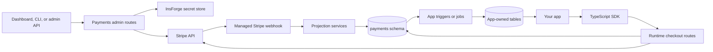

Use InsForge Payments when your app needs Stripe Checkout or Billing Portal without storing Stripe secret keys in app code. InsForge stores separate Stripe `test` and `live` keys in the secret store, attempts to create managed Stripe webhooks, syncs Stripe catalog and customer state, and projects payment events into the `payments` schema.

<Warning>
  Payments is currently in private preview. APIs and behavior may change before general availability.
</Warning>

## How It Fits

Payments is split into three surfaces.

| Surface | What it owns |
|---------|--------------|
| Control plane | Stripe keys, connection status, catalog management, sync, and managed webhook setup. |
| Runtime plane | Checkout Session and Billing Portal Session creation from application code. |
| Projection plane | Webhook-processed rows for checkout state, customer mappings, payment history, subscriptions, customers, and webhook processing. |

Stripe remains the source of truth for money movement. InsForge mirrors the Stripe state your app and dashboard need to reason about billing without making every request call Stripe.

## Control Plane

Project admins configure Stripe from the Dashboard, CLI, or REST API.

- Configure separate `test` and `live` Stripe secret keys.
- Check account, sync, and webhook status for each environment.
- Sync products, prices, customers, and subscriptions from Stripe.
- Create or recreate the InsForge-managed Stripe webhook endpoint.
- Manage products and prices through the CLI or REST API when you need scripted catalog changes.

Saving a new key validates it against Stripe and stores it as a reserved InsForge secret. If the key points at a different Stripe account than the previously configured key for that environment, InsForge clears the mirrored payment data for that environment before syncing the new account.

## Runtime Plane

Application code uses the [TypeScript Payments SDK](/sdks/typescript/payments) for user-facing flows.

| SDK method | Use it for | Auth requirement |
|------------|------------|------------------|
| `createCheckoutSession` | Start one-time payment or subscription checkout. | Requires a user token. Anonymous InsForge tokens can be used for guest one-time checkout. |
| `createCustomerPortalSession` | Open Stripe Billing Portal for an existing billing subject. | Requires an authenticated user and an existing Stripe customer mapping. |

Subscription checkout requires a billing `subject`, such as `{ type: "team", id: "team_123" }`, because the resulting subscription must belong to a stable app-defined owner. One-time checkout can omit `subject` for guest payments, or include it when you want InsForge to map the Stripe customer back to that subject after checkout completes.

## Projection Plane

Stripe webhooks update local payment state:

- `payments.checkout_sessions` records local checkout attempts and their Stripe session IDs.
- `payments.stripe_customer_mappings` maps app-defined billing subjects to Stripe customers.
- `payments.payment_history` records one-time payments, subscription invoices, refunds, and failed payments.
- `payments.subscriptions` and `payments.subscription_items` mirror subscription state.
- `payments.customers` mirrors Stripe customer display data for dashboard and admin views.
- `payments.webhook_events` records webhook processing, retries, ignored events, and failures.

Use these rows as operational records and fulfillment inputs. Do not expose them directly as your end-user billing API. Instead, write app-owned tables such as `orders`, `credit_ledger`, `team_entitlements`, or `billing_status`, protect those tables with your app's RLS policies, and populate them from webhook-projected payment rows.

<Warning>
  Do not mark an order paid, grant credits, or activate a subscription from the Checkout success URL alone. Treat success and return URLs as UX redirects. Fulfillment should come from webhook-projected payment state.
</Warning>

## Dashboard

The Payments dashboard uses the same admin REST API.

| Page | Purpose |
|------|---------|
| Catalog | Read-only view of synced Stripe products and prices for the selected environment. |
| Customers | Read-only customer mirror with email, payment method summary, country, spend, and payment count. |
| Subscriptions | Read-only subscription mirror with status, period, customer, and line items. |
| Payment History | Read-only payment, invoice, refund, and failed-payment activity. |
| Settings | Stripe key configuration, sync, and managed webhook setup for `test` and `live`. |

If an environment has no Stripe key, the dashboard shows a key-missing state before loading catalog, customer, subscription, or history data.

## Common Build Paths

### One-time orders

1. Create an app-owned pending order row.
2. Create a Checkout Session with `mode: "payment"` and pass the order ID in metadata.
3. Redirect the user to the returned Stripe Checkout URL.
4. Fulfill from `payments.payment_history` after the webhook records a succeeded one-time payment.

### Subscriptions

1. Decide the billing subject, such as user, team, organization, workspace, or tenant.
2. Create a Checkout Session with `mode: "subscription"` and the subject.
3. Redirect the user to Checkout.
4. Read or project subscription status from `payments.subscriptions` after Stripe webhooks are processed.
5. Open Billing Portal for plan changes, payment method changes, invoices, and cancellation flows.

### Catalog administration

Create and edit products and prices in Stripe, then sync them into InsForge, or use the Payments CLI/REST API to create Stripe catalog objects and mirror them locally after Stripe succeeds.

## More Resources

<CardGroup cols={2}>
  <Card title="Architecture" icon="diagram-project" href="/core-concepts/payments/architecture">
    Learn the backend routes, tables, webhook processing, and fulfillment model.
  </Card>

  <Card title="Payments CLI" icon="terminal" href="/core-concepts/payments/cli">
    Configure Stripe keys, sync state, manage catalog objects, and inspect projections.
  </Card>

  <Card title="TypeScript SDK" icon="js" href="/sdks/typescript/payments">
    Create Checkout and Billing Portal sessions from your app.
  </Card>

  <Card title="REST patterns" icon="code" href="/sdks/rest/overview">
    Use REST client setup patterns for admin tooling and non-TypeScript clients.
  </Card>
</CardGroup>
