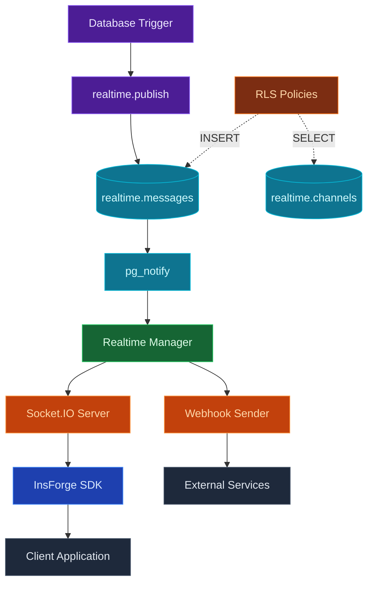
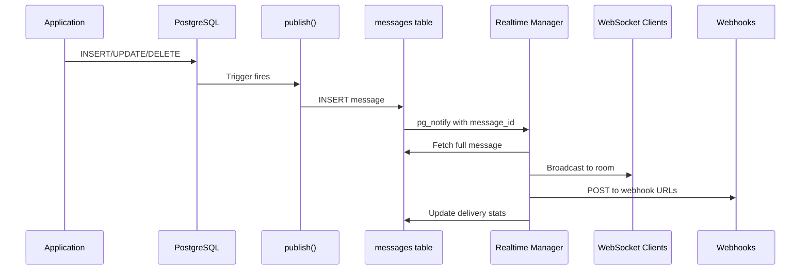
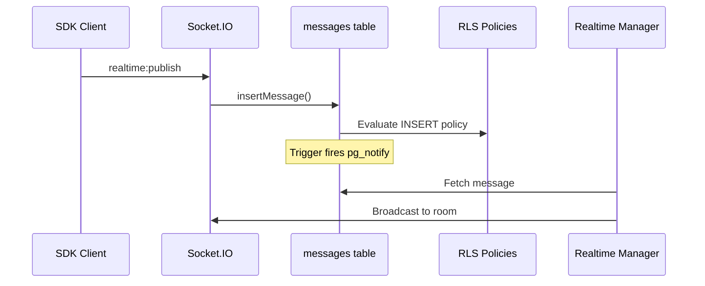

## Overview

InsForge Realtime provides a powerful event-driven messaging system that bridges database changes to connected clients. Events are triggered by PostgreSQL triggers, delivered through WebSocket connections via Socket.IO, and optionally forwarded to webhook endpoints.

## Technology Stack



## Core Components

| Component | Technology | Purpose |
|-----------|------------|---------|
| **Realtime Schema** | PostgreSQL | Channels, messages tables and publish function |
| **Permission Model** | Grants + RLS (optional) | Controls subscribe and publish access |
| **Notification Bridge** | pg_notify | Bridges database to Node.js process |
| **Realtime Manager** | Node.js | Listens for notifications, dispatches messages |
| **WebSocket Server** | Socket.IO | Bidirectional client communication |
| **Webhook Sender** | Axios | HTTP delivery to external endpoints |
| **SDK** | @insforge/sdk | Client-side subscription and messaging |

## Database Schema

### Channels Table

The `realtime.channels` table defines available channel patterns and their configuration:

| Column | Type | Description |
|--------|------|-------------|
| `id` | UUID | Primary key |
| `pattern` | TEXT | Channel name pattern (e.g., `orders`, `order:%`) |
| `description` | TEXT | Human-readable description |
| `webhook_urls` | TEXT[] | Array of webhook endpoints |
| `enabled` | BOOLEAN | Whether the channel is active |

<Note>
Channel patterns use `:` as separator and `%` for wildcards (SQL LIKE pattern). For example, `order:%` matches `order:123`, `order:456`, etc.
</Note>

### Messages Table

The `realtime.messages` table stores all published messages for audit purposes:

| Column | Type | Description |
|--------|------|-------------|
| `id` | UUID | Primary key |
| `event_name` | TEXT | Event type (e.g., `order_created`) |
| `channel_id` | UUID | Reference to channels table |
| `channel_name` | TEXT | Resolved channel name (e.g., `order:123`) |
| `payload` | JSONB | Event data |
| `sender_type` | TEXT | `system` (trigger) or `user` (client) |
| `sender_id` | UUID | User ID for client-initiated messages |
| `ws_audience_count` | INTEGER | WebSocket subscribers at time of delivery |
| `wh_audience_count` | INTEGER | Webhook URLs configured |
| `wh_delivered_count` | INTEGER | Successful webhook deliveries |

## Permission Model

InsForge Realtime uses PostgreSQL grants and optional Row Level Security (RLS) to control channel access.

<Note>
**RLS is disabled by default** for the best developer experience. Channels and messages are open to all authenticated and anonymous users out of the box. Enable RLS when you need fine-grained access control.
</Note>

### Default Permissions (RLS Disabled)

| Permission | Table | Grant | Access |
|------------|-------|-------|--------|
| **Subscribe** | `realtime.channels` | SELECT | All authenticated/anon users |
| **Publish** | `realtime.messages` | INSERT | All authenticated/anon users |

### Enabling Access Control

To restrict access, enable RLS and add policies:

```sql
-- Step 1: Enable RLS
ALTER TABLE realtime.channels ENABLE ROW LEVEL SECURITY;
ALTER TABLE realtime.messages ENABLE ROW LEVEL SECURITY;

-- Step 2: Add policies (see examples below)
```

### How RLS Works (When Enabled)

| Permission | Table | Policy Type | Description |
|------------|-------|-------------|-------------|
| **Subscribe** | `realtime.channels` | SELECT | Who can subscribe to a channel |
| **Publish** | `realtime.messages` | INSERT | Who can publish to a channel |

1. When a client subscribes, the backend executes a SELECT query on `realtime.channels` with the user's role
2. RLS policies filter the result. If a matching channel is returned, subscription is allowed
3. When a client publishes, the backend attempts an INSERT into `realtime.messages`
4. RLS policies evaluate the INSERT. If allowed, the message is stored and broadcast

### Helper Function

Use `realtime.channel_name()` in your policies to access the channel being requested:

```sql
-- Allow authenticated users to subscribe to their own order channels
CREATE POLICY "users_can_subscribe_own_orders"
ON realtime.channels
FOR SELECT
TO authenticated
USING (
  pattern = 'order:%'
  AND EXISTS (
    SELECT 1 FROM orders
    WHERE id = NULLIF(split_part(realtime.channel_name(), ':', 2), '')::uuid
      AND user_id = auth.uid()
  )
);
```

## Message Flow

### System Events (Database Triggers)



### Client Events (User-Initiated)



## Publish Function

The `realtime.publish()` function is called by your database triggers:

```sql
CREATE OR REPLACE FUNCTION notify_order_changes()
RETURNS TRIGGER AS $$
BEGIN
  PERFORM realtime.publish(
    'order:' || NEW.id::text,           -- channel name
    TG_OP || '_order',                   -- event: INSERT_order, UPDATE_order, etc.
    jsonb_build_object(
      'id', NEW.id,
      'status', NEW.status,
      'total', NEW.total
    )
  );
  RETURN NEW;
END;
$$ LANGUAGE plpgsql SECURITY DEFINER;

CREATE TRIGGER order_changes_trigger
  AFTER INSERT OR UPDATE ON orders
  FOR EACH ROW
  EXECUTE FUNCTION notify_order_changes();
```

<Warning>
The `realtime.publish()` function can only be called by database triggers (SECURITY DEFINER). It bypasses RLS to insert system messages.
</Warning>

## WebSocket Events

### Client-to-Server Events

| Event | Payload | Description |
|-------|---------|-------------|
| `realtime:subscribe` | `{ channel: string }` | Subscribe to a channel |
| `realtime:unsubscribe` | `{ channel: string }` | Unsubscribe from a channel |
| `realtime:publish` | `{ channel, event, payload }` | Publish a message |

### Server-to-Client Events

| Event | Payload | Description |
|-------|---------|-------------|
| `{eventName}` | Message payload + meta | Custom event from channel |
| `realtime:error` | `{ code, message }` | Error notification |

### Socket Message Structure

All WebSocket messages include a `meta` object with server-enforced fields alongside the event payload:

```typescript
interface SocketMessage {
  meta: {
    channel?: string           // Channel the message was sent to
    messageId: string          // Unique message ID (UUID)
    senderType: 'system' | 'user'
    senderId?: string          // User ID for client messages
    timestamp: Date            // Server timestamp
  }
  // ...event payload fields
}
```

## Webhook Delivery

When channels have `webhook_urls` configured, messages are delivered via HTTP POST:

### Request Format

```http
POST /your-webhook-endpoint HTTP/1.1
Content-Type: application/json
X-InsForge-Event: order_created
X-InsForge-Channel: order:123
X-InsForge-Message-Id: a1b2c3d4-e5f6-...

{
  "id": "123",
  "status": "confirmed",
  "total": 99.99
}
```

### Delivery Guarantees

| Feature | Behavior |
|---------|----------|
| **Retries** | 2 retries with 1s, 2s backoff |
| **Timeout** | 10 seconds per request |
| **Parallel** | All webhook URLs called concurrently |
| **Tracking** | Success/failure counts stored per message |

## Sender Types

| Type | Source | Description |
|------|--------|-------------|
| **system** | Database triggers | Events from `realtime.publish()` function |
| **user** | Client SDK | Events from `insforge.realtime.publish()` |

<Tip>
System events are trusted and bypass publish RLS checks. User events must pass INSERT policy on `realtime.messages`.
</Tip>

## Developer Workflow

<Steps>
  <Step title="Define Channels">
    Create channel patterns in `realtime.channels`:
    ```sql
    INSERT INTO realtime.channels (pattern, description)
    VALUES ('order:%', 'Order-specific events');
    ```
  </Step>

  <Step title="Configure Permissions (Optional)">
    RLS is disabled by default, so all users can subscribe and publish. To restrict access, enable RLS and add policies:
    ```sql
    -- Step 1: Enable RLS
    ALTER TABLE realtime.channels ENABLE ROW LEVEL SECURITY;
    ALTER TABLE realtime.messages ENABLE ROW LEVEL SECURITY;

    -- Step 2: Add policies
    -- Subscribe: users can only subscribe to their own order channels
    CREATE POLICY "users_subscribe_own_orders"
    ON realtime.channels FOR SELECT
    TO authenticated
    USING (
      pattern = 'order:%'
      AND EXISTS (
        SELECT 1 FROM orders
        WHERE id = NULLIF(split_part(realtime.channel_name(), ':', 2), '')::uuid
          AND user_id = auth.uid()
      )
    );

    -- Publish: only admins can publish to order channels
    CREATE POLICY "admins_publish_orders"
    ON realtime.messages FOR INSERT
    TO authenticated
    WITH CHECK (
      channel_name LIKE 'order:%'
      AND EXISTS (
        SELECT 1 FROM admins
        WHERE user_id = auth.uid()
      )
    );
    ```
  </Step>

  <Step title="Create Triggers">
    Add trigger function and trigger to emit events on database changes:
    ```sql
    CREATE OR REPLACE FUNCTION notify_order_changes()
    RETURNS TRIGGER AS $$
    BEGIN
      PERFORM realtime.publish(
        'order:' || NEW.id::text,
        TG_OP || '_order',
        jsonb_build_object('id', NEW.id, 'status', NEW.status)
      );
      RETURN NEW;
    END;
    $$ LANGUAGE plpgsql SECURITY DEFINER;

    CREATE TRIGGER order_realtime
    AFTER INSERT OR UPDATE ON orders
    FOR EACH ROW EXECUTE FUNCTION notify_order_changes();
    ```
  </Step>

  <Step title="Subscribe in Client">
    Use the SDK to subscribe and listen:
    ```javascript
    await insforge.realtime.connect()
    await insforge.realtime.subscribe('order:123')
    insforge.realtime.on('UPDATE_order', (data) => {
      console.log('Order updated:', data)
    })
    ```
  </Step>
</Steps>

## Architecture Features

<CardGroup cols={2}>
  <Card title="Database-Driven" icon="database">
    Events originate from PostgreSQL triggers, ensuring consistency with your data
  </Card>

  <Card title="Optional RLS Security" icon="shield">
    Works out of the box, with optional RLS for fine-grained access control
  </Card>

  <Card title="Dual Delivery" icon="arrows-split-up-and-left">
    Messages delivered to both WebSocket clients and webhook endpoints simultaneously
  </Card>

  <Card title="Audit Trail" icon="clipboard-list">
    All messages stored in database with delivery statistics for debugging and replay
  </Card>

  <Card title="Pattern Matching" icon="asterisk">
    Wildcard channel patterns let you define permissions for dynamic channels
  </Card>

  <Card title="Bidirectional" icon="arrows-left-right">
    Clients can both receive events and publish their own messages (subject to RLS)
  </Card>
</CardGroup>

## Performance Characteristics

| Metric | Value | Notes |
|--------|-------|-------|
| **Latency** | ~10-50ms | Database to client, depends on network |
| **Throughput** | High | Limited by PostgreSQL NOTIFY and Socket.IO |
| **Persistence** | Full | All messages stored in database |
| **Reconnection** | Automatic | Socket.IO handles reconnection |
| **Webhook Timeout** | 10s | Per webhook request |

## Best Practices

<CardGroup cols={2}>
  <Card title="Keep Payloads Small" icon="compress">
    Only include necessary data in payloads
  </Card>

  <Card title="Use Specific Channels" icon="bullseye">
    Prefer `order:123` over broadcasting to `orders` for reducing the traffic
  </Card>

  <Card title="Add RLS When Needed" icon="gavel">
    Enable RLS and add policies when you need to restrict channel access
  </Card>

  <Card title="Monitor Delivery" icon="chart-bar">
    Check `ws_audience_count` and `wh_delivered_count` to debug delivery issues
  </Card>

  <Card title="Handle Reconnection" icon="rotate">
    Design clients to refetch state on reconnect since missed messages are not replayed
  </Card>

  <Card title="Use Webhooks for Reliability" icon="webhook">
    For critical notifications, configure webhook URLs as backup delivery method
  </Card>
</CardGroup>

## Limitations

- **No Message Replay**: Clients don't receive messages missed during disconnection
- **No Presence**: No built-in tracking of who's online in a channel
- **Single Region**: Messages delivered from single backend instance
- **Webhook Retries**: Limited to 2 retries with short timeout
