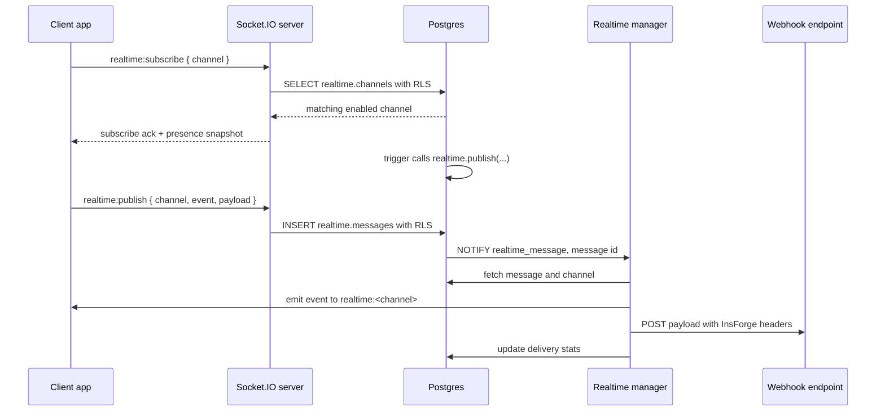

Realtime has one core path: an event becomes a row in `realtime.messages`, Postgres notifies the backend, and the backend delivers that message to WebSocket subscribers and webhook URLs.

## Runtime Flow


```mermaid
sequenceDiagram
    participant App as Client app
    participant Socket as Socket.IO server
    participant DB as Postgres
    participant RT as Realtime manager
    participant WH as Webhook endpoint

    App->>Socket: realtime:subscribe { channel }
    Socket->>DB: SELECT realtime.channels with RLS
    DB-->>Socket: matching enabled channel
    Socket-->>App: subscribe ack + presence snapshot

    DB->>DB: trigger calls realtime.publish(...)
    App->>Socket: realtime:publish { channel, event, payload }
    Socket->>DB: INSERT realtime.messages with RLS
    DB->>RT: NOTIFY realtime_message, message id
    RT->>DB: fetch message and channel
    RT->>App: emit event to realtime:<channel>
    RT->>WH: POST payload with InsForge headers
    RT->>DB: update delivery stats
```

## Channel Patterns

Channels are configured in `realtime.channels`.

| Pattern | Matches | Use case |
|---------|---------|----------|
| `orders` | `orders` | One shared channel |
| `order:%` | `order:123`, `order:456` | Per-record channels |
| `chat:%:messages` | `chat:room-1:messages` | Scoped rooms |

Pattern matching uses SQL `LIKE`. Use `%` as the wildcard. Use `:` as the path separator. Channel patterns may contain letters, numbers, hyphens, colons, and `%`; `_` is intentionally rejected because it is also a SQL wildcard.

When several patterns match, an exact match wins before wildcard matches.

## Message Sources

### Database-triggered messages

Database triggers call `realtime.publish(channel, event, payload)`. The function looks up an enabled channel pattern, inserts a system message, and returns the new message ID.

```sql
PERFORM realtime.publish(
  'order:' || NEW.id::text,
  'status_changed',
  jsonb_build_object('id', NEW.id, 'status', NEW.status)
);
```

Use `SECURITY DEFINER` on trigger functions created through project-admin SQL so the function can execute `realtime.publish(TEXT, TEXT, JSONB)`.

### Client-published messages

Clients publish over Socket.IO or the TypeScript SDK. The backend requires the socket to be subscribed to the target channel first. It then inserts a user message into `realtime.messages`, which means the same Postgres notify path handles delivery and stats.

Client publish is authorized by `INSERT` policies on `realtime.messages` when RLS is enabled.

## WebSocket Contract

The raw Socket.IO endpoint is the project origin, for example `https://your-app.insforge.app`.

Client-to-server events:

| Event | Payload | Acknowledgement |
|-------|---------|-----|
| `realtime:subscribe` | `{ channel }` | `{ ok, channel, presence?, error? }` |
| `realtime:unsubscribe` | `{ channel }` | None |
| `realtime:publish` | `{ channel, event, payload }` | None. Errors are emitted as `realtime:error`. |

Server-to-client events:

| Event | When |
|-------|------|
| Custom event name | A message is delivered to the subscribed channel |
| `presence:join` | A logical member becomes present in the channel |
| `presence:leave` | A logical member is no longer present in the channel |
| `realtime:error` | Subscribe or publish authorization fails, or delivery cannot proceed |

Delivered messages include your payload fields plus a `meta` object with `messageId`, `senderType`, optional `senderId`, `timestamp`, and channel metadata.

## Presence

Presence is ephemeral online state. It is not stored in Postgres.

On a successful subscribe, the server acknowledgement includes the current presence snapshot:

```json
{
  "ok": true,
  "channel": "chat:room-1",
  "presence": {
    "members": [
      {
        "type": "user",
        "presenceId": "7f0d8b2f-5f58-4f31-8d87-a0ebc711af3e",
        "joinedAt": "2026-04-25T17:00:00.000Z"
      }
    ]
  }
}
```

For authenticated users, `presenceId` is the user ID. For anonymous sockets and API-key sockets, it is the socket ID. Multiple sockets for the same user count as one logical member; `presence:leave` fires only when the final socket for that member leaves the channel.

## Access Control

Realtime is open by default. The migrations grant `anon` and `authenticated`:

- `SELECT` on `realtime.channels`, which allows subscribe checks.
- `INSERT` on `realtime.messages`, which allows client publish checks.

To restrict realtime access, enable RLS and add policies:

```sql
ALTER TABLE realtime.channels ENABLE ROW LEVEL SECURITY;
ALTER TABLE realtime.messages ENABLE ROW LEVEL SECURITY;
```

Subscribe policies live on `realtime.channels` and use `FOR SELECT`. Publish policies live on `realtime.messages` and use `FOR INSERT`.

```sql
CREATE POLICY "users_subscribe_own_orders"
ON realtime.channels
FOR SELECT
TO authenticated
USING (
  pattern = 'order:%'
  AND EXISTS (
    SELECT 1
    FROM orders
    WHERE id = NULLIF(split_part(realtime.channel_name(), ':', 2), '')::uuid
      AND user_id = auth.uid()
  )
);
```

`realtime.channel_name()` returns the resolved channel requested by the client, such as `order:123`. Use it in subscribe policies because `realtime.channels` stores patterns, not resolved channel instances.

```sql
CREATE POLICY "members_publish_chat"
ON realtime.messages
FOR INSERT
TO authenticated
WITH CHECK (
  channel_name LIKE 'chat:%'
  AND EXISTS (
    SELECT 1
    FROM chat_members
    WHERE room_id = NULLIF(split_part(channel_name, ':', 2), '')::uuid
      AND user_id = auth.uid()
  )
);
```

## Webhooks

Each channel can include `webhookUrls`. When a message is delivered, InsForge sends the message payload as the HTTP request body to every configured URL.

Webhook requests include:

| Header | Value |
|--------|-------|
| `Content-Type` | `application/json` |
| `X-InsForge-Event` | Event name |
| `X-InsForge-Channel` | Resolved channel name |
| `X-InsForge-Message-Id` | Message UUID |

Network failures are retried twice with a short retry delay. Non-2xx HTTP responses are recorded as failed deliveries and are not retried.

## Message History And Retention

`realtime.messages` stores event history and delivery stats:

- `wsAudienceCount`: WebSocket subscribers that received the message.
- `whAudienceCount`: Webhook URLs configured on the channel.
- `whDeliveredCount`: Webhook requests that returned a 2xx response.

Message retention is configured in `realtime.config.retention_days`. `NULL` means keep messages indefinitely. The cleanup job runs daily through pg_cron and deletes old messages in batches.

The Dashboard exposes common retention choices and shows message history, stats, channel configuration, and active RLS policy definitions.
