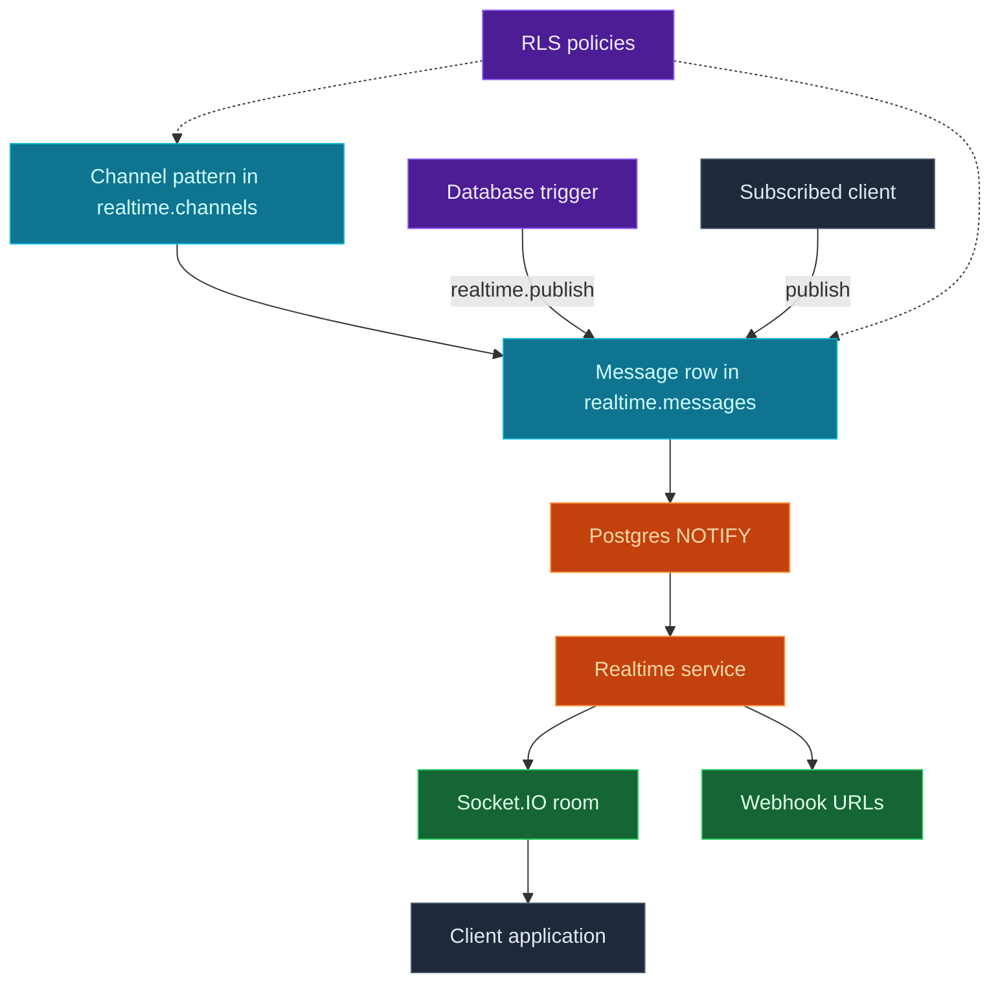

Use InsForge Realtime when a client needs to react while data is changing. A client subscribes to a channel such as `orders:123` or `chat:room-1`, and InsForge delivers matching events over Socket.IO. Those events can come from database triggers, client broadcasts, or any code that inserts into the realtime message pipeline.

<Note>
  **Need server-side work after a database change?** Use [Edge Functions](/core-concepts/functions/overview) with database triggers. Realtime is for live clients and webhook delivery.
</Note>



## How It Works

### Channels define what clients can join

Create channel patterns in `realtime.channels`. Exact names such as `orders` match one channel. SQL `LIKE` patterns such as `order:%` match many resolved channel names like `order:123` and `order:456`.

### Messages are the delivery unit

Every database-triggered event and client-published event is stored in `realtime.messages`. The backend listens for new message rows, delivers them to subscribed WebSocket clients, forwards them to configured webhooks, and records delivery counts.

### RLS is optional and uses the same auth context

Realtime is open by default for fast development. To restrict access, enable RLS on `realtime.channels` for subscribe checks and `realtime.messages` for client publish checks. Policies read the same JWT helpers as the database, plus `realtime.channel_name()` for the requested channel.

## Features

### Postgres changes

Mirror table writes to clients with a database trigger that calls `realtime.publish(channel, event, payload)`. The trigger decides the channel, event name, and payload.

### Client broadcasts

Send arbitrary messages to every client subscribed to the same channel. This is useful for chat, typing indicators, cursors, and live collaboration signals.

### Presence

Track who is currently present in a channel. Presence is ephemeral online state, returned on subscribe and updated through `presence:join` and `presence:leave` events.

### Webhooks

Attach webhook URLs to a channel. Each delivered message posts the payload to those URLs with InsForge headers for the event, channel, and message ID.

### Dashboard management

Use the Dashboard to manage channels, inspect message history, view delivery stats, review realtime RLS policies, and configure message retention.

## Quick Start

### 1. Create a channel pattern

```sql
INSERT INTO realtime.channels (pattern, description, enabled)
VALUES ('order:%', 'Per-order status updates', true);
```

### 2. Publish from a database trigger

```sql
CREATE OR REPLACE FUNCTION notify_order_status()
RETURNS TRIGGER AS $$
BEGIN
  PERFORM realtime.publish(
    'order:' || NEW.id::text,
    'status_changed',
    jsonb_build_object(
      'id', NEW.id,
      'status', NEW.status,
      'updatedAt', NEW.updated_at
    )
  );
  RETURN NEW;
END;
$$ LANGUAGE plpgsql SECURITY DEFINER;

CREATE TRIGGER order_status_realtime
  AFTER UPDATE OF status ON orders
  FOR EACH ROW
  WHEN (OLD.status IS DISTINCT FROM NEW.status)
  EXECUTE FUNCTION notify_order_status();
```

### 3. Subscribe from the client

```typescript
await insforge.realtime.connect();

const response = await insforge.realtime.subscribe(`order:${orderId}`);

if (response.ok) {
  insforge.realtime.on('status_changed', (message) => {
    console.log(message.status);
  });
}
```

<Tip>
  A client must subscribe to a channel before it can publish to that same channel.
</Tip>

## Concepts

<CardGroup cols={2}>
  <Card title="Architecture" icon="diagram-project" href="/core-concepts/realtime/architecture">
    Channel matching, message delivery, RLS checks, webhooks, and retention.
  </Card>
</CardGroup>

## Build with it

<CardGroup cols={2}>
  <Card title="TypeScript SDK" icon="js" href="/sdks/typescript/realtime">
    Subscribe to channels and receive event payloads from Node, browser, and edge.
  </Card>

  <Card title="Swift SDK" icon="swift" href="/sdks/swift/realtime">
    Native Swift realtime client for iOS and macOS.
  </Card>

  <Card title="Kotlin SDK" icon="android" href="/sdks/kotlin/realtime">
    Coroutines-first realtime client for Android and JVM.
  </Card>

  <Card title="REST API" icon="code" href="/sdks/rest/realtime">
    Realtime over WebSockets, addressable from any language.
  </Card>
</CardGroup>

## Next steps

- Read the [architecture guide](/core-concepts/realtime/architecture) for the runtime model.
- Use the [TypeScript SDK reference](/sdks/typescript/realtime) for client subscriptions.
