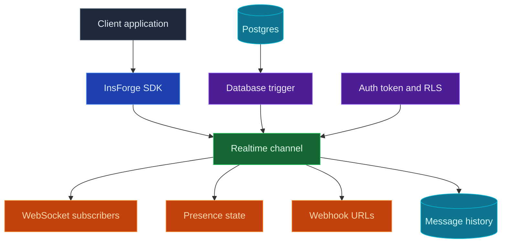

Use InsForge Realtime when your app needs to update without a page refresh. Clients subscribe to channels such as `orders:123` or `chat:room-1`, then receive events over WebSockets. Events can come from database triggers, other connected clients, or app code that publishes into a channel.

<Frame caption="Realtime dashboard: channel patterns, message history, permissions, and retention settings.">
  
</Frame>

<Note>
  **Need backend work after a database change?** Use [Edge Functions](/core-concepts/functions/overview) for server-side jobs. Realtime is for live clients, presence, and webhook fan-out.
</Note>

## Features

### Channels

Channels are named topics that clients can join. Use exact names for shared rooms, or patterns like `order:%` when every record needs its own live stream.

### Database events

Publish from Postgres triggers when table rows change. This is the usual path for order status, notifications, moderation queues, dashboards, and anything else that should mirror database state.

### Client broadcasts

Clients can publish messages to channels they have joined. Use this for chat, typing indicators, cursors, collaborative editing signals, and other user-to-user updates.

### Presence

Presence tracks who is online in a channel. Clients receive the current presence snapshot when they subscribe, then join and leave events as members come and go.

### Webhooks

Attach webhook URLs to a channel to fan out the same event to external systems. Webhook deliveries include InsForge headers for the event name, channel, and message ID.

### Row-level security

Realtime can be open while prototyping, then locked down with Postgres RLS. Subscribe checks use `realtime.channels`; publish checks use `realtime.messages`; both read the same auth context as the rest of InsForge.

### Message history

Every delivered event is recorded with delivery counts. The dashboard can inspect recent messages, delivery stats, and retention settings when you need to debug live behavior.

## Build with it

<CardGroup cols={2}>
  <Card title="TypeScript SDK" icon="js" href="/sdks/typescript/realtime">
    Subscribe to channels, publish events, and track presence from Node, browser, and edge.
  </Card>

  <Card title="Swift SDK" icon="swift" href="/sdks/swift/realtime">
    Native Swift realtime client for iOS and macOS.
  </Card>

  <Card title="Kotlin SDK" icon="android" href="/sdks/kotlin/realtime">
    Coroutines-first realtime client for Android and JVM.
  </Card>

  <Card title="REST and WebSocket API" icon="code" href="/sdks/rest/realtime">
    Use the raw Socket.IO contract from any language.
  </Card>
</CardGroup>

## Next steps

- Set up the [CLI](/quickstart) to link your project.
- Create channels in the Realtime dashboard.
- Use the [TypeScript SDK reference](/sdks/typescript/realtime) for client subscriptions.
