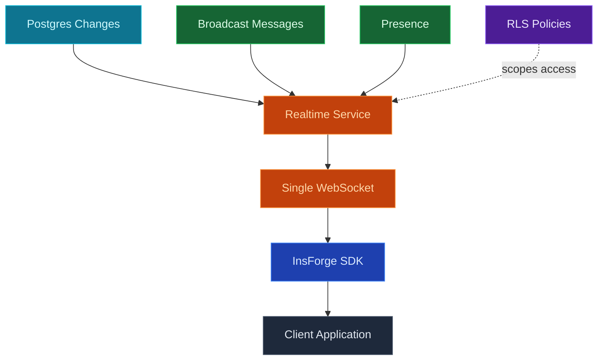

Use InsForge Realtime to stream Postgres row changes, broadcast messages between clients, and track presence on one WebSocket connection. Subscriptions enforce the same row-level security policies as REST queries, so a client only sees the changes its session is allowed to read.

<Note>
  **Need to react to changes on the server?** Use [Edge Functions](/core-concepts/functions/overview) with database triggers. Realtime is for clients that want to watch; Edge Functions are for code that responds.
</Note>

## Features

### Postgres changes

Subscribe to `INSERT`, `UPDATE`, and `DELETE` events on any table the user is allowed to read. Row-level filters and column selection happen server-side; payloads only contain rows the session is authorized to see.

### Broadcast

Send arbitrary messages to every client subscribed to a named channel. Useful for chat, multiplayer cursors, typing indicators, and any low-latency fan-out that does not need to hit the database.

### Presence

Track which clients are currently online in a channel and what state they hold (name, avatar, status). Presence syncs are CRDT-merged so eventual consistency is automatic.

### Row-level security

Channel access reads the same JWT as REST and storage requests. The same RLS policy that scopes a `SELECT` scopes the stream, so a channel needs no permission rules of its own.

### One connection

Database changes, broadcast, and presence all multiplex over a single WebSocket. Open one connection per session, subscribe to as many channels as you need.

## Build with it

<CardGroup cols={2}>
  <Card title="TypeScript SDK" icon="js" href="/sdks/typescript/realtime">
    Subscribe to channels and database changes from Node, browser, and edge.
  </Card>

  <Card title="Swift SDK" icon="swift" href="/sdks/swift/realtime">
    Native Swift realtime client for iOS and macOS.
  </Card>

  <Card title="Kotlin SDK" icon="android" href="/sdks/kotlin/realtime">
    Coroutines-first realtime client for Android and JVM.
  </Card>

  <Card title="REST API" icon="code" href="/sdks/rest/realtime">
    Realtime over WebSockets, addressable from any language.
  </Card>
</CardGroup>

## Next steps

- Set up the [CLI](/quickstart) to link your project (the recommended path).
- Browse the [TypeScript SDK reference](/sdks/typescript/realtime) for subscription patterns.
