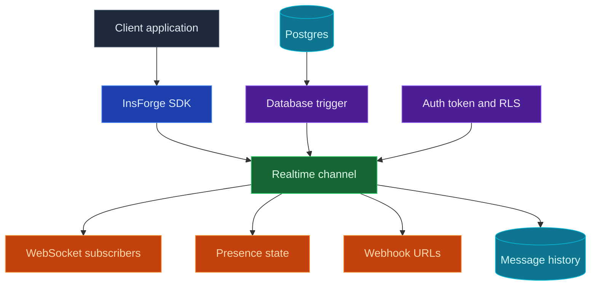

Use InsForge Realtime when your app needs to update without a page refresh. Clients subscribe to channels such as `orders:123` or `chat:room-1`, then receive database changes, broadcasts, and presence updates over WebSockets. Channels can also fan out the same messages to webhook URLs when another backend should receive the event.

<Frame caption="Realtime dashboard: channel patterns, message history, permissions, and retention settings.">
  
</Frame>

<Note>
  **Need code to run after a database change?** Put that business logic in an [Edge Function](/core-concepts/functions/overview) and trigger it from the database. Realtime delivers events to browsers, mobile apps, and webhook endpoints; it does not replace server-side jobs.
</Note>

## Features

### Channels

Channels are named topics that clients can join. Use exact names for shared rooms, or patterns like `order:%` when every record needs its own live stream.

### Database changes

Use database changes when a table write should become a live app event. A Postgres trigger calls `realtime.publish(channel, event, payload)`, which records the message and notifies the realtime service. You choose the channel, event name, and payload, so clients receive domain events like `status_changed` instead of a raw row replication stream.

### Client broadcasts

Clients can publish messages to channels they have already joined. Use this for chat, typing indicators, cursors, collaborative editing signals, and other user-to-user updates that do not need to start from a database write.

### Presence

Presence tracks who is online in a channel. Clients receive the current member snapshot when they subscribe, then `presence:join` and `presence:leave` events as members come and go. Store durable room membership, roles, and permissions in your own tables; presence is only online state.

### Webhooks

Attach webhook URLs to a channel when another server should receive each message. InsForge posts the event payload to every configured URL, includes headers for the event name, channel, and message ID, retries transient network failures, and records webhook delivery counts in message history.

### Row-level security

Realtime can be open while prototyping, then locked down with Postgres RLS. Subscribe checks run `SELECT` against `realtime.channels`; client publish checks run `INSERT` against `realtime.messages`. The client publish path does not return the inserted row, while database-triggered publishes use the backend-owned `realtime.publish()` function.

### Message history

Every delivered event is recorded with WebSocket and webhook delivery counts. The dashboard can inspect recent messages, delivery stats, and retention settings when you need to debug live behavior.

## Build with it

<CardGroup cols={2}>
  <Card title="TypeScript SDK" icon="js" href="/sdks/typescript/realtime">
    Subscribe to channels, publish events, and track presence from Node, browser, and edge.
  </Card>

  <Card title="Swift SDK" icon="swift" href="/sdks/swift/realtime">
    Native Swift realtime client for iOS and macOS.
  </Card>

  <Card title="Kotlin SDK" icon="android" href="/sdks/kotlin/realtime">
    Coroutines-first realtime client for Android and JVM.
  </Card>

  <Card title="REST and WebSocket API" icon="code" href="/sdks/rest/realtime">
    Use the raw Socket.IO contract from any language.
  </Card>
</CardGroup>

## Next steps

- Set up the [CLI](/quickstart) to link your project.
- Create channels in the Realtime dashboard.
- Use the [TypeScript SDK reference](/sdks/typescript/realtime) for client subscriptions.
- Add webhook URLs to a channel when another backend needs the same event stream.
