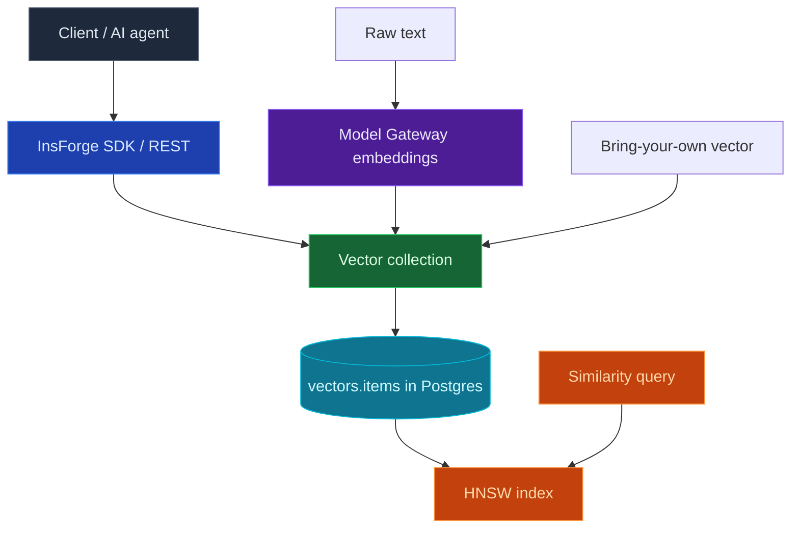

Use the InsForge Vector Store to power semantic search, retrieval-augmented generation (RAG), recommendations, and deduplication. Group embeddings into **collections**, upsert items with a vector or raw text, then query by similarity with optional metadata filtering. It is backed by `pgvector` on the same Postgres instance as your data — a managed, Pinecone-style API without a separate vector database to run.

<Note>
  **Vector Store vs. raw pgvector.** The [Database](/core-concepts/database/pgvector) lets you add a `vector` column to your own tables and write SQL. The Vector Store is a higher-level managed API: collections, server-side embedding, and similarity queries over REST, with row-level security applied for you.
</Note>



## Data model

- **Collection** — a named group of vectors with a fixed `dimension` and a distance `metric`. Like KV and the rest of the platform, collections are either project-global (managed with the project API key) or owned by an end user and isolated by row-level security.
- **Item** — an `embedding` plus optional source `content` (the text it was embedded from) and arbitrary JSON `metadata`. Provide your own `id` to make upserts idempotent.

The current version fixes the embedding dimension at **1536**, matching the managed embedding model (`text-embedding-3-small`) served by the [Model Gateway](/core-concepts/ai/overview). The `cosine` metric is index-accelerated with HNSW; `l2` and `ip` are supported and return correct distances but are not index-accelerated yet.

## Features

### Create a collection

```bash
curl -X POST "$INSFORGE_URL/api/vectors/collections" \
  -H "Authorization: Bearer $API_KEY" \
  -H "Content-Type: application/json" \
  -d '{"name": "docs", "dimension": 1536, "metric": "cosine"}'
```

### Upsert items

Provide a `vector` directly, or send `content` and let InsForge embed it server-side via the Model Gateway. Content items in a single request are embedded in one batched call.

```bash
# Auto-embed from text
curl -X POST "$INSFORGE_URL/api/vectors/collections/docs/upsert" \
  -H "Authorization: Bearer $API_KEY" \
  -H "Content-Type: application/json" \
  -d '{
        "items": [
          { "content": "InsForge is an open-source backend platform.",
            "metadata": { "source": "readme", "section": "intro" } },
          { "content": "The KV store supports TTL and atomic counters.",
            "metadata": { "source": "docs", "section": "kv" } }
        ]
      }'
# => { "ids": ["..."] }
```

Pass an `id` on an item to overwrite an existing one; bring your own `vector` instead of `content` when you have already computed embeddings.

### Query by similarity

Query with a `vector` or with `text` (embedded for you). Add a `filter` to restrict matches by metadata (Pinecone-style JSON containment).

```bash
curl -X POST "$INSFORGE_URL/api/vectors/collections/docs/query" \
  -H "Authorization: Bearer $API_KEY" \
  -H "Content-Type: application/json" \
  -d '{
        "text": "how do I store a counter?",
        "topK": 5,
        "filter": { "source": "docs" }
      }'
# => { "matches": [ { "id": "...", "score": 0.83, "content": "...", "metadata": { ... } } ] }
```

`score` is the cosine similarity (higher is closer) for cosine collections. Set `includeContent: false` to return only ids, scores, and metadata.

### Row-level security

End-user collections and items are enforced by Postgres RLS keyed on `auth.uid()`, so each user's vectors are private to them. The project API key manages the project-global store. As with KV, the managed schema ships the policies — you don't write any.

## A typical RAG flow

1. **Index** your documents: chunk them, then `upsert` each chunk's `content` (InsForge embeds it).
2. **Retrieve** at query time: `query` with the user's question `text` and a `topK` of 5–10.
3. **Generate**: pass the retrieved `content` as context to a chat model through the [Model Gateway](/core-concepts/ai/overview).

## Limits

- Embedding dimension is fixed at 1536 in this version.
- Up to 100 items per `upsert` and `topK` up to 100 per query.

## Next steps

- Set up the [CLI](/quickstart) to link your project.
- Configure the [Model Gateway](/core-concepts/ai/overview) so server-side auto-embedding works.
- Use the [Key-Value Store](/core-concepts/kv/overview) for exact-key cache and counters alongside semantic search.
