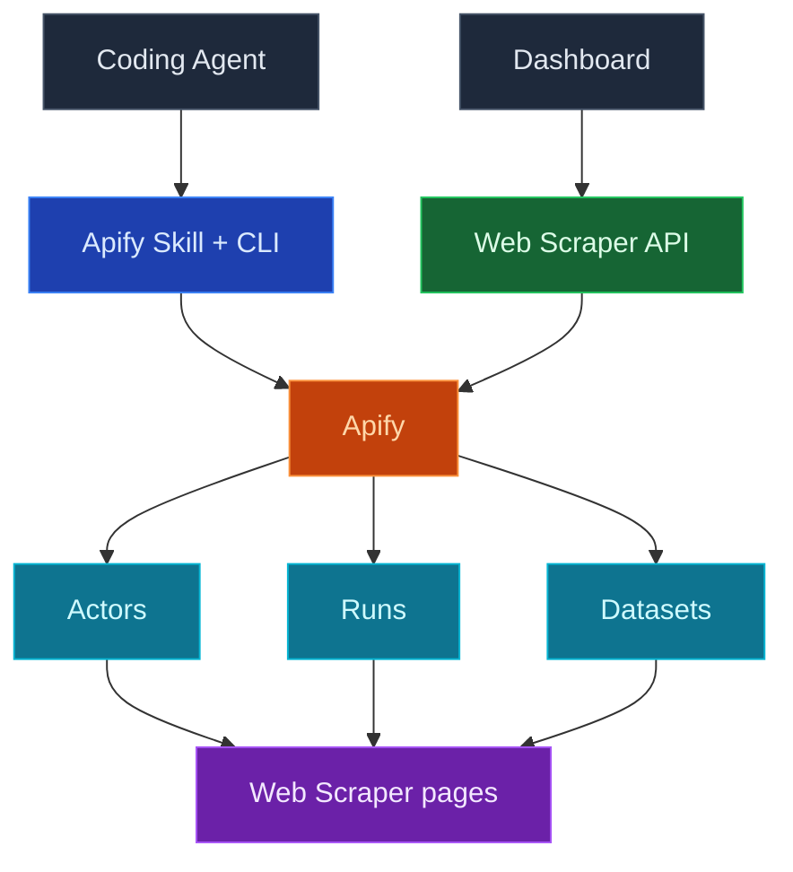

Use InsForge Web Scraper to give your coding agent live access to external data: connect your own Apify account once, and your agent can run scrapers (Apify calls them actors) on demand, while the dashboard shows your actors, run history, and scraped datasets without leaving InsForge.

Connect Apify with one click, then paste the scrape prompt into your coding agent. The agent authenticates with your InsForge-managed Apify token, picks the right actor for the job, and returns the results.

<Frame caption="Web Scraper dashboard: connected actors with their last run and total run counts.">
  
</Frame>

<Note>
  Apify remains the source of truth for actors, runs, and datasets. InsForge surfaces a focused subset for everyday checks, then deep-links into the Apify console for anything beyond it. The Web Scraper integration is available on InsForge Cloud; self-hosted deployments return `501 Not Implemented` on these routes.
</Note>



## Features

### One-click Apify connection

Connect Apify from the Web Scraper page in the dashboard. InsForge walks you through the Apify OAuth flow, stores credentials server-side, and keeps the access token refreshed for you. The raw token never lands in your repo or your frontend; agents and functions fetch a live token from the backend when they need one.

### Scrape via your coding agent

After connecting, the empty state ships a scrape prompt you can paste into your coding agent:

```
Use the insforge webscraper apify skill to scrape <what you want> and return the results.
```

Behind the prompt, `npx @insforge/cli webscraper apify login` fetches your InsForge-managed Apify token, authenticates the local Apify CLI headlessly (no browser OAuth), and installs the Apify agent skills. From there the agent picks an actor from the Apify Store, starts runs, and reads the results back.

### Actors

The actors you have used or created recently, with their last run time and total run count. Each row deep-links into the Apify console for full actor configuration.

### Runs

Recent scraper executions with status (succeeded, failed, running), start time, and cost in USD. Useful for a quick "did last night's scrape work and what did it cost" check without opening Apify.

### Dataset

Datasets produced by your runs, with item counts, creation time, and the actor that produced them. Deep-links into Apify storage where you can inspect or export the items.

### Landing scraped data in your database

Scraped results live in Apify datasets by default; nothing is written to your project's Postgres unless you want it there. For small scrapes, your agent can just return the results. For anything you want to keep or refresh on a schedule, have the agent deploy an [edge function](/core-concepts/functions/overview) or [compute service](/core-concepts/compute/overview) that fetches the dataset from Apify and upserts rows into a table.

### Settings and disconnect

The Web Scraper Config dialog (the gear icon in the sidebar) shows the connected Apify account, plan, and data retention, links into the Apify console, and lets admins disconnect. Disconnecting only stops InsForge from using your Apify credentials; your Apify account, actors, and datasets stay intact, and you can reconnect anytime.

## Concepts

<CardGroup cols={2}>
  <Card title="Apify actors" icon="robot" href="https://docs.apify.com/platform/actors">
    The serverless scrapers behind every run, from ready-made Store actors to your own.
  </Card>

  <Card title="Apify storage" icon="database" href="https://docs.apify.com/platform/storage/dataset">
    How datasets store scraped items and how to export or fetch them via API.
  </Card>
</CardGroup>

## Build with it

<CardGroup cols={2}>
  <Card title="InsForge CLI" icon="terminal" href="/quickstart">
    `npx @insforge/cli webscraper apify connect` links your project to Apify, then logs your local agent in.
  </Card>

  <Card title="Apify Store" icon="store" href="https://apify.com/store">
    Thousands of ready-made actors for common targets, from Google Maps to social platforms.
  </Card>

  <Card title="Apify API client" icon="js" href="https://docs.apify.com/api/client/js/">
    Call actors and read datasets from your edge functions or compute services.
  </Card>
</CardGroup>

## Next steps

- Open the Web Scraper page in the dashboard and click **Connect Apify**.
- Paste the scrape prompt into your coding agent and tell it what you want to scrape.
- When a scrape is worth keeping, ask your agent to land the dataset in a table via an [edge function](/core-concepts/functions/overview) or a [schedule](/core-concepts/functions/schedules).
