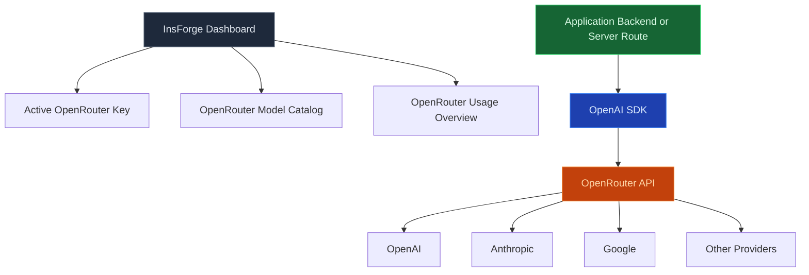

Utilice la puerta de enlace de modelos para llamar a modelos de chat, transmisión e incrustación a través de un único punto final compatible con OpenAI. InsForge mantiene las claves del proveedor, realiza un seguimiento del uso por proyecto e enruta el tráfico a través de [OpenRouter](https://openrouter.ai), por lo que el código de su aplicación nunca ve directamente las credenciales de Anthropic, OpenAI o Mistral.

<Frame caption="Un punto final compatible con OpenAI con acceso por proveedor, código listo para copiar y seguimiento de uso.">
  
</Frame>

<Note>
  **¿Quiere ejecutar código de IA, no llamar a un modelo?** Utilice [Funciones perimetrales](/core-concepts/functions/overview) para orquestar indicaciones, recuperación y herramientas. La puerta de enlace de modelos es la llamada; las funciones son el programa que la rodea.
</Note>

## Características

### API compatible con OpenAI

Apunte cualquier SDK de OpenAI o biblioteca compatible con `openai` a `https://<project>.insforge.dev/v1` y funcionará. `/v1/chat/completions`, `/v1/embeddings` y `/v1/models` se comportan como la especificación ascendente.

### Transmisión

Eventos enviados por servidor para finalizaciones de chat. Utilice el punto final de transmisión de la misma manera que lo haría con OpenAI; la puerta de enlace reenvía los tokens a medida que llegan del proveedor.

### Incrustaciones

Genere vectores densos a partir de cualquier modelo de incrustación que OpenRouter admita. Almacene el resultado en Postgres con [pgvector](/core-concepts/database/pgvector) para búsqueda semántica.

### Cuotas por proyecto

Cada proyecto tiene su propio límite de velocidad y límite de gasto. Al alcanzarlo, la puerta de enlace devuelve un 429 limpio en lugar de filtrar el estado de cuota del proveedor en su aplicación.

### Seguimiento de uso

Cada solicitud se registra con modelo, recuento de tokens y costo. Consulte el uso desde el panel, CLI o MCP — la facturación se reconcilia automáticamente con la factura de OpenRouter.

### Enrutamiento multiproveedor

Cambie entre Anthropic, OpenAI, Mistral, Llama, Gemini y docenas más al cambiar el nombre del modelo en la solicitud. El código de la aplicación no cambia.

## Compilar con él

<CardGroup cols={2}>
  <Card title="SDK de TypeScript" icon="js" href="/sdks/typescript/ai">
    Chat, transmisión e incrustación desde runtimes de Node, navegador y borde.
  </Card>

  <Card title="SDK de Swift" icon="swift" href="/sdks/swift/ai">
    Cliente de IA Swift nativo para iOS y macOS.
  </Card>

  <Card title="SDK de Kotlin" icon="android" href="/sdks/kotlin/ai">
    Cliente de IA orientado a corrutinas para Android y JVM.
  </Card>

  <Card title="API REST" icon="code" href="/sdks/rest/ai">
    Puntos finales de IA HTTP simples, invocables desde cualquier idioma.
  </Card>
</CardGroup>

## Próximos pasos

- Configure el [CLI](/quickstart) para vincular su proyecto (la ruta recomendada).
- Explore la [referencia del SDK de TypeScript](/sdks/typescript/ai) para patrones de chat e incrustación.
