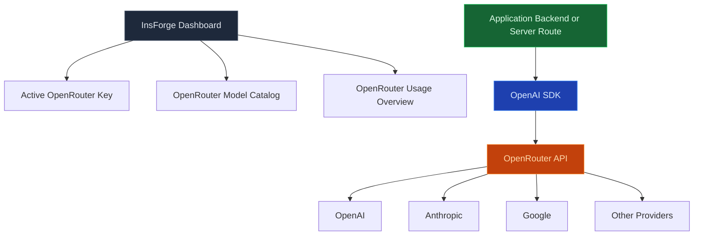

Utilice la puerta de enlace de modelos para provisionar una clave de OpenRouter para su proyecto, explorar el catálogo de modelos y seguir el gasto y el uso por modelo. Su aplicación llama a [OpenRouter](https://openrouter.ai) directamente con esa clave, por lo que una única integración alcanza modelos de chat, transmisión e incrustación de Anthropic, OpenAI, Mistral, Google y docenas de otros proveedores.

<Frame caption="La página de la puerta de enlace de modelos en el panel: la clave activa, acceso por proveedor, código listo para copiar y gráficos de uso.">
  
</Frame>

<Note>
  **¿Quiere ejecutar código de IA, no llamar a un modelo?** Utilice [Funciones perimetrales](/core-concepts/functions/overview) para orquestar indicaciones, recuperación y herramientas. La puerta de enlace de modelos es la llamada; las funciones son el programa que la rodea.
</Note>

```mermaid
graph TB
    Dashboard[InsForge Dashboard] --> Key[Active OpenRouter Key]
    Dashboard --> Catalog[OpenRouter Model Catalog]
    Dashboard --> Metrics[OpenRouter Usage Overview]

    App[Application Backend or Server Route] --> SDK[OpenAI SDK]
    SDK --> OpenRouter[OpenRouter API]

    OpenRouter --> OpenAI[OpenAI]
    OpenRouter --> Anthropic[Anthropic]
    OpenRouter --> Google[Google]
    OpenRouter --> More[Other Providers]

    style Dashboard fill:#1e293b,stroke:#475569,color:#e2e8f0
    style App fill:#166534,stroke:#22c55e,color:#dcfce7
    style SDK fill:#1e40af,stroke:#3b82f6,color:#dbeafe
    style OpenRouter fill:#c2410c,stroke:#fb923c,color:#fed7aa
```

## Características

### API compatible con OpenAI

Copie la clave provisionada desde el panel en una variable `OPENROUTER_API_KEY` solo de servidor y luego apunte cualquier SDK de OpenAI o biblioteca compatible con `openai` a `https://openrouter.ai/api/v1`. Las referencias del [SDK de TypeScript](/sdks/typescript/ai) y [REST](/sdks/rest/ai) incluyen fragmentos funcionales.

<Warning>
  La clave provisionada es una credencial del lado del servidor. Mantenga las llamadas a OpenRouter detrás de una ruta de backend, una acción de servidor o una función perimetral, y nunca incluya la clave en un paquete del navegador.
</Warning>

### Transmisión

Eventos enviados por servidor para finalizaciones de chat. Establezca `stream: true` como lo haría con OpenAI, y los tokens llegan a medida que el proveedor los produce.

### Incrustaciones

Genere vectores densos a partir de cualquier modelo de incrustación que OpenRouter admita. Almacene el resultado en Postgres con [pgvector](/core-concepts/database/pgvector) para búsqueda semántica.

### Gasto y uso

La página de la puerta de enlace de modelos en el panel lee la actividad de su clave desde OpenRouter: gasto total, uso diario, semanal y mensual, crédito restante y su fecha de restablecimiento, y un desglose por modelo.

### Enrutamiento multiproveedor

Cambie entre Anthropic, OpenAI, Mistral, Llama, Gemini y docenas más al cambiar el nombre del modelo en la solicitud. El código de la aplicación no cambia.

## Compilar con él

<CardGroup cols={2}>
  <Card title="SDK de TypeScript" icon="js" href="/sdks/typescript/ai">
    Chat, transmisión e incrustación desde runtimes de Node, navegador y borde.
  </Card>

  <Card title="SDK de Swift" icon="swift" href="/sdks/swift/ai">
    Cliente de IA Swift nativo para iOS y macOS.
  </Card>

  <Card title="SDK de Kotlin" icon="android" href="/sdks/kotlin/ai">
    Cliente de IA orientado a corrutinas para Android y JVM.
  </Card>

  <Card title="API REST" icon="code" href="/sdks/rest/ai">
    Puntos finales de IA HTTP simples, invocables desde cualquier idioma.
  </Card>
</CardGroup>

## Próximos pasos

- Configure el [CLI](/quickstart) para vincular su proyecto (la ruta recomendada).
- Explore la [referencia del SDK de TypeScript](/sdks/typescript/ai) para patrones de chat e incrustación.
