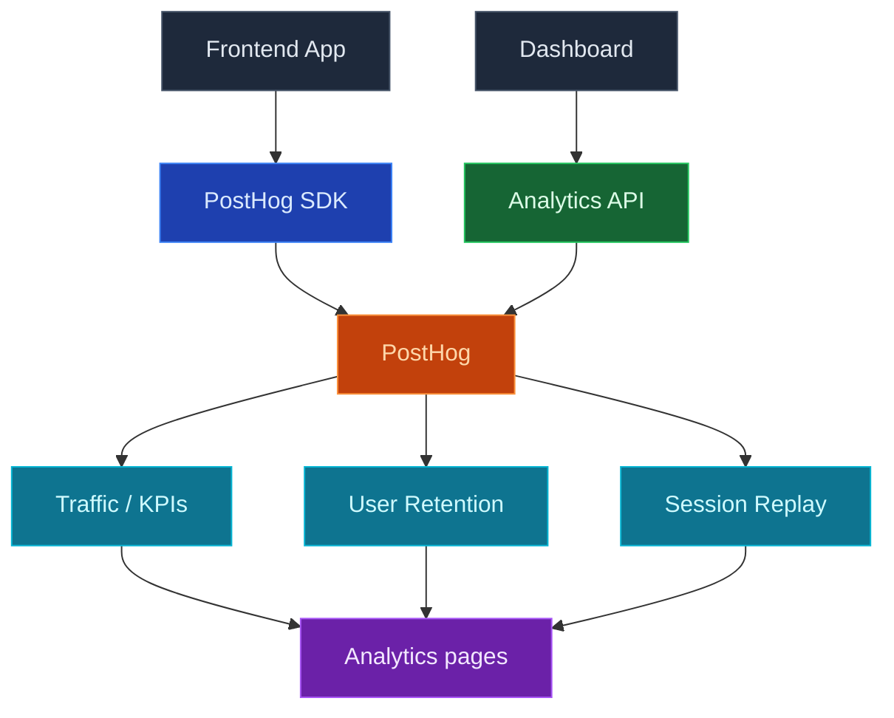

Utilice InsForge Analytics para comprender cómo las personas utilizan realmente su aplicación: tráfico de páginas, retención y reproducciones de sesión, todo conectado vinculando un proyecto PostHog a su backend de InsForge. Una vez conectado, el panel muestra páginas de tráfico, retención de usuarios y reproducción de sesión basadas en sus datos de PostHog sin salir de InsForge.

Conecte PostHog una sola vez con un clic, coloque el mensaje de configuración en su agente de codificación para que ejecute el asistente de PostHog e instale el SDK de PostHog en su frontend, y las páginas de análisis comienzan a llenarse.

<Frame caption="Panel de análisis: KPI en el tiempo más desgloses por página, país y dispositivo.">
  
</Frame>

<Note>
  PostHog sigue siendo la fuente de verdad para eventos, paneles, información y grabaciones. InsForge presenta un subconjunto enfocado para controles diarios, luego se vincula profundamente a PostHog para cualquier cosa más allá.
</Note>



## Características

### Conexión PostHog con un clic

Conecte PostHog desde la página de análisis en el panel. InsForge aprovisiona o vincula un proyecto PostHog para usted, almacena credenciales en el lado del servidor y desbloquea las páginas de tráfico, retención y reproducción de sesión una vez que la conexión se realiza correctamente.

### Configuración de SDK a través del asistente de PostHog

Después de conectar, el estado vacío envía un mensaje de configuración que puede pegar en su agente de codificación:

```
I want to add product analytics to this project. Read the current directory and use the InsForge skill to set up PostHog analytics by running `npx @insforge/cli posthog setup`.
```

`@insforge/cli posthog setup` vincula su proyecto InsForge a PostHog, luego imprime el comando oficial [Asistente de PostHog](https://posthog.com/docs/libraries/wizard) (`npx -y @posthog/wizard@latest`) para que usted (o su agente) ejecute a continuación. El asistente detecta su marco, instala el SDK de PostHog correcto e inserta el código de inicialización para que las vistas de página, eventos de captura automática y grabaciones de sesión comiencen a fluir.

### Tráfico

KPI durante el rango de tiempo seleccionado (visitantes, vistas de página, sesiones, tasa de rebote y tendencia), más desgloses por página, país y tipo de dispositivo. Útil para el primer paso "cómo le está yendo a la aplicación esta semana" sin abrir PostHog.

### Retención de usuario

Gráfico de retención de cohortes creado a partir de sus eventos de PostHog. Seleccione un rango de tiempo y vea cuántos usuarios regresan durante los días o semanas siguientes.

### Reproducción de sesión

Una lista paginada de grabaciones de sesión recientes con duración, persona y un vínculo profundo al reproductor de reproducción completo de PostHog. Ayuda a ver qué hicieron los usuarios después de detectar algo extraño en Tráfico o Retención.

### Configuración y desconexión

El cuadro de diálogo Configuración de análisis (el icono de engranaje en la barra lateral) permite a los administradores revisar el proyecto PostHog vinculado, saltar directamente a PostHog y desconectar cuando sea necesario. Desconectar solo corta el vínculo InsForge ↔ PostHog; su proyecto PostHog, eventos y grabaciones permanecen intactos.

## Conceptos

<CardGroup cols={2}>
  <Card title="Análisis de productos PostHog" icon="chart-mixed" href="https://posthog.com/docs/product-analytics">
    Eventos, captura automática, información y paneles detrás de las páginas de análisis.
  </Card>

  <Card title="Reproducción de sesión de PostHog" icon="circle-play" href="https://posthog.com/docs/session-replay">
    Cómo se capturan, editan y reproducen las grabaciones.
  </Card>
</CardGroup>

## Construir con él

<CardGroup cols={2}>
  <Card title="Asistente de PostHog" icon="wand-magic-sparkles" href="https://posthog.com/docs/libraries/wizard">
    Detecta automáticamente su marco, instala el SDK de PostHog correcto y agrega código de inicialización.
  </Card>

  <Card title="SDK de JavaScript de PostHog" icon="js" href="https://posthog.com/docs/libraries/js">
    Captura eventos personalizados además de lo que configura el asistente.
  </Card>

  <Card title="CLI de InsForge" icon="terminal" href="/quickstart">
    `npx @insforge/cli posthog setup` vincula su proyecto InsForge a PostHog, luego imprime el comando del asistente.
  </Card>
</CardGroup>

## Próximos pasos

- Abra la página de análisis en el panel y haga clic en **Conectar PostHog**.
- Pegue el mensaje de configuración en su agente de codificación, luego ejecute el comando `@posthog/wizard` que imprime para conectar el SDK a su aplicación.
- Configure el [CLI](/quickstart) si desea administrar la conexión desde la terminal.
