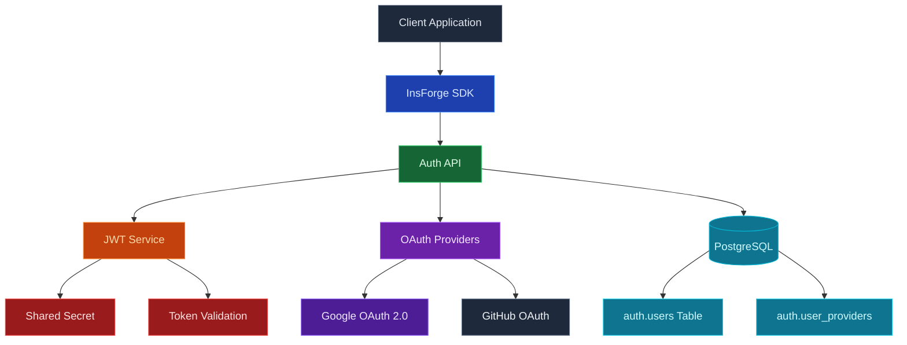

Use la autenticación de InsForge para manejar el registro, inicio de sesión, sesiones e identidad de su aplicación. Los usuarios pueden iniciar sesión con correo electrónico y contraseña, enlace mágico, código de un solo uso, proveedores de OAuth (Google, GitHub, Apple y otros) o cualquier proveedor de identidad compatible con OIDC que traiga. InsForge emite JSON Web Tokens al iniciar sesión, y todos los demás productos de la plataforma consumen el mismo token.

<Frame caption="Métodos de inicio de sesión configurados: correo electrónico y contraseña, Google y GitHub OAuth.">
  
</Frame>

<Note>
  **Autenticación** es verificar que un usuario es quien dice ser. **Autorización** es verificar qué pueden hacer. InsForge maneja lo primero directamente y potencia lo segundo a través de políticas de [seguridad a nivel de fila](/core-concepts/database/overview) que leen el JWT de autenticación.
</Note>

## Características

### Correo electrónico y contraseña

El valor por defecto. Los nuevos usuarios se registran con un correo electrónico y contraseña, reciben un correo electrónico de confirmación y reciben un JWT de sesión al iniciar sesión. El restablecimiento de contraseña, la verificación de correo electrónico y el limitador de fuerza bruta están integrados.

<Note>
  **¿Autohospedado?** El envío de estos correos electrónicos, incluido el inicio de sesión sin contraseña mediante enlace mágico y código de un solo uso, requiere un proveedor de correo electrónico. Los proyectos vinculados a la nube usan el remitente gestionado automáticamente; una instancia autohospedada debe configurar [Custom SMTP](/core-concepts/messaging/custom-smtp) primero, de lo contrario los correos de verificación, restablecimiento e inicio de sesión no se entregarán.
</Note>

### Enlace mágico y OTP

Envíe un enlace de un solo uso o un código de seis dígitos al correo electrónico del usuario. El inicio de sesión sin contraseña, la recuperación de cuenta y la autenticación de paso a paso utilizan la misma primitiva.

### Proveedores de OAuth

Soporte de primera clase para Google, GitHub, Apple, Microsoft, GitLab, Discord y más. Agregue proveedores OAuth 2.0 / OIDC personalizados (Keycloak, Okta, Auth0, su propio IdP) por URL sin escribir código específico del proveedor.

### Modo servidor de OAuth

Ejecute InsForge como un proveedor de identidad OAuth 2.0 / OIDC para sus propias aplicaciones posteriores. Vea la [guía del servidor OAuth](/oauth-server) para la configuración completa.

### Seguridad a nivel de fila

El JWT de autenticación fluye automáticamente a través de cada llamada del SDK de InsForge. Las políticas RLS de Postgres leen reclamaciones del token y deciden, fila a fila, qué puede leer y escribir el usuario. La misma identidad y las mismas políticas se aplican tanto si la solicitud llega a la base de datos, el almacenamiento o un canal en tiempo real.

### `auth.users` en su base de datos

El estado del usuario vive en la base de datos Postgres de su proyecto en el esquema `auth`. Una `auth.users` a sus tablas de aplicación mediante claves ajenas, reaccione a cambios de identidad con activadores y respalda todo de la misma manera que respalda todo lo demás.

## Construir con él

<CardGroup cols={2}>
  <Card title="SDK de TypeScript" icon="js" href="/sdks/typescript/auth">
    Registrarse, iniciar sesión y administrar sesiones desde Node, navegador y borde.
  </Card>

  <Card title="SDK de Swift" icon="swift" href="/sdks/swift/auth">
    Cliente de autenticación Swift nativo para iOS y macOS.
  </Card>

  <Card title="SDK de Kotlin" icon="android" href="/sdks/kotlin/auth">
    Cliente de autenticación orientado a corrutinas para Android y JVM.
  </Card>

  <Card title="API REST" icon="code" href="/sdks/rest/auth">
    Puntos finales de autenticación HTTP simples, invocables desde cualquier idioma.
  </Card>
</CardGroup>

## Próximos pasos

- Configure el [CLI](/quickstart) para vincular su proyecto (la ruta recomendada).
- Explore la [referencia del SDK de TypeScript](/sdks/typescript/auth) para patrones de inicio de sesión.
