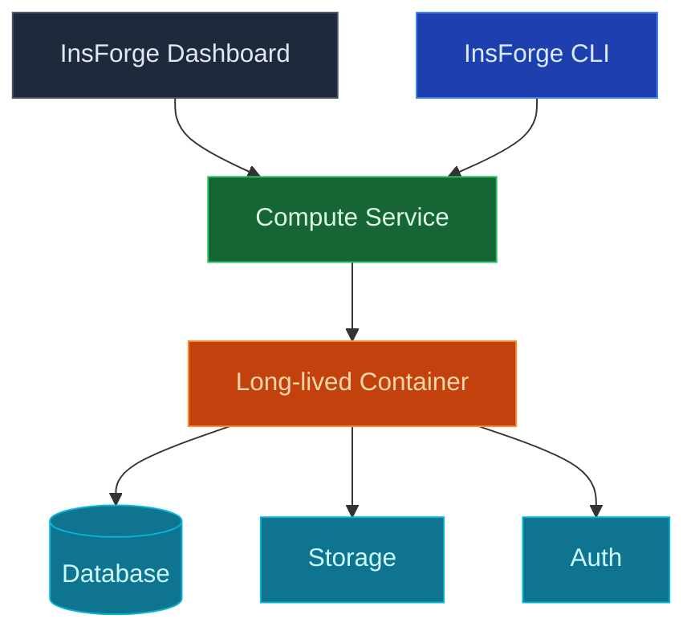

Utilice InsForge Custom Compute para ejecutar contenedores de larga duración junto a su proyecto: trabajadores en cola, procesadores en segundo plano, bucles de inferencia de IA, servidores de websocket, raspadores, cualquier cosa que necesite mantenerse activa. Los contenedores se adjuntan a la base de datos, almacenamiento y autenticación de su proyecto con las mismas credenciales que usaría una función.

<Note>
  **¿Solo necesita manejar una solicitud?** Utilice [Funciones perimetrales](/core-concepts/functions/overview) para trabajo de solicitud/respuesta y trabajos cortos. La computación personalizada es para procesos que necesitan ejecutarse continuamente.
</Note>

## Características

### Implementaciones de contenedores

Envíe cualquier imagen de Docker a InsForge y se ejecutará. Utilice un `Dockerfile` de su repositorio o apunte a una imagen preconstruida en un registro. Sin tubería de compilación propietaria que aprender.

### Credenciales vinculadas al proyecto

Los contenedores reciben la URL del proyecto de InsForge, JWT de función de servicio y credenciales de almacenamiento S3 como variables de entorno. Conéctese a Postgres, llame al SDK y lea objetos sin aprovisionar nada.

### Escalado

Ejecute una instancia para un trabajador singleton o escale horizontalmente para cargas de trabajo sin estado. La memoria, la CPU y el recuento de réplicas se pueden configurar por servicio.

### Registros

Registros estructurados por contenedor, consultables por servicio y rango de tiempo. Cola en el panel, CLI o MCP sin necesidad de `kubectl exec` en nada.

### Secretos y variables de entorno

Establezca variables de entorno y secretos por servicio, separados de sus secretos de función de borde. Rotar sin reimplementar.

## Próximos pasos

- Configure el [CLI](/quickstart) para vincular su proyecto (la ruta recomendada).
- Vea [Funciones perimetrales](/core-concepts/functions/overview) si todo lo que necesita es solicitud/respuesta.
