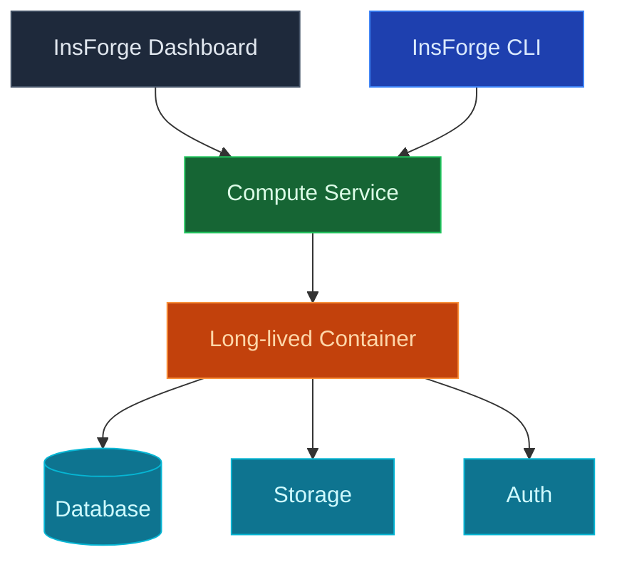

Usa Computación personalizada de InsForge para ejecutar contenedores de larga duración junto a tu proyecto: workers de cola, procesadores en segundo plano, bucles de inferencia de IA, servidores websocket, scrapers, cualquier proceso que deba permanecer activo.

<Note>
  **¿Solo necesitas atender una petición?** Usa [Edge Functions](/core-concepts/functions/overview) para trabajo de petición/respuesta y tareas cortas. La Computación personalizada es para procesos que deben ejecutarse de forma continua.
</Note>


```mermaid
graph TB
    Dashboard[InsForge Dashboard] --> Service[Compute Service]
    CLI[InsForge CLI] --> Service

    Service --> Container[Long-lived Container]

    Container --> DB[(Database)]
    Container --> Storage[Storage]
    Container --> Auth[Auth]

    style Dashboard fill:#1e293b,stroke:#475569,color:#e2e8f0
    style CLI fill:#1e40af,stroke:#3b82f6,color:#dbeafe
    style Service fill:#166534,stroke:#22c55e,color:#dcfce7
    style Container fill:#c2410c,stroke:#fb923c,color:#fed7aa
    style DB fill:#0e7490,stroke:#06b6d4,color:#cffafe
    style Storage fill:#0e7490,stroke:#06b6d4,color:#cffafe
    style Auth fill:#0e7490,stroke:#06b6d4,color:#cffafe
```

## Características

### Despliegue de contenedores

Entrega cualquier imagen de Docker a InsForge y se ejecuta. Apunta a una imagen ya construida en un registry, o sube un contexto de construcción y deja que InsForge la construya desde tu `Dockerfile`. No hay que aprender ningún pipeline propietario.

### Acceder a tu proyecto

Las credenciales que necesite tu contenedor las defines tú como variables de entorno del servicio: la URL del proyecto, una API key, credenciales de S3, lo que use esa carga de trabajo. InsForge no inyecta nada por ti, así que tú decides exactamente a qué puede llegar el contenedor.

Cuando te autoalojas, los contenedores de compute se unen por defecto a la red del propio proyecto, de modo que `postgres:5432` y `postgrest:3000` se resuelven por nombre desde dentro del contenedor igual que en las edge functions, sin dar una vuelta por la red pública.

### Recursos

La memoria y la CPU se configuran por servicio. Cada servicio ejecuta una instancia; crea varios servicios si necesitas varios workers.

### Logs

Logs estructurados por contenedor, consultables por servicio y rango de tiempo. Míralos en el dashboard, la CLI o MCP sin hacer `kubectl exec` en nada.

### Secretos y variables de entorno

Define variables de entorno y secretos por servicio, aparte de los secretos de tus edge functions. Rótalos sin volver a desplegar.

<Warning>
  **Todavía no hay volúmenes persistentes.** El estado del contenedor sobrevive a los reinicios y al reinicio del host, pero cambiar la imagen, las variables de entorno o el puerto recrea el contenedor y descarta lo que se haya escrito dentro. Usa el Postgres o el Storage de tu proyecto para los datos que necesites conservar.
</Warning>

## Autoalojamiento: activar compute

En InsForge Cloud, compute está totalmente gestionado y no configuras nada. Cuando te autoalojas, tú eliges dónde se ejecutan los contenedores. Hay dos proveedores disponibles y, hasta que configures uno, los endpoints de compute devuelven `503 COMPUTE_NOT_CONFIGURED`.

<Tabs>
  <Tab title="Docker (tu propio host)">
    Los contenedores se ejecutan en el mismo daemon de Docker que ejecuta InsForge, como hermanos del contenedor de InsForge. No hay que registrarse en nada, ni hay factura por contenedor.

    Activarlo es un acto deliberado: monta el socket de Docker en el contenedor de InsForge. En tu archivo compose, descomenta la línea que ya está ahí para esto:

    ```yaml
    services:
      insforge:
        volumes:
          - ${DOCKER_SOCKET_PATH:-/var/run/docker.sock}:${DOCKER_SOCKET_PATH:-/var/run/docker.sock}
    ```

    Esa es toda la edición. El socket es `660 root:docker` en Linux y `root:root` en Docker Desktop, y el id de grupo cambia según el host, así que el contenedor lo lee del propio socket al arrancar y se une a ese grupo antes de bajar al usuario de la aplicación. Nada que buscar y nada que configurar.

    Reinicia el stack. El driver se registra solo cuando el socket es accesible y escribe `Compute provider "docker" ready`.

    <Warning>
      **El socket de Docker equivale a root en el host.** Cualquiera que pueda alcanzarlo puede arrancar un contenedor que lea todo el sistema de archivos, así que montarlo es una decisión que hay que tomar de forma deliberada. InsForge construye la especificación de cada contenedor por su cuenta y nunca reenvía opciones suministradas por quien llama, así que una API key de InsForge filtrada no puede pedir un contenedor privilegiado ni un bind mount del host, pero el socket en sí sigue siendo tan poderoso como la cuenta que lo posee.
    </Warning>

    Ajustes opcionales:

    | Variable | Por defecto | Qué hace |
    | --- | --- | --- |
    | `DOCKER_SOCKET_PATH` | `/var/run/docker.sock` | Apunta a un socket de Docker rootless (`$XDG_RUNTIME_DIR/docker.sock`) o de Podman (`/run/podman/podman.sock`). El archivo compose lo monta en la misma ruta dentro del contenedor, así un solo valor cubre ambos lados. |
    | `COMPUTE_ISOLATE_NETWORK` | desactivado | Mantiene los contenedores de compute fuera de la red del proyecto. Desactivado por defecto, porque estar junto a la base de datos y el almacenamiento es justamente el punto. |
    | `COMPUTE_BUILD_MAX_CONTEXT` | `64mb` | Límite del contexto de construcción subido. El tarball completo se almacena en memoria, así que bájalo en un host pequeño. |
    | `COMPUTE_BUILD_UPLOAD_IDLE_TIMEOUT` | `30` | Segundos que una subida puede pasar sin enviar nada antes de considerarse estancada. Se reinicia con cada fragmento, así que una conexión lenta pero activa nunca se corta. |
  </Tab>

  <Tab title="Fly.io">
    Los contenedores se ejecutan en [Fly.io](https://fly.io) bajo tu propia cuenta. Actívalo con dos variables de entorno en tu `.env`:

    - `FLY_API_TOKEN`: un token de la API de Fly.io, creado con `fly tokens create org -o <your-org>`. Pega la línea completa que imprime la CLI; el prefijo `FlyV1` se gestiona por ti. InsForge lo usa para crear y gestionar tus contenedores de compute.
    - `FLY_ORG`: el slug de tu organización de Fly, que ves con `fly orgs list`. Es la organización donde se crean los contenedores.

    Ambas son obligatorias. Un token sin organización no tiene contra qué autenticarse, y una organización sin token no se puede llamar. Defínelas y reinicia el contenedor.
  </Tab>
</Tabs>

Si configuras los dos, los servicios existentes se quedan con el proveedor que los creó y los nuevos van a Fly. Define `COMPUTE_PROVIDER` como `fly`, `docker` u `off` para ser explícito.

### Elegir cómo se alcanza un servicio

Cada servicio elige un modo de ingress. Qué modos existen depende del proveedor, y el valor por defecto también: en un solo host es `none`, porque la mayor parte del compute —workers de cola, procesadores, bucles de inferencia— no recibe tráfico entrante en absoluto, mientras que Fly da un nombre de host a cada app y por eso solo ofrece `host`. Si omites el campo se aplica el valor por defecto del proveedor activo; si pides un modo que el proveedor no puede dar, se ajusta a uno que sí.

| Modo | Qué ocurre |
| --- | --- |
| `none` | Alcanzable solo en la red interna del proyecto. No se publica ningún puerto del host ni se anuncia ninguna URL. |
| `port` | Publicado en un puerto del host que asigna el daemon. Define `COMPUTE_PUBLIC_HOST` para que InsForge anuncie una URL; si lo dejas vacío no se devuelve ninguna, en lugar de una que quizá no resuelva. |
| `host` | Alcanzable en un nombre de host que enrutas tú. Define `COMPUTE_DOMAIN` con el dominio base. |

Los puertos publicados se enlazan a `127.0.0.1` por defecto. Cambia eso con `COMPUTE_BIND_ADDRESS`: el propio valor por defecto de Docker publica en todas las interfaces, IPv6 incluido, lo que pondría tu contenedor en la internet pública en un host accesible.

Define el valor por defecto de todo el despliegue con `COMPUTE_DEFAULT_INGRESS`. En modo `host`, InsForge anuncia el nombre de host pero no termina TLS ni enruta tráfico: ejecuta tu propia pasarela (Caddy, Traefik, nginx) por delante, como ya haces con el dashboard.

### Construir desde el código fuente

Desplegar una imagen ya construida no necesita nada especial: crea el servicio con una referencia de imagen y se descarga y arranca.

Para que InsForge construya tu `Dockerfile`, reserva el servicio y luego sube el contexto de construcción como un tarball:

```bash
# 1. Reserva el nombre (todavía sin imagen) y guarda el id que devuelve
ID=$(curl -sX POST "$INSFORGE_URL/api/compute/services/deploy" \
  -H "x-api-key: $INSFORGE_API_KEY" -H 'Content-Type: application/json' \
  -d '{"name":"worker","port":8080,"memory":512}' | jq -r .id)

# 2. Sube el contexto; la respuesta trae el log de construcción y el tag desplegado
tar --no-xattrs -cf context.tar -C ./worker .
curl -X POST "$INSFORGE_URL/api/compute/services/$ID/build" \
  -H "x-api-key: $INSFORGE_API_KEY" -H 'Content-Type: application/x-tar' \
  --data-binary @context.tar
```

Añade `?dockerfile=docker/Dockerfile` si tu `Dockerfile` no está en la raíz del contexto; la ruta debe permanecer dentro del contexto. Solo se ejecuta una construcción a la vez: una segunda subida recibe `429` en lugar de almacenarse. En macOS, empaqueta con `--no-xattrs` (o `COPYFILE_DISABLE=1`): los atributos extendidos que el daemon de Linux no puede aplicar hacen que rechace todo el contexto.

### Soporte de plataformas

| Nivel | Plataformas | Notas |
| --- | --- | --- |
| Verificado | Docker Compose en Linux, Docker Desktop (macOS) | Ambas rutas de despliegue probadas de extremo a extremo, incluido un reinicio del host y SELinux en modo enforcing en Amazon Linux 2023. |
| Se espera que funcione | Dokploy, Coolify, Containarium | El montaje del socket es el mismo; aún no se ha probado para compute. |
| No soportado | Plataformas de contenedores gestionadas que no exponen un socket de Docker | No hay daemon con el que hablar. |

### Diferencias entre proveedores

Pide a `GET /api/metadata` la sección `compute`: informa de los proveedores configurados y de lo que puede hacer cada uno, para que las herramientas dejen de ofrecer opciones que se ignorarían.

| | Docker | Fly.io |
| --- | --- | --- |
| Regiones | Un solo host | Seleccionables |
| Escalar a cero | No disponible | Compatible |
| Modos de ingress | `none`, `port`, `host` | Nombre de host |
| Construcción desde fuente | Subes un contexto a InsForge | La CLI construye con `flyctl` |

## Próximos pasos

- Configura la [CLI](/quickstart) para vincular tu proyecto (la ruta recomendada).
- Consulta [Edge Functions](/core-concepts/functions/overview) si solo necesitas petición/respuesta.
