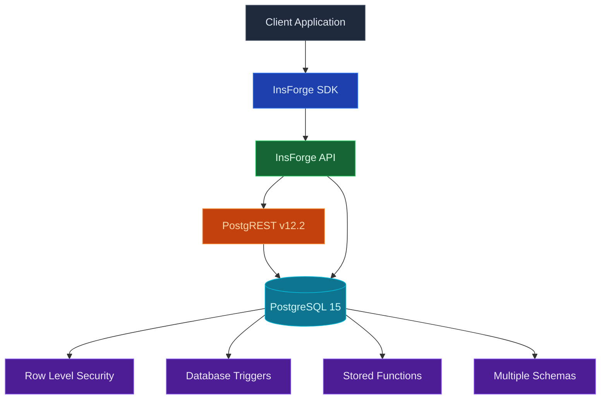

Cada proyecto de InsForge viene con una base de datos [Postgres](https://www.postgresql.org/) completa. Cada tabla es automáticamente un punto final REST y SDK escrito. Los tokens de autenticación limitan cada lectura y escritura a través de seguridad a nivel de fila. El mismo Postgres maneja consultas relacionales, búsqueda semántica a través de pgvector y fuentes de cambios en tiempo real.

<Frame caption="El editor de tablas: columnas escrita, edición en línea, importación CSV y estudio SQL.">
  
</Frame>

<Note>
  **¿Busca almacenamiento de archivos?** Utilice [Storage](/core-concepts/storage/overview) para imágenes, PDF y otro contenido binario. La base de datos almacena filas; el almacenamiento almacena objetos.
</Note>

## Características

### Tablas como API

Defina una tabla y obtendrá inmediatamente puntos finales REST más un cliente SDK escrito para ella. Sin paso de generación de código. El JWT de autenticación limita cada consulta a través de RLS.

### Migraciones

Rastrear y aplicar cambios SQL en orden. [Migrations](/core-concepts/database/migrations) se envían como archivos `.sql` simples en su repositorio, aplicados con `npx @insforge/cli db migrations up --all` o mediante la herramienta MCP.

### Ramificación

Cree una rama de base de datos aislada para probar cambios de esquema arriesgados en relación con una copia de datos de producción. Ver [Branching](/agent-native/branching).

### pgvector

Búsqueda de vectores nativos para incrustaciones, con índices HNSW e IVFFlat. Ver [pgvector](/core-concepts/database/pgvector).

### Seguridad a nivel de fila

Las políticas RLS de Postgres aplican acceso a nivel de fila. Las políticas leen el JWT de autenticación, por lo que la misma regla se aplica a consultas REST, llamadas SDK, suscripciones en tiempo real y solicitudes de almacenamiento.

### Cadena de conexión

Apunta herramientas de Postgres externas — `psql`, un panel de BI, un ORM o un worker corriendo en una VM — directamente a la base de datos de tu proyecto con una cadena de conexión `postgresql://` estándar. Abre tu proyecto en el [dashboard](https://insforge.dev), haz clic en **Connect** (la misma sección también está en **Project Settings**) y consulta **Connection String**. Obtienes la URL completa más los parámetros individuales — host, database, user, port y password — con un botón para mostrar/ocultar la contraseña antes de copiarla. Es una conexión directa, ideal para clientes persistentes y de larga duración como máquinas virtuales y contenedores de larga ejecución. El código de tu app rara vez la necesita, ya que cada tabla ya es un endpoint REST y SDK, pero está ahí siempre que una herramienta necesite acceso Postgres en crudo.

## Conceptos

<CardGroup cols={2}>
  <Card title="Migrations" icon="layer-group" href="/core-concepts/database/migrations">
    Aplicar cambios SQL en orden, de forma segura.
  </Card>
  <Card title="Branching" icon="code-branch" href="/agent-native/branching">
    Bases de datos aisladas para vista previa y cambios arriesgados.
  </Card>
  <Card title="pgvector" icon="brain" href="/core-concepts/database/pgvector">
    Búsqueda de vectores para incrustaciones.
  </Card>
</CardGroup>

## Construir con él

<CardGroup cols={2}>
  <Card title="SDK de TypeScript" icon="js" href="/sdks/typescript/database">
    Consultas, inserciones y actualizaciones escritas desde Node, navegador y borde.
  </Card>

  <Card title="SDK de Swift" icon="swift" href="/sdks/swift/database">
    Cliente de base de datos Swift nativo para iOS y macOS.
  </Card>

  <Card title="SDK de Kotlin" icon="android" href="/sdks/kotlin/database">
    Cliente de base de datos orientado a corrutinas para Android y JVM.
  </Card>

  <Card title="API REST" icon="code" href="/sdks/rest/database">
    Puntos finales de base de datos HTTP simples, invocables desde cualquier idioma.
  </Card>
</CardGroup>

## Próximos pasos

- Configure el [CLI](/quickstart) para vincular su proyecto (la ruta recomendada).
- Explore la [referencia del SDK de TypeScript](/sdks/typescript/database) para consultas escritas.
