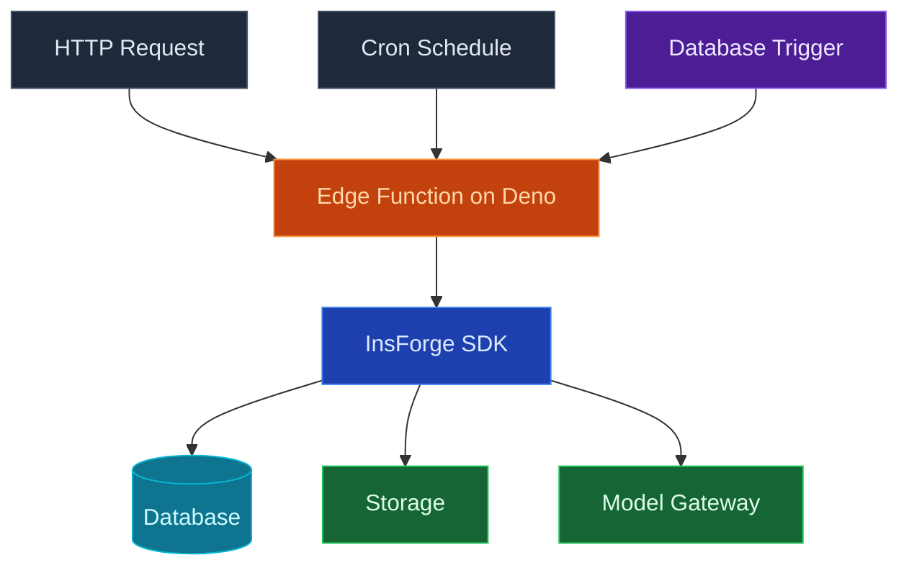

Utilice InsForge Edge Functions para ejecutar TypeScript en [Deno](https://deno.com), implementado cerca de sus usuarios para baja latencia. Las funciones se pueden invocar bajo demanda desde cualquier cliente, encadenarse desde activadores de base de datos o programarse para ejecutarse en una expresión cron. El tiempo de ejecución incluye búsqueda estándar, respuestas de transmisión e importaciones ESM listos para usar.

<Note>
  **¿Necesita un proceso que permanezca activo?** Utilice [Compute](/core-concepts/compute/overview) para trabajadores en cola, bucles de inferencia de IA y cualquier cosa con estado. Edge Functions son para solicitud/respuesta y trabajos de corta duración.
</Note>

## Características

### Activadores HTTP

Cada función es accesible en `https://<project>.insforge.dev/functions/<name>`. Búsqueda estándar de entrada, salida estándar `Response`. La transmisión, JSON, redirecciones y websockets funcionan.

### Calendarios

Adjunte una expresión cron a una función e InsForge la invoca a tiempo, con reintentos en caso de fallo. Vea [Schedules](/core-concepts/functions/schedules) para la sintaxis cron y el modelo de ejecución.

### Activadores de base de datos

Conecte una función para que se dispare en `INSERT`, `UPDATE` o `DELETE` en una tabla. La función recibe la carga útil de fila y se ejecuta con un JWT de función de servicio para que pueda realizar escrituras posteriores privilegiadas.

### Secretos y variables de entorno

Establezca variables de entorno y secretos por función. El panel, CLI y MCP leen y escriben el mismo almacén; los secretos nunca realizan un viaje de ida y vuelta a través de su repositorio.

### Registros

Los registros estructurados se capturan por invocación, consultables por estado, duración y nombre de función. La herramienta InsForge MCP `get-function-logs` permite que su agente diagnostique fallos sin salir del editor.

### Biblioteca estándar de Deno

Utilice la [biblioteca estándar de Deno](https://jsr.io/@std) y cualquier módulo ESM de los especificadores `jsr.io`, `esm.sh` o `npm:`. No ejecuta un agrupador y no hay directorio `node_modules` para enviar.

## Conceptos

<CardGroup cols={2}>
  <Card title="Schedules" icon="clock" href="/core-concepts/functions/schedules">
    Ejecute una función en una expresión cron en lugar de en respuesta a una solicitud.
  </Card>
</CardGroup>

## Construir con él

<CardGroup cols={2}>
  <Card title="SDK de TypeScript" icon="js" href="/sdks/typescript/functions">
    Invoque y transmita funciones desde Node, navegador y borde.
  </Card>

  <Card title="SDK de Swift" icon="swift" href="/sdks/swift/functions">
    Invoque funciones desde aplicaciones iOS y macOS.
  </Card>

  <Card title="SDK de Kotlin" icon="android" href="/sdks/kotlin/functions">
    Invoque funciones desde aplicaciones Android y JVM.
  </Card>

  <Card title="API REST" icon="code" href="/sdks/rest/functions">
    Puntos finales de función HTTP simples, invocables desde cualquier idioma.
  </Card>
</CardGroup>

## Próximos pasos

- Configure el [CLI](/quickstart) para vincular su proyecto (la ruta recomendada).
- Explore la [referencia del SDK de TypeScript](/sdks/typescript/functions) para patrones de invocación.
