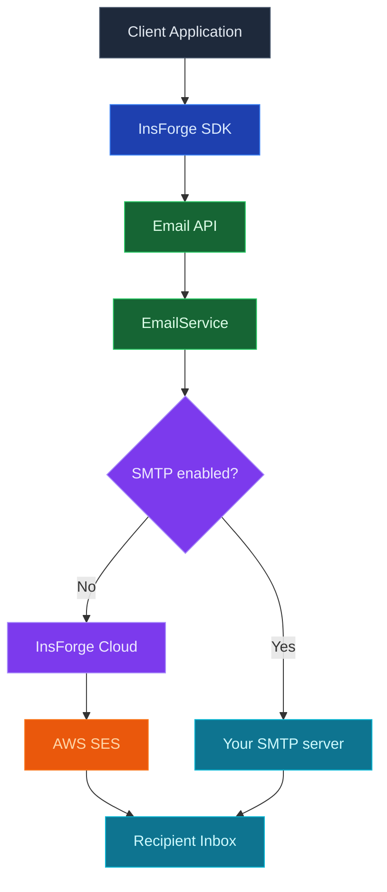

InsForge Messaging envía notificaciones transaccionales desde su proyecto: recibos, resúmenes, códigos de restablecimiento de contraseña, resúmenes de notificaciones, cualquier cosa para la que de otro modo usaría SendGrid, Postmark o Twilio. El correo electrónico es el primer canal; SMS e inserción están en la hoja de ruta y compartirán la misma superficie API.

<Note>
  **¿Solo enviar correos electrónicos de autenticación?** Los enlaces mágicos, los códigos de verificación y los restablecimientos de contraseña están integrados en [Authentication](/core-concepts/authentication/overview). Solo necesita este producto para mensajes transaccionales más allá de la autenticación.
</Note>

## Canales

<CardGroup cols={3}>
  <Card title="Email" icon="envelope" href="/core-concepts/messaging/custom-smtp">
    SMTP administrado o use su propio proveedor. Plantillas, seguimiento de entrega y eventos de webhook.
  </Card>

  <Card title="SMS" icon="message">
    Próximamente. Misma API, Twilio o Sinch en el backend.
  </Card>

  <Card title="Push" icon="bell">
    Próximamente. APNs y FCM a través de un único punto final.
  </Card>
</CardGroup>

## Características

### Una API, cada canal

La misma forma `emails.send()` para correo electrónico hoy, con SMS e inserción para seguir cuando lleguen. Cambiar canales es un cambio de campo, no una reescritura.

### Entrega administrada o use la suya

Envíe a través de InsForge Cloud (AWS SES para correo electrónico hoy) para una configuración cero, o conecte su propio proveedor cuando necesite controlar la capacidad de entrega y la reputación del remitente. Ver [Custom SMTP](/core-concepts/messaging/custom-smtp).

### Plantillas

Seleccione una plantilla por nombre, pase las variables e InsForge renderiza y envía. Las plantillas se pueden editar por proyecto; las cuatro plantillas de autenticación (`email-verification-*`, `reset-password-*`) se envían con valores predeterminados sensatos.

### Seguimiento de entrega

Los eventos de envío (`accepted`, `delivered`, `bounced`, `complained`) se registran por mensaje. Consulte la tabla de auditoría en Postgres, suscríbase a webhooks o observe el panel.

### Límites de velocidad

Los límites por proyecto y por plan evitan que los bucles extraviados destruyan la capacidad de entrega. Configurable desde el panel, aplicado en la puerta de enlace.

## Conceptos

<CardGroup cols={2}>
  <Card title="Custom SMTP" icon="envelope" href="/core-concepts/messaging/custom-smtp">
    Use su propio proveedor SMTP (SendGrid, Postmark, AWS SES, etc.).
  </Card>
</CardGroup>

## Construir con él

<CardGroup cols={2}>
  <Card title="SDK de TypeScript" icon="js" href="/sdks/typescript/email">
    Envíe correo desde Node, navegador y runtimes perimetrales.
  </Card>

  <Card title="API REST" icon="code" href="/sdks/rest/overview">
    Puntos finales de mensajería HTTP simples, invocables desde cualquier idioma.
  </Card>
</CardGroup>

## Próximos pasos

- Configure el [CLI](/quickstart) para vincular su proyecto (la ruta recomendada).
- Explore la [referencia del SDK de TypeScript](/sdks/typescript/email) para patrones de envío.
