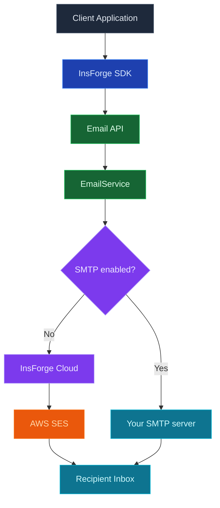

InsForge Messaging envía notificaciones transaccionales desde su proyecto: recibos, resúmenes, códigos de restablecimiento de contraseña, resúmenes de notificaciones, cualquier cosa para la que de otro modo usaría SendGrid, Postmark o Twilio. El correo electrónico es el primer canal; SMS e inserción están en la hoja de ruta y compartirán la misma superficie API.

<Note>
  **¿Solo enviar correos electrónicos de autenticación?** Los enlaces mágicos, los códigos de verificación y los restablecimientos de contraseña están integrados en [Authentication](/core-concepts/authentication/overview). Solo necesita este producto para mensajes transaccionales más allá de la autenticación.
</Note>

<Warning>
  **¿Autohospedado?** El remitente gestionado de InsForge Cloud solo está disponible para proyectos vinculados a la nube. En una instancia autohospedada debe configurar [Custom SMTP](/core-concepts/messaging/custom-smtp) antes de que se pueda enviar cualquier correo electrónico, incluidos los de autenticación. InsForge rechaza activar la verificación obligatoria hasta que haya un proveedor disponible e impide desactivar el único proveedor SMTP mientras la verificación siga siendo obligatoria. Si un correo de verificación falla durante el registro, la API devuelve un error con instrucciones para reintentar con `POST /api/auth/email/send-verification`.
</Warning>

```mermaid
graph TB
    Client[Client Application] --> SDK[InsForge SDK]
    SDK --> API[Email API]
    API --> Service[EmailService]
    Service --> Decision{SMTP enabled?}
    Decision -->|No| Cloud[InsForge Cloud]
    Cloud --> SES[AWS SES]
    Decision -->|Yes| SMTP[Your SMTP server]
    SES --> Inbox[Recipient Inbox]
    SMTP --> Inbox

    style Client fill:#1e293b,stroke:#475569,color:#e2e8f0
    style SDK fill:#1e40af,stroke:#3b82f6,color:#dbeafe
    style API fill:#166534,stroke:#22c55e,color:#dcfce7
    style Service fill:#166534,stroke:#22c55e,color:#dcfce7
    style Decision fill:#7c3aed,stroke:#a78bfa,color:#ede9fe
    style Cloud fill:#7c3aed,stroke:#a78bfa,color:#ede9fe
    style SES fill:#ea580c,stroke:#f97316,color:#fed7aa
    style SMTP fill:#0e7490,stroke:#06b6d4,color:#cffafe
    style Inbox fill:#0e7490,stroke:#06b6d4,color:#cffafe
```

## Canales

<CardGroup cols={3}>
  <Card title="Email" icon="envelope" href="/core-concepts/messaging/custom-smtp">
    SMTP administrado o use su propio proveedor. Plantillas, seguimiento de entrega y eventos de webhook.
  </Card>

  <Card title="SMS" icon="message">
    Próximamente. Misma API, Twilio o Sinch en el backend.
  </Card>

  <Card title="Push" icon="bell">
    Próximamente. APNs y FCM a través de un único punto final.
  </Card>
</CardGroup>

## Características

### Una API, cada canal

La misma forma `emails.send()` para correo electrónico hoy, con SMS e inserción para seguir cuando lleguen. Cambiar canales es un cambio de campo, no una reescritura.

### Entrega administrada o use la suya

Envíe a través de InsForge Cloud (AWS SES para correo electrónico hoy) para una configuración cero, o conecte su propio proveedor cuando necesite controlar la capacidad de entrega y la reputación del remitente. Ver [Custom SMTP](/core-concepts/messaging/custom-smtp).

### Plantillas

Seleccione una plantilla por nombre, pase las variables e InsForge renderiza y envía. Las plantillas se pueden editar por proyecto; las cuatro plantillas de autenticación (`email-verification-*`, `reset-password-*`) se envían con valores predeterminados sensatos.

### Seguimiento de entrega

Los eventos de envío (`accepted`, `delivered`, `bounced`, `complained`) se registran por mensaje. Consulte la tabla de auditoría en Postgres, suscríbase a webhooks o observe el panel.

### Límites de velocidad

Los límites por proyecto y por plan evitan que los bucles extraviados destruyan la capacidad de entrega. Configurable desde el panel, aplicado en la puerta de enlace.

<Note>
  **El correo bajo demanda requiere un plan de pago.** Enviar mensajes transaccionales con `emails.send()` solo está disponible en los planes de pago: en el plan **Free**, la llamada devuelve `On-demand email service is only available for paid plans` y no se entrega nada. Los correos de autenticación (códigos de verificación, restablecimiento de contraseña, códigos de un solo uso) son la excepción: se envían en todos los planes, limitados únicamente por su uso mensual de correo.

  **Cada destinatario se cuenta individualmente.** Cada dirección en `to`, `cc` y `bcc` cuenta como un envío frente a su límite de velocidad y su uso mensual: un solo mensaje a tres destinatarios son tres envíos. Los planes de pago aplican una ventana fija de límite de velocidad de una hora; la cantidad exacta por hora depende de su plan. Consulte su plan actual con `npx @insforge/cli usage` y vea [Precios](/pricing) para saber qué incluye cada plan.
</Note>

## Conceptos

<CardGroup cols={2}>
  <Card title="Custom SMTP" icon="envelope" href="/core-concepts/messaging/custom-smtp">
    Use su propio proveedor SMTP (SendGrid, Postmark, AWS SES, etc.).
  </Card>
</CardGroup>

## Construir con él

<CardGroup cols={2}>
  <Card title="SDK de TypeScript" icon="js" href="/sdks/typescript/email">
    Envíe correo desde Node, navegador y runtimes perimetrales.
  </Card>

  <Card title="API REST" icon="code" href="/sdks/rest/overview">
    Puntos finales de mensajería HTTP simples, invocables desde cualquier idioma.
  </Card>
</CardGroup>

## Próximos pasos

- Configure el [CLI](/quickstart) para vincular su proyecto (la ruta recomendada).
- Explore la [referencia del SDK de TypeScript](/sdks/typescript/email) para patrones de envío.
