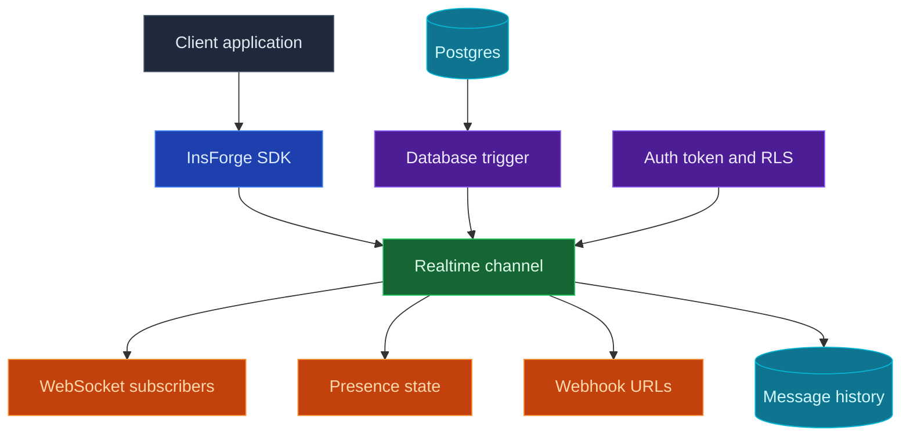

Usa InsForge Realtime cuando tu aplicación necesite actualizarse sin recargar la página. Los clientes se suscriben a canales como `order:123` o `chat:room-1`, y luego reciben cambios de base de datos, difusiones y actualizaciones de presencia a través de WebSockets. Los canales también pueden distribuir los mismos mensajes a URLs de webhook cuando otro servicio deba recibir el evento.

<Frame caption="Panel de Realtime: patrones de canal, historial de mensajes, permisos y configuración de retención.">
  
</Frame>

<Note>
  **¿Necesitas ejecutar código del lado del servidor después de un cambio en la base de datos?** Coloca esa lógica de negocio en una [Edge Function](/core-concepts/functions/overview) e invócala desde un disparador (trigger) de base de datos. Usa Realtime cuando el cambio deba entregarse a los clientes conectados o a los endpoints de webhook configurados.
</Note>



## Funciones

### Canales

Los canales son temas con nombre a los que los clientes pueden unirse. Usa nombres exactos para salas compartidas, o patrones como `order:%` cuando cada registro necesite su propio flujo en vivo.

### Cambios de base de datos

Usa los cambios de base de datos cuando una escritura en una tabla deba convertirse en un evento en vivo de la aplicación. Crea un disparador (trigger) en la tabla que quieras observar. En su función de disparador, llama a la función predefinida `realtime.publish(channel, event, payload)` para decidir qué canal recibe el mensaje, qué nombre de evento manejan los clientes y qué payload reciben.

Para un patrón de canal como `order:%`, un disparador puede publicar un evento por cada pedido:

```sql
CREATE OR REPLACE FUNCTION public.notify_order_status()
RETURNS TRIGGER AS $$
BEGIN
  PERFORM realtime.publish(
    'order:' || NEW.id::text,
    'status_changed',
    jsonb_build_object(
      'id', NEW.id,
      'status', NEW.status,
      'updatedAt', NEW.updated_at
    )
  );

  RETURN NEW;
END;
$$ LANGUAGE plpgsql SECURITY DEFINER;

CREATE TRIGGER order_status_realtime
  AFTER UPDATE OF status ON public.orders
  FOR EACH ROW
  WHEN (OLD.status IS DISTINCT FROM NEW.status)
  EXECUTE FUNCTION public.notify_order_status();
```

Luego suscríbete desde la aplicación con el SDK:

```typescript
const channel = `order:${orderId}`;

await insforge.realtime.connect();

const subscription = await insforge.realtime.subscribe(channel);
if (!subscription.ok) {
  throw new Error(subscription.error.message);
}

insforge.realtime.on('status_changed', (message) => {
  renderOrderStatus(message.status);
});
```

### Difusiones del cliente

Los clientes pueden publicar mensajes en canales a los que ya se han unido. Úsalo para chat, indicadores de escritura, cursores, señales de edición colaborativa y otras actualizaciones de usuario a usuario que no necesiten originarse en una escritura de base de datos.

```typescript
await insforge.realtime.publish(`chat:${roomId}`, 'typing', {
  userId,
  isTyping: true
});
```

### Webhooks

Adjunta URLs de webhook a un canal cuando otro servicio deba recibir cada mensaje. InsForge publica el payload del evento en cada URL configurada, incluye encabezados con el nombre del evento, el canal y el ID del mensaje, reintenta los fallos transitorios de red y registra los conteos de entrega de webhooks en el historial de mensajes.

### Presencia

La presencia rastrea quién está en línea en un canal. Los clientes reciben una instantánea de los miembros actuales al suscribirse, y luego los eventos `presence:join` y `presence:leave` a medida que los miembros entran y salen. Guarda la membresía duradera de la sala, los roles y los permisos en tus propias tablas; la presencia solo ofrece el estado en línea.

```typescript
const response = await insforge.realtime.subscribe(`chat:${roomId}`);

if (response.ok) {
  renderOnlineMembers(response.presence.members);
}

insforge.realtime.on('presence:join', (message) => {
  addOnlineMember(message.member);
});

insforge.realtime.on('presence:leave', (message) => {
  removeOnlineMember(message.member.presenceId);
});
```

### Seguridad a nivel de fila

Realtime puede estar abierto durante el prototipado y luego bloquearse con RLS de Postgres. Usa políticas `SELECT` en `realtime.channels` para controlar quién puede suscribirse, y políticas `INSERT` en `realtime.messages` para controlar quién puede publicar desde un cliente.

Esta política permite que los usuarios autenticados se suscriban a canales `order:<id>` solo cuando el pedido les pertenece:

```sql
ALTER TABLE realtime.channels ENABLE ROW LEVEL SECURITY;

CREATE POLICY "users_subscribe_own_orders"
ON realtime.channels
FOR SELECT
TO authenticated
USING (
  pattern = 'order:%'
  AND EXISTS (
    SELECT 1
    FROM public.orders
    WHERE id = NULLIF(split_part(realtime.channel_name(), ':', 2), '')::uuid
      AND user_id = auth.uid()
  )
);
```

Usa `realtime.channel_name()` en las políticas de suscripción porque los clientes se suscriben a canales resueltos como `order:123`, mientras que `realtime.channels` almacena patrones como `order:%`.

### Historial de mensajes

Cada evento entregado se registra con los conteos de entrega de WebSocket y webhook. El panel puede inspeccionar los mensajes recientes, las estadísticas de entrega y la configuración de retención cuando necesites depurar el comportamiento en vivo.

## Empieza a construir

<CardGroup cols={2}>
  <Card title="TypeScript SDK" icon="js" href="/sdks/typescript/realtime">
    Suscríbete a canales, publica eventos y rastrea la presencia desde Node, el navegador y el edge.
  </Card>

  <Card title="Swift SDK" icon="swift" href="/sdks/swift/realtime">
    Cliente nativo de Swift en tiempo real para iOS y macOS.
  </Card>

  <Card title="Kotlin SDK" icon="android" href="/sdks/kotlin/realtime">
    Cliente en tiempo real basado en corrutinas para Android y JVM.
  </Card>

  <Card title="REST and WebSocket API" icon="code" href="/sdks/rest/realtime">
    Usa el contrato Socket.IO en bruto desde cualquier lenguaje.
  </Card>
</CardGroup>

## Próximos pasos

- Configura la [CLI](/quickstart) para vincular tu proyecto.
- Crea canales en el panel de Realtime.
- Usa la [referencia del SDK de TypeScript](/sdks/typescript/realtime) para las suscripciones del cliente.
- Agrega URLs de webhook a un canal cuando otro servicio necesite el mismo flujo de eventos.
