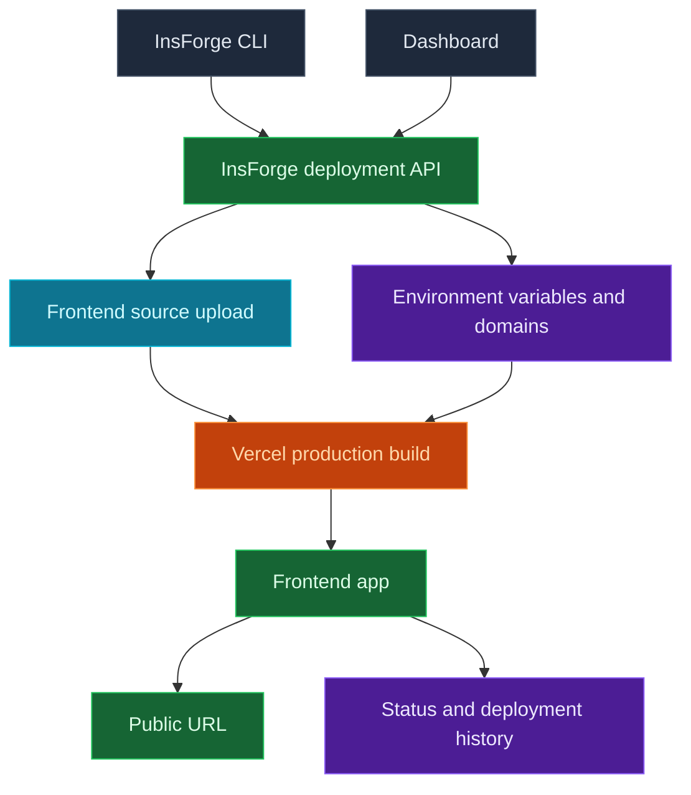

Usa InsForge Sites para publicar la aplicación orientada al navegador que pertenece a tu proyecto. El CLI de InsForge sube el código fuente de tu frontend a través de InsForge, que crea una implementación de producción en Vercel. El panel realiza el seguimiento de la URL, el estado, el historial de implementaciones, las variables de entorno y los dominios.

<Frame caption="Panel de Sites: estado, dominios, variables de entorno e historial de implementaciones.">
  
</Frame>

<Note>
  **¿Necesitas implementar un contenedor o un servicio backend?** Usa [Compute](/core-concepts/compute/overview) para workers, colas, servidores WebSocket y servicios de larga duración. Sites está pensado para sitios web frontend y compilaciones de frameworks que generan una aplicación web alojada.
</Note>



## Funciones

### Implementaciones desde el CLI

Implementa desde el directorio fuente de tu aplicación. El CLI sube el árbol de archivos fuente, omite los archivos exclusivamente locales como `node_modules`, `.git`, la salida de compilación y los archivos `.env`, y luego inicia la compilación en Vercel a través de InsForge.

```bash
npx @insforge/cli deployments deploy ./frontend
```

### Compilaciones de frameworks

Implementa proyectos en React, Vue, Svelte, Next.js, sitios estáticos y otros proyectos frontend. InsForge envía los archivos fuente a Vercel, donde la detección de framework y los archivos del proyecto, como `package.json` y `vercel.json`, determinan cómo se compila la aplicación.

### Variables de entorno

Gestiona las variables de entorno del proveedor desde el panel. Usa prefijos públicos como `VITE_` o `NEXT_PUBLIC_` solo para valores que sean seguros de exponer en el código del navegador.

```bash
npx @insforge/cli deployments env list
npx @insforge/cli deployments env set VITE_INSFORGE_URL https://your-project.region.insforge.app
npx @insforge/cli deployments env set VITE_INSFORGE_ANON_KEY ik_xxx
```

### Historial de implementaciones

Revisa las ejecuciones anteriores, sincroniza el estado de Vercel, inspecciona los metadatos y cancela implementaciones en curso desde la página de registros de implementación.

```bash
npx @insforge/cli deployments list
npx @insforge/cli deployments status deployment_123 --sync
npx @insforge/cli deployments cancel deployment_123
```

### Dominios

Cada implementación lista obtiene una URL predeterminada en `https://<appkey>.insforge.site`. También puedes configurar un slug gestionado por InsForge en `https://<slug>.insforge.site`. Para un dominio personalizado, agrega el dominio en el panel y configura el registro DNS que este devuelve, normalmente un CNAME para subdominios.

## Solución de problemas

### 404: NOT_FOUND en rutas del lado del cliente

Las aplicaciones de una sola página que gestionan el enrutamiento en el navegador (React Router, Vue Router y similares) pueden devolver `404: NOT_FOUND` cuando un enlace profundo o una recarga de página llega a una ruta que no tiene un archivo correspondiente en el servidor. Como InsForge construye tu sitio en Vercel, agrega un `vercel.json` en la raíz de tu proyecto que reescriba todas las rutas a `index.html`, para que el enrutador del navegador tome el control:

```json
{
  "rewrites": [{ "source": "/(.*)", "destination": "/index.html" }]
}
```

Luego vuelve a desplegar:

```bash
npx @insforge/cli deployments deploy ./frontend
```

Si el 404 aparece en la primera carga y no solo en una subruta, es probable que el directorio de salida de la compilación sea incorrecto para tu framework. Vercel lo detecta a partir de `package.json` y `vercel.json`, así que confirma que tu compilación produce la carpeta de salida esperada.

## Impleméntalo

<CardGroup cols={2}>
  <Card title="Guía rápida del CLI" icon="terminal" href="/quickstart">
    Conecta tu proyecto y ejecuta comandos del CLI de InsForge desde el directorio de tu aplicación.
  </Card>
</CardGroup>

## Próximos pasos

- Configura el [CLI](/quickstart) y conecta tu proyecto.
- Agrega variables de entorno seguras para el navegador desde el panel o con `npx @insforge/cli deployments env set`.
- Ejecuta `npx @insforge/cli deployments deploy ./frontend`.
