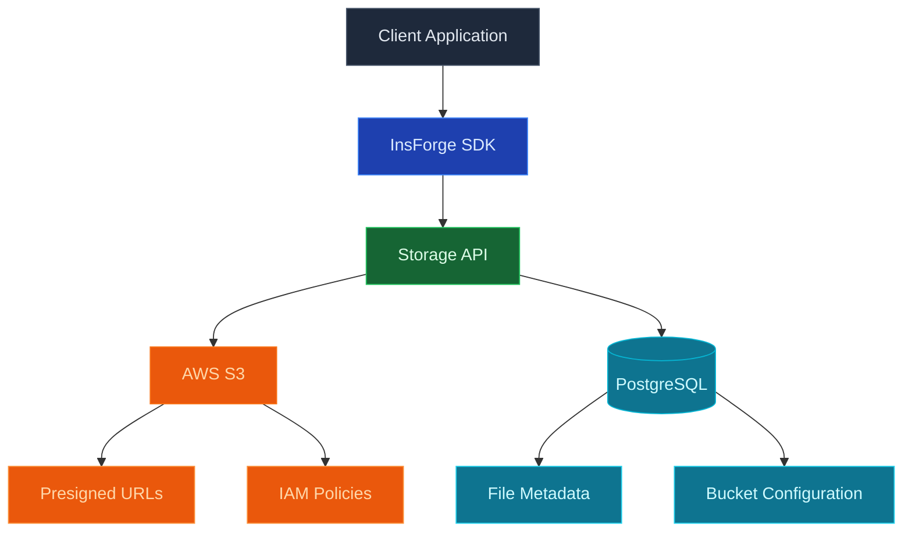

Use InsForge para almacenar y servir archivos binarios grandes: imágenes, videos, PDF, audio, copias de seguridad, cualquier cosa que no pondría en una fila de base de datos. Cada proyecto obtiene un depósito compatible con S3. Los archivos se sirven detrás de URL firmadas, las políticas de acceso siguen el mismo modelo de seguridad a nivel de fila que la base de datos, y la API de S3 funciona con rclone, AWS CLI, Terraform y SDK en cualquier idioma.

<Frame caption="Navegador de almacenamiento: depósitos, listado de archivos y cargas, todo detrás del mismo RLS que la base de datos.">
  
</Frame>

<Note>
  **¿Busca datos estructurados?** Use [Database](/core-concepts/database/overview) para filas, relaciones y consultas. El almacenamiento contiene objetos; la base de datos contiene filas. Mantenga los metadatos del archivo (propietario, nombre, tamaño, tipo de contenido) en una tabla de base de datos y los bytes en el almacenamiento.
</Note>

## Características

### API compatible con S3

Apunte cualquier cliente de S3 al depósito de su proyecto. Credenciales nativas de AWS, cargas multiparte nativas, URL presignadas nativas. Ver [S3 compatibility](/core-concepts/storage/s3-compatibility).

### URL firmadas

Genere URL con límite de tiempo para compartir objetos privados sin exponer sus credenciales. El SDK y la API REST emiten URL firmadas para carga y descarga.

### Seguridad a nivel de fila

Las políticas de almacenamiento leen el mismo JWT de autenticación que las consultas de base de datos. El mismo usuario que puede `SELECT` una fila puede `GET` el archivo al que hace referencia la fila, por lo que nunca tiene que mantener un conjunto separado de permisos de almacenamiento.

### Depósitos

Agrupe objetos en depósitos con políticas de acceso separadas. Los depósitos públicos sirven archivos directamente a través de HTTPS; los depósitos privados requieren una URL firmada o una solicitud autenticada.

### Cargas directas

Los clientes de navegador y móvil cargan directamente al almacenamiento con una URL presignada. El backend nunca actúa como proxy de bytes.

## Conceptos

<CardGroup cols={2}>
  <Card title="S3 compatibility" icon="bucket" href="/core-concepts/storage/s3-compatibility">
    Apunte cualquier cliente de S3 al depósito de su proyecto con credenciales nativas.
  </Card>
</CardGroup>

## Construir con él

<CardGroup cols={2}>
  <Card title="SDK de TypeScript" icon="js" href="/sdks/typescript/storage">
    Carga, descarga, lista y administra objetos desde Node, navegador y borde.
  </Card>

  <Card title="SDK de Swift" icon="swift" href="/sdks/swift/storage">
    Cliente de almacenamiento Swift nativo para iOS y macOS.
  </Card>

  <Card title="SDK de Kotlin" icon="android" href="/sdks/kotlin/storage">
    Cliente de almacenamiento orientado a corrutinas para Android y JVM.
  </Card>

  <Card title="API REST" icon="code" href="/sdks/rest/storage">
    Puntos finales de almacenamiento HTTP simples, invocables desde cualquier idioma.
  </Card>
</CardGroup>

## Próximos pasos

- Configure el [CLI](/quickstart) para vincular su proyecto (la ruta recomendada).
- Explore la [referencia del SDK de TypeScript](/sdks/typescript/storage) para cargas y descargas.
