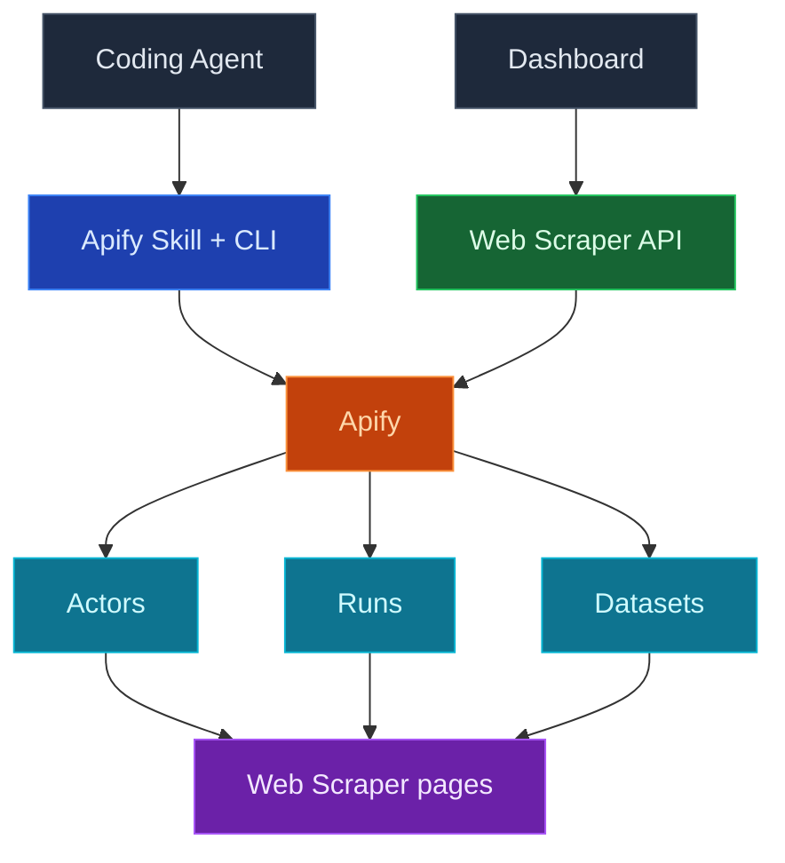

Use InsForge Web Scraper para dar a su agente de codificación acceso en vivo a datos externos: conecte su propia cuenta de Apify una sola vez, y su agente podrá ejecutar raspadores (Apify los llama actors) bajo demanda, mientras el panel muestra sus actors, el historial de ejecuciones y los conjuntos de datos raspados sin salir de InsForge.

Conecte Apify con un solo clic y luego pegue el prompt de raspado en su agente de codificación. El agente se autentica con su token de Apify gestionado por InsForge, elige el actor adecuado para la tarea y devuelve los resultados.

<Frame caption="Panel de Web Scraper: actors conectados con su última ejecución y el número total de ejecuciones.">
  
</Frame>

<Note>
  Apify sigue siendo la fuente de verdad para los actors, las ejecuciones y los conjuntos de datos. InsForge muestra un subconjunto enfocado para las verificaciones diarias, y luego enlaza directamente a la consola de Apify para cualquier cosa que vaya más allá. La integración de Web Scraper está disponible en InsForge Cloud; las implementaciones autoalojadas devuelven `501 Not Implemented` en estas rutas.
</Note>



## Funciones

### Conexión a Apify con un clic

Conecte Apify desde la página Web Scraper en el panel. InsForge lo guía a través del flujo de OAuth de Apify, almacena las credenciales en el servidor y mantiene el token de acceso actualizado por usted. El token en bruto nunca llega a su repositorio ni a su frontend; los agentes y las funciones obtienen un token en vivo desde el backend cuando lo necesitan.

### Raspar mediante su agente de codificación

Después de conectar, el estado vacío ofrece un prompt de raspado que puede pegar en su agente de codificación:

```
Use the insforge webscraper apify skill to scrape <what you want> and return the results.
```

Detrás de este prompt, `npx @insforge/cli webscraper apify login` obtiene su token de Apify gestionado por InsForge, autentica el CLI local de Apify de forma silenciosa (sin OAuth por navegador) e instala las skills del agente de Apify. A partir de ahí, el agente elige un actor de la Apify Store, inicia ejecuciones y lee los resultados.

### Actors

Los actors que ha usado o creado recientemente, con su última hora de ejecución y el número total de ejecuciones. Cada fila enlaza directamente a la consola de Apify para la configuración completa del actor.

### Runs

Ejecuciones recientes del raspador con su estado (succeeded, failed, running), hora de inicio y costo en USD. Útil para una verificación rápida de "¿funcionó el raspado de anoche y cuánto costó?" sin necesidad de abrir Apify.

### Dataset

Conjuntos de datos producidos por sus ejecuciones, con el número de elementos, la hora de creación y el actor que los produjo. Enlaza directamente al almacenamiento de Apify, donde puede inspeccionar o exportar los elementos.

### Llevar los datos raspados a su base de datos

Los resultados raspados residen en los conjuntos de datos de Apify de forma predeterminada; no se escribe nada en el Postgres de su proyecto a menos que usted lo desee. Para raspados pequeños, su agente simplemente puede devolver los resultados. Para cualquier cosa que desee conservar o actualizar según un horario, haga que el agente implemente una [función edge](/core-concepts/functions/overview) o un [servicio de cómputo](/core-concepts/compute/overview) que obtenga el conjunto de datos de Apify e inserte o actualice filas en una tabla.

### Configuración y desconexión

El cuadro de diálogo de configuración de Web Scraper (el icono de engranaje en la barra lateral) muestra la cuenta de Apify conectada, el plan y la retención de datos, enlaza a la consola de Apify y permite a los administradores desconectarse. Desconectar solo detiene el uso de sus credenciales de Apify por parte de InsForge; su cuenta de Apify, sus actors y sus conjuntos de datos permanecen intactos, y puede volver a conectarse en cualquier momento.

## Conceptos

<CardGroup cols={2}>
  <Card title="Actors de Apify" icon="robot" href="https://docs.apify.com/platform/actors">
    Los raspadores sin servidor detrás de cada ejecución, desde actors ya preparados de la Store hasta los suyos propios.
  </Card>

  <Card title="Almacenamiento de Apify" icon="database" href="https://docs.apify.com/platform/storage/dataset">
    Cómo los conjuntos de datos almacenan los elementos raspados y cómo exportarlos u obtenerlos mediante la API.
  </Card>
</CardGroup>

## Construya con esto

<CardGroup cols={2}>
  <Card title="InsForge CLI" icon="terminal" href="/quickstart">
    `npx @insforge/cli webscraper apify connect` vincula su proyecto a Apify y luego inicia sesión en su agente local.
  </Card>

  <Card title="Apify Store" icon="store" href="https://apify.com/store">
    Miles de actors ya preparados para objetivos comunes, desde Google Maps hasta plataformas sociales.
  </Card>

  <Card title="Cliente de la API de Apify" icon="js" href="https://docs.apify.com/api/client/js/">
    Llame a actors y lea conjuntos de datos desde sus funciones edge o servicios de cómputo.
  </Card>
</CardGroup>

## Próximos pasos

- Abra la página Web Scraper en el panel y haga clic en **Connect Apify**.
- Pegue el prompt de raspado en su agente de codificación e indíquele qué desea raspar.
- Cuando un raspado valga la pena conservar, pida a su agente que lleve el conjunto de datos a una tabla mediante una [función edge](/core-concepts/functions/overview) o un [horario](/core-concepts/functions/schedules).
