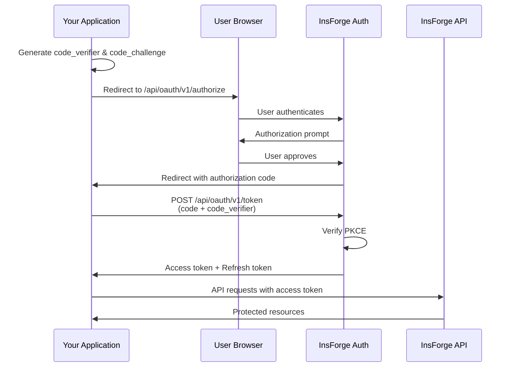

## Descripción general

InsForge puede funcionar como proveedor de identidad OAuth 2.0, permitiendo que aplicaciones de terceros autentiquen usuarios mediante "Sign in with InsForge". Esto permite que los desarrolladores que construyen sobre tu plataforma aprovechen el sistema de autenticación de InsForge sin tener que gestionar sus propias credenciales de usuario.

## Casos de uso

<CardGroup cols={2}>
  <Card title="Plataformas para desarrolladores" icon="code">
    Permite que desarrolladores externos creen integraciones con "Sign in with InsForge", mientras mantienes el control sobre el acceso a los datos de los usuarios.
  </Card>

  <Card title="Agentes de IA y MCP" icon="robot">
    Autentica agentes de IA y herramientas LLM a través de Model Context Protocol con autorización basada en OAuth.
  </Card>

  <Card title="Aplicaciones de socios" icon="handshake">
    Permite que las aplicaciones de socios autentiquen usuarios contra tu proyecto de InsForge sin compartir credenciales.
  </Card>

  <Card title="CLI y aplicaciones de escritorio" icon="terminal">
    Emite tokens OAuth para herramientas de línea de comandos y aplicaciones de escritorio que necesitan acceso a la API.
  </Card>
</CardGroup>

## Flujo de OAuth 2.0

InsForge implementa el **flujo de código de autorización con PKCE** (Proof Key for Code Exchange), el flujo OAuth más seguro tanto para aplicaciones web como nativas.



## Primeros pasos

<Steps>
  <Step title="Registra tu aplicación">
    Contacta a InsForge para registrar tu aplicación como un cliente OAuth. Recibirás:
    - **Client ID**: Identificador público de tu aplicación
    - **Client Secret**: Clave confidencial para el intercambio de tokens del lado del servidor
    - **Allowed Redirect URIs**: URLs a las que se puede redirigir a los usuarios después de la autorización
  </Step>

  <Step title="Configura los scopes">
    Define los permisos que necesita tu aplicación:

    | Scope | Descripción |
    |-------|-------------|
    | `user:read` | Lee la información del perfil del usuario |
    | `organizations:read` | Lista las organizaciones del usuario |
    | `projects:read` | Lee los metadatos del proyecto |
    | `projects:write` | Crea y modifica proyectos |
  </Step>

  <Step title="Implementa el flujo de autorización">
    Integra el flujo de OAuth en tu aplicación utilizando los endpoints que se indican a continuación.
  </Step>
</Steps>

## Endpoints

### Endpoint de autorización

Redirige a los usuarios a este endpoint para iniciar el flujo de OAuth.

```
GET https://api.insforge.dev/api/oauth/v1/authorize
```

**Parámetros de consulta:**

| Parámetro | Obligatorio | Descripción |
|-----------|----------|-------------|
| `client_id` | Sí | El client ID de tu aplicación |
| `redirect_uri` | Sí | URL a la que redirigir tras la autorización (debe estar registrada previamente) |
| `response_type` | Sí | Debe ser `code` |
| `scope` | Sí | Lista de scopes separados por espacios |
| `state` | Sí | Cadena aleatoria para protección CSRF |
| `code_challenge` | Sí | Code challenge de PKCE (hash SHA256 codificado en base64url) |
| `code_challenge_method` | Sí | Debe ser `S256` |

**Ejemplo:**

```
https://api.insforge.dev/api/oauth/v1/authorize?
  client_id=clf_abc123xyz&
  redirect_uri=https://example.com/callback&
  response_type=code&
  scope=user:read%20organizations:read&
  state=random_state_string&
  code_challenge=E9Melhoa2OwvFrEMTJguCHaoeK1t8URWbuGJSstw-cM&
  code_challenge_method=S256
```

### Endpoint de token

Intercambia el código de autorización por tokens de acceso y de actualización.

```
POST https://api.insforge.dev/api/oauth/v1/token
```

**Cuerpo de la solicitud (JSON):**

```json
{
  "grant_type": "authorization_code",
  "code": "AUTH_CODE_FROM_CALLBACK",
  "redirect_uri": "https://example.com/callback",
  "client_id": "clf_abc123xyz",
  "client_secret": "your_client_secret",
  "code_verifier": "your_original_code_verifier"
}
```

**Respuesta:**

```json
{
  "access_token": "eyJhbGciOiJIUzI1NiIs...",
  "refresh_token": "eyJhbGciOiJIUzI1NiIs...",
  "token_type": "Bearer",
  "expires_in": 3600
}
```

### Token de actualización

Intercambia un refresh token por un nuevo token de acceso.

```
POST https://api.insforge.dev/api/oauth/v1/token
```

**Cuerpo de la solicitud (JSON):**

```json
{
  "grant_type": "refresh_token",
  "refresh_token": "your_refresh_token",
  "client_id": "clf_abc123xyz",
  "client_secret": "your_client_secret"
}
```

### Endpoint de perfil de usuario

Recupera la información del perfil del usuario autenticado.

```
GET https://api.insforge.dev/auth/v1/profile
Authorization: Bearer {access_token}
```

**Respuesta:**

```json
{
  "user": {
    "id": "uuid-string",
    "email": "user@example.com",
    "profile": {
      "name": "John Doe",
      "avatar_url": "https://..."
    },
    "email_verified": true,
    "created_at": "2025-01-01T00:00:00Z"
  }
}
```

## Guía de implementación

### Genera los parámetros de PKCE

PKCE añade una capa adicional de seguridad al garantizar que la aplicación que inició el flujo sea la misma que lo completa.

<Tabs>
  <Tab title="Node.js">
```javascript
const crypto = require('crypto');

// Generate a random code verifier (keep this secret, stored server-side)
function generateCodeVerifier() {
  return crypto.randomBytes(32).toString('base64url');
}

// Generate the code challenge from the verifier
function generateCodeChallenge(verifier) {
  return crypto
    .createHash('sha256')
    .update(verifier)
    .digest('base64url');
}

// Usage
const codeVerifier = generateCodeVerifier();
const codeChallenge = generateCodeChallenge(codeVerifier);

// Store codeVerifier in session, send codeChallenge to authorization endpoint
```
  </Tab>
  <Tab title="Python">
```python
import secrets
import hashlib
import base64

def generate_code_verifier():
    return secrets.token_urlsafe(32)

def generate_code_challenge(verifier):
    digest = hashlib.sha256(verifier.encode()).digest()
    return base64.urlsafe_b64encode(digest).rstrip(b'=').decode()

# Usage
code_verifier = generate_code_verifier()
code_challenge = generate_code_challenge(code_verifier)

# Store code_verifier in session, send code_challenge to authorization endpoint
```
  </Tab>
  <Tab title="Navegador (Web Crypto)">
```javascript
async function generateCodeVerifier() {
  const array = new Uint8Array(32);
  crypto.getRandomValues(array);
  return base64UrlEncode(array);
}

async function generateCodeChallenge(verifier) {
  const encoder = new TextEncoder();
  const data = encoder.encode(verifier);
  const digest = await crypto.subtle.digest('SHA-256', data);
  return base64UrlEncode(new Uint8Array(digest));
}

function base64UrlEncode(buffer) {
  return btoa(String.fromCharCode(...buffer))
    .replace(/\+/g, '-')
    .replace(/\//g, '_')
    .replace(/=+$/, '');
}
```
  </Tab>
</Tabs>

### Ejemplo completo del lado del servidor

Aquí tienes una implementación completa con Express.js. Primero, crea un archivo `.env` con tus credenciales:

```bash
# .env - DO NOT commit this file to version control
SESSION_SECRET=your-secure-random-secret-min-32-chars
INSFORGE_CLIENT_ID=clf_your_client_id
INSFORGE_CLIENT_SECRET=your_client_secret
INSFORGE_URL=https://api.insforge.dev
REDIRECT_URI=http://localhost:3000/auth/callback
```

<Note>
Genera un secreto de sesión seguro usando: `node -e "console.log(require('crypto').randomBytes(32).toString('hex'))"`
</Note>

Luego implementa el flujo de OAuth:

```javascript
require('dotenv').config();
const express = require('express');
const crypto = require('crypto');
const session = require('express-session');

const app = express();

// Validate required environment variables
const requiredEnvVars = ['SESSION_SECRET', 'INSFORGE_CLIENT_ID', 'INSFORGE_CLIENT_SECRET'];
for (const envVar of requiredEnvVars) {
  if (!process.env[envVar]) {
    console.error(`Missing required environment variable: ${envVar}`);
    process.exit(1);
  }
}

app.use(express.json());
app.use(session({
  secret: process.env.SESSION_SECRET,
  resave: false,
  saveUninitialized: true,
  cookie: { secure: process.env.NODE_ENV === 'production' }
}));

const config = {
  clientId: process.env.INSFORGE_CLIENT_ID,
  clientSecret: process.env.INSFORGE_CLIENT_SECRET,
  insforgeUrl: process.env.INSFORGE_URL || 'https://api.insforge.dev',
  redirectUri: process.env.REDIRECT_URI || 'http://localhost:3000/auth/callback',
  scopes: 'user:read organizations:read'
};

// Step 1: Initiate OAuth flow
app.get('/auth/login', (req, res) => {
  // Generate PKCE parameters
  const codeVerifier = crypto.randomBytes(32).toString('base64url');
  const codeChallenge = crypto
    .createHash('sha256')
    .update(codeVerifier)
    .digest('base64url');

  // Generate state for CSRF protection
  const state = crypto.randomBytes(16).toString('hex');

  // Store in session
  req.session.codeVerifier = codeVerifier;
  req.session.oauthState = state;

  // Build authorization URL
  const authUrl = new URL(`${config.insforgeUrl}/api/oauth/v1/authorize`);
  authUrl.searchParams.set('client_id', config.clientId);
  authUrl.searchParams.set('redirect_uri', config.redirectUri);
  authUrl.searchParams.set('response_type', 'code');
  authUrl.searchParams.set('scope', config.scopes);
  authUrl.searchParams.set('state', state);
  authUrl.searchParams.set('code_challenge', codeChallenge);
  authUrl.searchParams.set('code_challenge_method', 'S256');

  res.redirect(authUrl.toString());
});

// Step 2: Handle callback
app.get('/auth/callback', async (req, res) => {
  const { code, state, error } = req.query;

  // Check for errors
  if (error) {
    return res.status(400).send(`OAuth error: ${error}`);
  }

  // Validate state to prevent CSRF
  if (state !== req.session.oauthState) {
    return res.status(403).send('Invalid state parameter');
  }

  try {
    // Exchange code for tokens
    const tokenResponse = await fetch(`${config.insforgeUrl}/api/oauth/v1/token`, {
      method: 'POST',
      headers: { 'Content-Type': 'application/json' },
      body: JSON.stringify({
        grant_type: 'authorization_code',
        code,
        redirect_uri: config.redirectUri,
        client_id: config.clientId,
        client_secret: config.clientSecret,
        code_verifier: req.session.codeVerifier
      })
    });

    const tokens = await tokenResponse.json();

    if (!tokenResponse.ok) {
      throw new Error(tokens.error || 'Token exchange failed');
    }

    // Fetch user profile
    const profileResponse = await fetch(`${config.insforgeUrl}/auth/v1/profile`, {
      headers: { 'Authorization': `Bearer ${tokens.access_token}` }
    });

    const { user } = await profileResponse.json();

    // Store tokens and user in session
    req.session.accessToken = tokens.access_token;
    req.session.refreshToken = tokens.refresh_token;
    req.session.user = user;

    // Clean up PKCE data
    delete req.session.codeVerifier;
    delete req.session.oauthState;

    res.redirect('/dashboard');
  } catch (err) {
    console.error('OAuth callback error:', err);
    res.status(500).send('Authentication failed');
  }
});

// Step 3: Use access token for API calls
app.get('/api/organizations', async (req, res) => {
  if (!req.session.accessToken) {
    return res.status(401).json({ error: 'Not authenticated' });
  }

  const response = await fetch(`${config.insforgeUrl}/organizations/v1`, {
    headers: { 'Authorization': `Bearer ${req.session.accessToken}` }
  });

  const data = await response.json();
  res.json(data);
});

app.listen(3000, () => console.log('Server running on http://localhost:3000'));
```

### Modo popup para SPAs

En aplicaciones de una sola página, puedes abrir el flujo de OAuth en una ventana emergente:

```javascript
function loginWithPopup() {
  const width = 500;
  const height = 600;
  const left = window.screenX + (window.outerWidth - width) / 2;
  const top = window.screenY + (window.outerHeight - height) / 2;

  const popup = window.open(
    '/auth/login?mode=popup',
    'insforge-oauth',
    `width=${width},height=${height},left=${left},top=${top}`
  );

  // Listen for completion message from popup
  window.addEventListener('message', (event) => {
    if (event.origin !== window.location.origin) return;

    if (event.data.type === 'oauth-complete') {
      popup.close();
      // Handle successful authentication
      window.location.reload();
    }
  });
}
```

En tu manejador de callback, envía un mensaje a la ventana principal:

```javascript
// In callback route, after successful token exchange
if (req.query.mode === 'popup') {
  res.send(`
    <script>
      window.opener.postMessage({ type: 'oauth-complete' }, window.location.origin);
      window.close();
    </script>
  `);
}
```

## Consideraciones de seguridad

<CardGroup cols={2}>
  <Card title="Usa siempre PKCE" icon="shield-check">
    PKCE es obligatorio en todos los flujos de OAuth. Evita los ataques de interceptación del código de autorización.
  </Card>

  <Card title="Valida el state" icon="fingerprint">
    Verifica siempre el parámetro state en los callbacks para prevenir ataques CSRF.
  </Card>

  <Card title="Almacenamiento seguro de tokens" icon="lock">
    Almacena los tokens de acceso en memoria o en cookies httpOnly seguras. Nunca expongas los tokens en URLs o en localStorage.
  </Card>

  <Card title="Usa HTTPS" icon="globe">
    Todos los endpoints de OAuth requieren HTTPS en producción. Nunca transmitas tokens por conexiones sin cifrar.
  </Card>

  <Card title="Expiración corta de los tokens" icon="clock">
    Los tokens de acceso expiran en 1 hora. Usa refresh tokens para obtener nuevos tokens de acceso sin volver a autenticarte.
  </Card>

  <Card title="Minimización de scopes" icon="minimize">
    Solicita solo los scopes que tu aplicación necesita. Los usuarios tienden a aprobar más fácilmente permisos limitados.
  </Card>
</CardGroup>

## Claims del token

Los tokens de acceso son JWTs que contienen los siguientes claims:

| Claim | Descripción |
|-------|-------------|
| `sub` | ID del usuario (UUID) |
| `email` | Dirección de correo electrónico del usuario |
| `role` | Rol del usuario (`authenticated`) |
| `client_id` | ID de cliente OAuth que solicitó el token |
| `scope` | Scopes concedidos |
| `iat` | Marca de tiempo de emisión |
| `exp` | Marca de tiempo de expiración |
| `iss` | Emisor (`insforge`) |
| `aud` | Audiencia (`insforge-api`) |

## Manejo de errores

### Errores de autorización

Si la autorización falla, los usuarios son redirigidos a tu `redirect_uri` con parámetros de error:

```
https://example.com/callback?error=access_denied&error_description=User%20denied%20access
```

Códigos de error comunes:

| Error | Descripción |
|-------|-------------|
| `invalid_request` | Parámetros faltantes o no válidos |
| `unauthorized_client` | El cliente no está autorizado para este tipo de concesión |
| `access_denied` | El usuario denegó la solicitud de autorización |
| `invalid_scope` | El scope solicitado no es válido o es desconocido |

### Errores de token

Los errores del endpoint de token se devuelven en formato JSON:

```json
{
  "error": "invalid_grant",
  "error_description": "Authorization code has expired"
}
```

| Error | Descripción |
|-------|-------------|
| `invalid_grant` | El código expiró, ya se usó, o el verifier no coincide |
| `invalid_client` | Falló la autenticación del cliente |
| `invalid_request` | Faltan parámetros requeridos |

## Límites de tasa

Los endpoints de OAuth tienen límite de tasa para prevenir abusos:

| Endpoint | Límite |
|----------|-------|
| `/authorize` | 100 solicitudes por minuto por IP |
| `/token` | 50 solicitudes por minuto por cliente |
| `/profile` | 100 solicitudes por minuto por token |

## Recursos

<Card title="Repositorio de ejemplo de OAuth" icon="github" href="https://github.com/InsForge/insforge-oauth-example">
  Ejemplo completo y funcional que muestra cómo integrar "Sign in with InsForge" en tu aplicación.
</Card>
