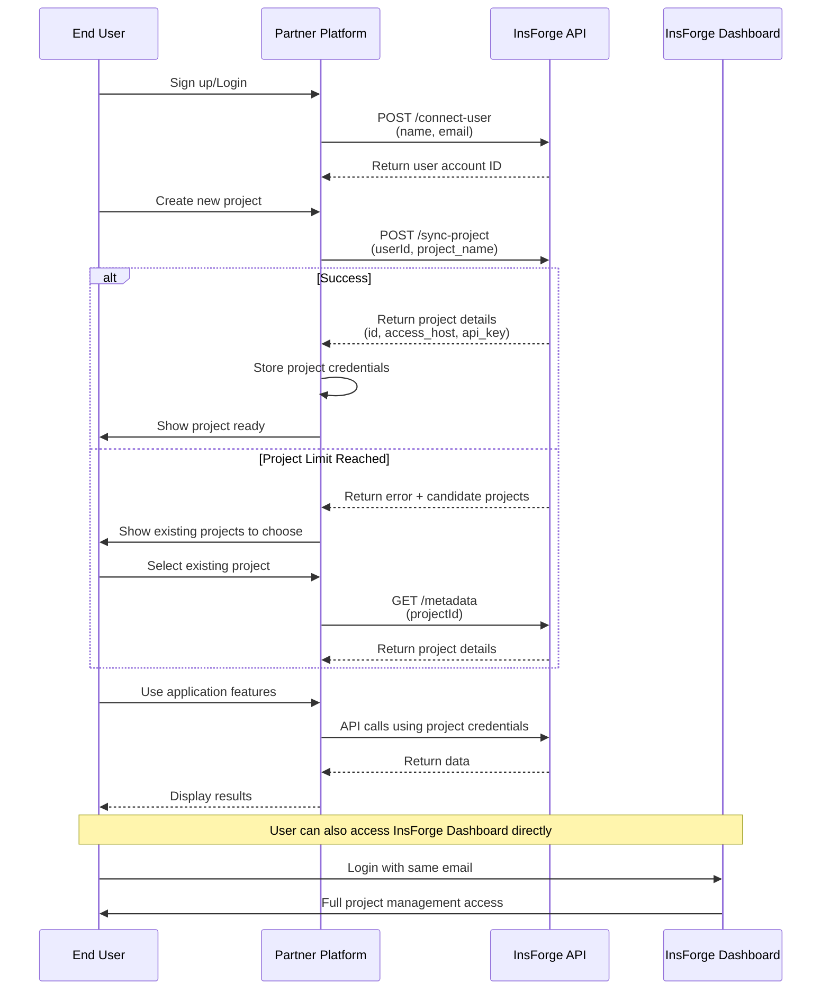
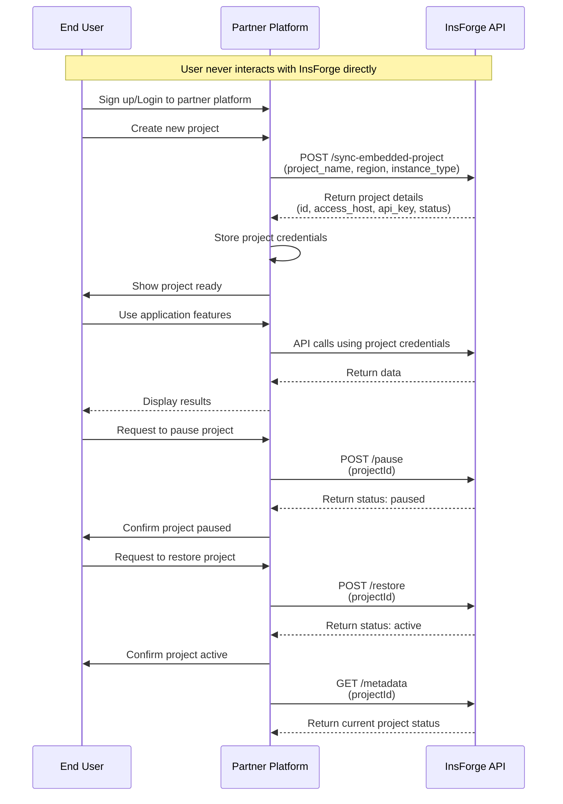

## Descripción general

InsForge ofrece dos modelos de asociación que permiten integrar de forma fluida nuestra plataforma de Backend as a Service en sus aplicaciones. Ya sea que busque una solución de marca compartida o una experiencia totalmente de marca blanca, tenemos el modelo de asociación adecuado para usted.

## Modelos de asociación

<CardGroup cols={2}>
  <Card title="Asociación de marca compartida" icon="handshake">
    Perfecto para plataformas que desean ofrecer InsForge junto con sus propios servicios.
    El proceso de integración es sumamente sencillo: los desarrolladores pueden conectarse a la plataforma InsForge con un solo clic, sin flujos de OAuth complicados.
  </Card>
  <Card title="Asociación de marca blanca" icon="tag">
    Ideal para plataformas que buscan un control total sobre la experiencia del usuario.
    Ofrece una gestión completa del ciclo de vida del proyecto, incluida la integración del panel del proyecto. Los desarrolladores pueden realizar todas las operaciones sin salir nunca de su plataforma de socio.
  </Card>
</CardGroup>

## Beneficios de la asociación

<CardGroup cols={2}>
  <Card title="Infraestructura escalable" icon="server">
    Aproveche nuestra sólida infraestructura de backend sin la sobrecarga de mantenimiento y escalado
  </Card>
  <Card title="Integración flexible" icon="plug">
    Elija entre múltiples opciones de integración que mejor se adapten a las necesidades de su aplicación
  </Card>
  <Card title="Reparto de ingresos" icon="handshake">
    Benefíciese de nuestro modelo competitivo de reparto de ingresos para aplicaciones de socios
  </Card>
  <Card title="Soporte técnico" icon="headset">
    Obtenga soporte técnico dedicado y recursos para garantizar una integración fluida
  </Card>
</CardGroup>

## Primeros pasos

<Steps>
  <Step title="Solicitar la asociación">
    Envíe su solicitud de asociación a través de nuestro [correo de asociaciones](mailto:partnerships@insforge.dev).
    Especifique si le interesa una asociación de marca compartida o de marca blanca.
  </Step>

  <Step title="Recibir las credenciales de socio">
    Una vez aprobado, recibirá:
    - **ID de socio**: su identificador único de socio
    - **Clave secreta**: su clave de autenticación para el acceso a la API
    - Documentación de integración y soporte
  </Step>

  <Step title="Configurar la autenticación">
    Todas las solicitudes a la API deben incluir su clave secreta para la autenticación:

    ```bash
    curl -X POST https://api.insforge.dev/partnership/v1/YOUR_PARTNER_ID/endpoint \
      -H "Content-Type: application/json" \
      -H "X-Partnership-Secret: YOUR_SECRET_KEY"
    ```
  </Step>

  <Step title="Comenzar la integración">
    Comience a integrar según su modelo de asociación utilizando nuestros endpoints de API.
  </Step>
</Steps>

## Funciones por tipo de asociación

### Funciones de marca compartida
En el modo de marca compartida, los desarrolladores saben explícitamente que son usuarios de la plataforma InsForge (vinculados mediante la misma dirección de correo electrónico). Después de iniciar sesión en la plataforma InsForge, los desarrolladores tienen derechos de gestión completos sobre los proyectos creados a través de socios y deben pagar de acuerdo con los planes de facturación de InsForge.

Las plataformas de socios pueden:
- Sincronizar cuentas de usuario (nombre, correo electrónico) con InsForge
- Sincronizar proyectos con InsForge
- Consultar la información de conexión del proyecto para aprovechar las capacidades de backend ya completadas.

### Funciones de marca blanca
En el modo de marca blanca, los desarrolladores no tienen conocimiento de la existencia de InsForge y no pueden ver los proyectos creados por socios en la plataforma InsForge.

Las plataformas de socios pueden:
- Crear proyectos integrados
- Consultar los metadatos del proyecto para aprovechar las capacidades de backend ya completadas.
- Pausar proyectos
- Restaurar proyectos
- Eliminar proyectos
- Obtener el token de autorización de acceso del proyecto
- Obtener el uso del proyecto
- Obtener el uso agregado de todos los proyectos de la asociación (para facturación)

## Referencia de la API

<Tabs>
  <Tab title="APIs de marca compartida">

    ### Conectar cuenta de usuario
    Sincroniza la información de la cuenta de usuario con InsForge.

    ```bash
    POST /partnership/v1/:partnerId/connect-user
    ```

    **Cuerpo de la solicitud:**
    ```json
    {
      "name": "John Doe",      // required
      "email": "john@example.com" // required
    }
    ```

    **Respuesta:**
    ```json
    {
      "account": {
        "id": "uuid-string"
      }
    }
    ```

    ### Sincronizar proyecto
    Crea o sincroniza un proyecto para un usuario específico.

    ```bash
    POST /partnership/v1/:partnerId/:userId/sync-project
    ```

    **Cuerpo de la solicitud:**
    ```json
    {
      "project_name": "my-project",  // required
      "region": "us-east",         // optional, "us-east", "us-west", "ap-southeast", "eu-central", default: "us-east"
      "instance_type": "nano"      // optional, "nano", "micro", "small", "medium", "large", "xl", "2xl", "4xl", "8xl", "16xl", default: "nano"
    }
    ```

    **Respuesta:**
    ```json
    {
      "success": true,
      "project": {
        "id": "uuid-string",
        "access_host": "https://project.us-east.insforge.app",
        "api_key": "project-api-key",
        "status": "active"
      }
    }
    ```

    #### Manejo de los límites de proyectos
    Nota: debido a los límites de proyectos en el plan gratuito de InsForge, la sincronización de proyectos desde las plataformas de socios puede fallar. En tales casos, la respuesta será:

    ```json
    {
      "success": false,
      "message": "Free plan allows up to 2 active projects. Please upgrade your plan to create more projects.",
      "candidate_projects": [
        {
          "id": "uuid-string",
          "access_host": "https://project2.us-east.insforge.app",
          "api_key": "project-api-key",
          "status": "active"
        }
      ]
    }
    ```

    Los socios pueden guiar a los usuarios para que seleccionen proyectos existentes para la conexión en lugar de crear siempre proyectos nuevos.

    ### Obtener metadatos del proyecto
    Recupera la información de conexión de un proyecto específico.

    ```bash
    GET /partnership/v1/:partnerId/:userId/:projectId/metadata
    ```

    **Respuesta:**
    ```json
    {
      "project": {
        "id": "uuid-string",
        "access_host": "https://project.us-east.insforge.app",
        "api_key": "project-api-key",
        "status": "active"
      }
    }
    ```

  </Tab>
  <Tab title="APIs de marca blanca">

    ### Sincronizar proyecto integrado
    Crea un proyecto integrado para socios de marca blanca.

    ```bash
    POST /partnership/v1/:partnerId/sync-embedded-project
    ```

    **Cuerpo de la solicitud:**
    ```json
    {
      "project_name": "embedded-project",  // required
      "region": "us-east",               // optional, "us-east", "us-west", "ap-southeast", "eu-central", default: "us-east"
      "instance_type": "nano"            // optional, "nano", "micro", "small", "medium", "large", "xl", "2xl", "4xl", "8xl", "16xl", default: "nano"
    }
    ```

    **Respuesta:**
    ```json
    {
      "success": true,
      "project": {
        "id": "uuid-string",
        "access_host": "https://project.us-east.insforge.app",
        "api_key": "project-api-key",
        "status": "active"
      }
    }
    ```

    ### Obtener metadatos del proyecto
    Recupera los metadatos de un proyecto específico.

    ```bash
    GET /partnership/v1/:partnerId/:projectId/metadata
    ```

    **Respuesta:**
    ```json
    {
      "project": {
        "id": "uuid-string",
        "access_host": "https://project.us-east.insforge.app",
        "api_key": "project-api-key",
        "region": "us-east",
        "instance_type": "nano",
        "last_activity_at": "2025-01-21T10:30:00Z",
        "status": "active"
      }
    }
    ```

    ### Pausar proyecto
    Pausa un proyecto activo para ahorrar recursos.

    ```bash
    POST /partnership/v1/:partnerId/:projectId/pause
    ```

    **Cuerpo de la solicitud:**
    ```json
    {
      "wait_for_completion": true  // optional
    }
    ```

    **Respuesta:**
    ```json
    {
      "project": {
        "id": "uuid-string",
        "status": "paused"
      }
    }
    ```

    ### Restaurar proyecto
    Restaura un proyecto pausado a su estado activo.

    ```bash
    POST /partnership/v1/:partnerId/:projectId/restore
    ```

    **Cuerpo de la solicitud:**
    ```json
    {
      "wait_for_completion": true  // optional
    }
    ```

    **Respuesta:**
    ```json
    {
      "project": {
        "id": "uuid-string",
        "status": "active"
      }
    }
    ```

    ### Eliminar proyecto
    Elimina un proyecto de forma permanente. Esta operación no se puede deshacer.

    ```bash
    DELETE /partnership/v1/:partnerId/:projectId
    ```

    **Respuesta (200 OK):**
    ```json
    {
      "message": "Project deleted successfully",
      "requestId": "xhiahif-fehfe-feae"
    }
    ```

    ### Generar autorización de proyecto
    Genera un token JWT asimétrico de corta duración para el acceso al proyecto. El token está firmado con una clave privada RSA y puede verificarse mediante el endpoint público JWKS. El token expira en 10 minutos.

    ```bash
    POST /partnership/v1/:partnerId/:projectId/authorization
    ```

    **Respuesta:**
    ```json
    {
      "code": "eyJhbGciOiJSUzI1NiIsInR5cCI6IkpXVCIsImtpZCI6Imluc2ZvcmdlLWtleS0yMDI1LTA4LTEzIn0...",
      "expires_in": 600,
      "type": "Bearer"
    }
    ```

    ### Obtener el uso del proyecto
    Recupera las métricas de uso de un proyecto específico durante un rango de fechas. Devuelve tanto estadísticas resumidas como el desglose diario de las métricas de uso. Si no se especifican fechas, devuelve los datos de los últimos 7 días.

    ```bash
    GET /partnership/v1/:partnerId/:projectId/usage?start_date=2025-11-10&end_date=2025-11-18
    ```

    **Parámetros de consulta:**
    - `start_date` (opcional): fecha de inicio en formato AAAA-MM-DD (por defecto, hace 7 días)
    - `end_date` (opcional): fecha de fin en formato AAAA-MM-DD (por defecto, hoy)

    **Respuesta:**
    ```json
    {
      "project": {
        "id": "uuid-string",
        "name": "project-name",
        "status": "active",
        "last_activity_at": "2025-11-18T10:30:00Z"
      },
      "period": {
        "start": "2025-11-10T00:00:00Z",
        "end": "2025-11-18T23:59:59Z"
      },
      "summary": {
        "max_database_size_bytes": 1048576,
        "max_file_storage_bytes": 5242880,
        "total_ai_tokens": 15000,
        "total_mcp_calls": 120,
        "total_egress_bytes": 2097152,
        "total_ai_credits": 1.5,
        "total_email_requests": 50,
        "total_function_calls": 300,
        "total_ec2_compute": 3600
      },
      "daily_usage": [
        {
          "usage_date": "2025-11-10",
          "database_size_bytes": 1048576,
          "file_storage_bytes": 5242880,
          "ai_tokens": 1500,
          "mcp_calls": 12,
          "egress_bytes": 204800,
          "ai_credits": 0.15,
          "email_requests": 5,
          "function_calls": 30,
          "ec2_compute": 3600
        }
      ]
    }
    ```

    ### Obtener el uso total de la asociación
    Recupera las métricas de uso agregadas de todos los proyectos de su asociación durante un rango de fechas. Este endpoint está diseñado para fines de facturación e informes, proporcionando una vista consolidada del consumo de recursos.

    ```bash
    GET /partnership/v1/:partnerId/usage?start_date=2025-11-01&end_date=2025-11-30
    ```

    **Parámetros de consulta:**
    - `start_date` (opcional): fecha de inicio en formato AAAA-MM-DD (por defecto, hace 7 días)
    - `end_date` (opcional): fecha de fin en formato AAAA-MM-DD (por defecto, hoy)

    **Respuesta:**
    ```json
    {
      "partnership": {
        "id": "ps_abc123xyz",
        "name": "Partner Name"
      },
      "period": {
        "start": "2025-11-01T00:00:00Z",
        "end": "2025-11-30T23:59:59Z"
      },
      "summary": {
        "database_bytes": 10485760,
        "storage_bytes": 52428800,
        "ai_tokens": 150000,
        "mcp_calls": 1200,
        "egress_bytes": 20971520,
        "ai_credits": 15.5,
        "email_requests": 500,
        "function_calls": 3000,
        "ec2_compute": 36000
      }
    }
    ```

    **Tipos de métricas de uso:**

    | Métrica | Tipo | Descripción |
    |--------|------|-------------|
    | `database_bytes` | Pico | Huella máxima total de la base de datos (suma por día, máximo entre días) |
    | `storage_bytes` | Pico | Huella máxima total de almacenamiento (suma por día, máximo entre días) |
    | `ai_tokens` | Acumulado | Total de tokens de IA consumidos |
    | `mcp_calls` | Acumulado | Total de llamadas MCP/herramientas realizadas |
    | `egress_bytes` | Acumulado | Transferencia total de datos (origen + CDN) |
    | `ai_credits` | Acumulado | Total de créditos de IA consumidos |
    | `email_requests` | Acumulado | Total de correos electrónicos enviados |
    | `function_calls` | Acumulado | Total de invocaciones de funciones sin servidor |
    | `ec2_compute` | Acumulado | Total de segundos de cómputo utilizados |

    <Note>
    Este endpoint incluye el uso de proyectos eliminados dentro del rango de fechas especificado, garantizando una precisión total en la facturación.
    </Note>

  </Tab>
</Tabs>

## Ejemplos de integración

### Flujo de integración de marca compartida

El siguiente diagrama de secuencia ilustra el flujo de integración para asociaciones de marca compartida:



```typescript
// 1. Connect user account
const connectUser = async (name: string, email: string) => {
  const response = await fetch(
    `https://api.insforge.dev/partnership/v1/${PARTNER_ID}/connect-user`,
    {
      method: 'POST',
      headers: {
        'X-Partnership-Secret': `${SECRET_KEY}`,
        'Content-Type': 'application/json'
      },
      body: JSON.stringify({ name, email })
    }
  );

  const { account } = await response.json();
  return account.id;
};

// 2. Create project for user
const createProject = async (userId: string, projectName: string) => {
  const response = await fetch(
    `https://api.insforge.dev/partnership/v1/${PARTNER_ID}/${userId}/sync-project`,
    {
      method: 'POST',
      headers: {
        'X-Partnership-Secret': `${SECRET_KEY}`,
        'Content-Type': 'application/json'
      },
      body: JSON.stringify({
        project_name: projectName,
        region: 'us-east',
        instance_type: 'nano'
      })
    }
  );

  const data = await response.json();
  if (data.success) {
    return data.project;
  }
  throw new Error(data.message);
};

// 3. Use project credentials
console.log(project.access_host);
console.log(project.api_key);
```

### Flujo de integración de marca blanca

El siguiente diagrama de secuencia ilustra el flujo de integración para asociaciones de marca blanca:



```typescript
// 1. Create embedded project
const createEmbeddedProject = async (projectName: string) => {
  const response = await fetch(
    `https://api.insforge.dev/partnership/v1/${PARTNER_ID}/sync-embedded-project`,
    {
      method: 'POST',
      headers: {
        'X-Partnership-Secret': `${SECRET_KEY}`,
        'Content-Type': 'application/json'
      },
      body: JSON.stringify({
        project_name: projectName,
        region: 'eu-west',
        instance_type: 'small'
      })
    }
  );

  const data = await response.json();
  if (data.success) {
    return data.project;
  }
  throw new Error(data.message);
};

// 2. Manage project lifecycle
const pauseProject = async (projectId: string) => {
  const response = await fetch(
    `https://api.insforge.dev/partnership/v1/${PARTNER_ID}/${projectId}/pause`,
    {
      method: 'POST',
      headers: {
        'X-Partnership-Secret': `${SECRET_KEY}`,
        'Content-Type': 'application/json'
      },
      body: JSON.stringify({
        wait_for_completion: true
      })
    }
  );

  const { project } = await response.json();
  console.log(`Project ${project.id} status: ${project.status}`);
};

const restoreProject = async (projectId: string) => {
  const response = await fetch(
    `https://api.insforge.dev/partnership/v1/${PARTNER_ID}/${projectId}/restore`,
    {
      method: 'POST',
      headers: {
        'X-Partnership-Secret': `${SECRET_KEY}`,
        'Content-Type': 'application/json'
      },
      body: JSON.stringify({
        wait_for_completion: true
      })
    }
  );

  const { project } = await response.json();
  console.log(`Project ${project.id} status: ${project.status}`);
};

// 3. Delete project
const deleteProject = async (projectId: string) => {
  const response = await fetch(
    `https://api.insforge.dev/partnership/v1/${PARTNER_ID}/${projectId}`,
    {
      method: 'DELETE',
      headers: {
        'X-Partnership-Secret': `${SECRET_KEY}`
      }
    }
  );

  if (response.ok) {
    const data = await response.json();
    console.log(data.message); // "Project deleted successfully"
    console.log(`Request ID: ${data.requestId}`);
  } else {
    throw new Error(`Failed to delete project: ${response.status}`);
  }
};

// 4. Get partnership total usage (for billing)
const getPartnershipUsage = async (startDate: string, endDate: string) => {
  const params = new URLSearchParams({ start_date: startDate, end_date: endDate });
  const response = await fetch(
    `https://api.insforge.dev/partnership/v1/${PARTNER_ID}/usage?${params}`,
    {
      method: 'GET',
      headers: {
        'X-Partnership-Secret': `${SECRET_KEY}`
      }
    }
  );

  const data = await response.json();
  console.log(`Period: ${data.period.start} to ${data.period.end}`);
  console.log(`Database: ${data.summary.database_bytes} bytes (peak)`);
  console.log(`Storage: ${data.summary.storage_bytes} bytes (peak)`);
  console.log(`AI Credits: ${data.summary.ai_credits}`);
  console.log(`Egress: ${data.summary.egress_bytes} bytes`);
  return data;
};
```

## Referencia de parámetros y respuestas

### Valores de región del proyecto
InsForge ofrece capacidades de implementación global. Cada proyecto puede implementarse en diferentes regiones:
- `us-east` - Costa este de Estados Unidos
- `us-west` - Costa oeste de Estados Unidos
- `ap-southeast` - Asia-Pacífico Sudeste
- `eu-central` - Europa Central

Se agregarán regiones adicionales según la demanda.

### Valores de tipo de instancia del proyecto
Según los requisitos de negocio de su proyecto, InsForge ofrece los siguientes tipos de recursos:
- `nano` - Recursos mínimos para desarrollo
- `micro` - Recursos básicos para pruebas y desarrollo
- `small` - Cargas de trabajo ligeras
- `medium` - Aplicaciones estándar
- `large` - Cargas de trabajo de producción
- `xl` - Aplicaciones de alto rendimiento
- `2xl` - Aplicaciones empresariales
- `4xl` - Operaciones a gran escala
- `8xl` - Sistemas de misión crítica
- `16xl` - Máximo rendimiento

### Valores de estado del proyecto

Los proyectos pueden tener los siguientes valores de estado:

- **active**: el proyecto está en ejecución y es accesible
- **paused**: el proyecto está pausado (solo marca blanca)

## Manejo de errores

Todos los endpoints de la API devuelven respuestas de error consistentes:

```json
{
  "success": false,
  "message": "Detailed error message describing what went wrong"
}
```

Escenarios de error comunes:
- Credenciales de autenticación inválidas
- Proyecto no encontrado
- Permisos insuficientes para la operación solicitada
- Parámetros de solicitud inválidos

## Próximos pasos

- Programe una [revisión técnica](https://calendly.com/tony-chang-insforge/45min) con nuestro equipo
