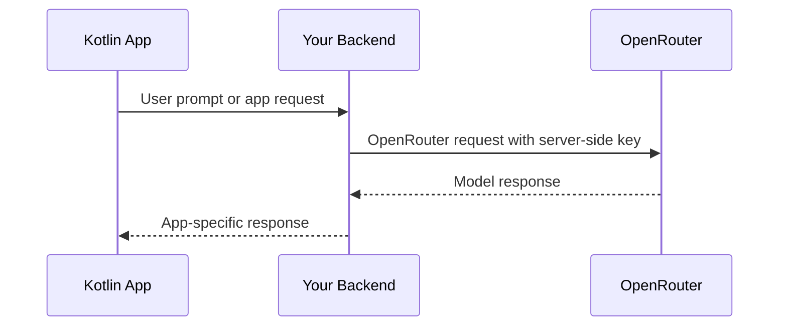

## Descripción general

InsForge proporciona una clave de API de OpenRouter para proyectos de puerta de enlace de modelos. Las nuevas aplicaciones Kotlin deben llamar a OpenRouter desde código del lado del servidor de confianza, una API de backend o otro límite seguro. No incrustes la clave de OpenRouter en binarios de cliente Android o de escritorio.

Los métodos anteriores del SDK de IA de Kotlin de InsForge están deprecados como contenedores de compatibilidad. Usa el SDK de InsForge para base de datos, autenticación, almacenamiento, funciones y tiempo real; usa OpenRouter para llamadas de modelo.

## Arquitectura recomendada



## Llamada de OpenRouter del lado del servidor

Usa el SDK de OpenAI o REST desde tu backend. Para backends de TypeScript:

```typescript
import OpenAI from 'openai';

const openai = new OpenAI({
  baseURL: 'https://openrouter.ai/api/v1',
  apiKey: process.env.OPENROUTER_API_KEY,
});

const completion = await openai.chat.completions.create({
  model: 'openai/gpt-4o-mini',
  messages: [{ role: 'user', content: 'Summarize this note.' }],
});
```

## Llamar a tu backend desde Kotlin

```kotlin
import io.ktor.client.HttpClient
import io.ktor.client.call.body
import io.ktor.client.plugins.contentnegotiation.ContentNegotiation
import io.ktor.client.request.header
import io.ktor.client.request.post
import io.ktor.client.request.setBody
import io.ktor.http.ContentType
import io.ktor.http.contentType
import io.ktor.serialization.kotlinx.json.json
import kotlinx.serialization.Serializable

@Serializable
data class ChatRequest(val prompt: String)

@Serializable
data class ChatResponse(val text: String)

val http = HttpClient {
    install(ContentNegotiation) {
        json()
    }
}

suspend fun sendPrompt(prompt: String, sessionToken: String): ChatResponse {
    return http.post("https://your-app.example/api/chat") {
        header("Authorization", "Bearer $sessionToken")
        contentType(ContentType.Application.Json)
        setBody(ChatRequest(prompt))
    }.body()
}
```

Usa un token de sesión de aplicación u otra credencial con alcance de usuario para tu ruta de backend. Nunca envíes la clave de OpenRouter desde un cliente Kotlin.

## Métodos legacy de InsForge AI

Estos métodos del SDK de Kotlin están deprecados para nuevas integraciones de IA:

- `client.ai.listModels()`
- `client.ai.chatCompletion(...)`
- `client.ai.chatCompletionStream(...)`
- `client.ai.generateEmbeddings(...)`
- `client.ai.generateImage(...)`

Se dirigen al proxy de IA de InsForge deprecado. Las nuevas integraciones deben usar la clave de OpenRouter del panel y seguir los documentos actuales de la API de OpenRouter para parámetros de modelo y capacidades.
