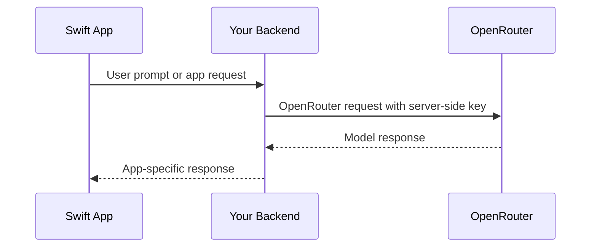

## Descripción general

InsForge proporciona una clave de API de OpenRouter para proyectos de la Puerta de enlace de modelos. Las nuevas aplicaciones Swift deben llamar a OpenRouter directamente desde código seguro del lado del servidor, una API de backend u otro límite seguro. No incruste la clave de OpenRouter en un binario de aplicación iOS, macOS, tvOS o watchOS.

Los métodos anteriores del SDK de IA de Swift de InsForge están obsoletos y son envoltorios de compatibilidad. Utilice el SDK de InsForge para base de datos, autenticación, almacenamiento, funciones y tiempo real; utilice OpenRouter para llamadas de modelo.

## Arquitectura recomendada



## Llamada OpenRouter del lado del servidor

Utilice el SDK de OpenAI o REST desde su backend. Para backends de TypeScript:

```typescript
import OpenAI from 'openai';

const openai = new OpenAI({
  baseURL: 'https://openrouter.ai/api/v1',
  apiKey: process.env.OPENROUTER_API_KEY,
});

const completion = await openai.chat.completions.create({
  model: 'openai/gpt-4o-mini',
  messages: [{ role: 'user', content: 'Summarize this note.' }],
});
```

## Llamada a su backend desde Swift

```swift
struct ChatRequest: Encodable {
    let prompt: String
}

struct ChatResponse: Decodable {
    let text: String
}

func sendPrompt(_ prompt: String, sessionToken: String) async throws -> ChatResponse {
    let url = URL(string: "https://your-app.example/api/chat")!
    var request = URLRequest(url: url)
    request.httpMethod = "POST"
    request.setValue("Bearer \\(sessionToken)", forHTTPHeaderField: "Authorization")
    request.setValue("application/json", forHTTPHeaderField: "Content-Type")
    request.httpBody = try JSONEncoder().encode(ChatRequest(prompt: prompt))

    let (data, response) = try await URLSession.shared.data(for: request)
    guard let httpResponse = response as? HTTPURLResponse,
          (200..<300).contains(httpResponse.statusCode) else {
        throw URLError(.badServerResponse)
    }

    return try JSONDecoder().decode(ChatResponse.self, from: data)
}
```

Utilice un token de sesión de aplicación u otra credencial con alcance de usuario para su ruta de backend. No envíe nunca la clave de OpenRouter desde un cliente de Swift.

## Métodos de IA de InsForge heredados

Estos métodos del SDK de Swift están obsoletos para nuevas integraciones de IA:

- `insforge.ai.chatCompletion(...)`
- `insforge.ai.generateEmbeddings(...)`
- `insforge.ai.generateImage(...)`
- `insforge.ai.listModels()`

Se dirigen al proxy de IA de InsForge obsoleto. Las nuevas integraciones deben utilizar la clave de OpenRouter del panel de control y seguir la documentación actual de la API de OpenRouter para parámetros de modelo y capacidades.
